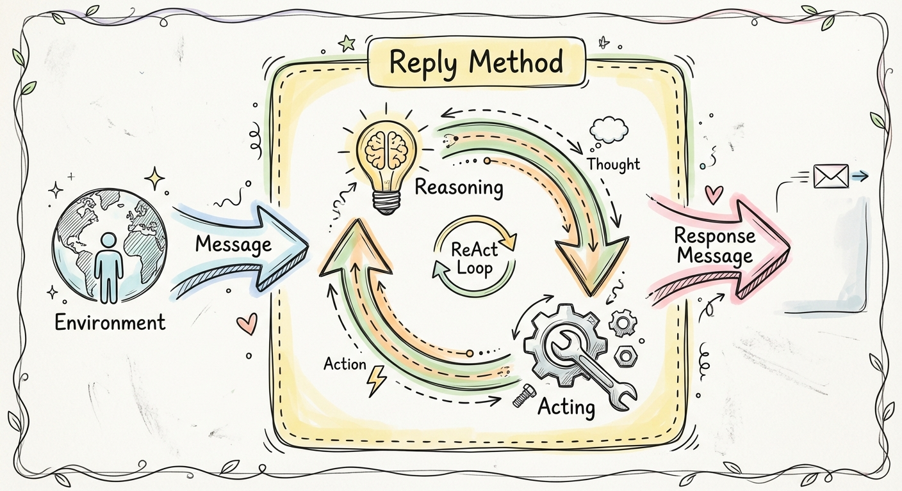

In AgentScope, an agent is an **independent** entity that can receive outside information, process it, and take actions to achieve specific goals.

To achieve this, an agent is abstracted into two main methods:

| Method | Description |
|--------|-------------|
| **`reply`** | Handle incoming messages, reason about the current state, and generate responses. |
| **`observe`** | Receive external information and update the agent's internal state without generating a response. |

During the `reply` process, the agent reasons based on the current state and takes actions accordingly — this is the "ReAct" (Reasoning + Acting) paradigm.

<Frame>
  
</Frame>

<Info>
The `observe` method is useful for injecting context into the agent's memory without triggering a reply, such as updating environment state or injecting background knowledge.
</Info>