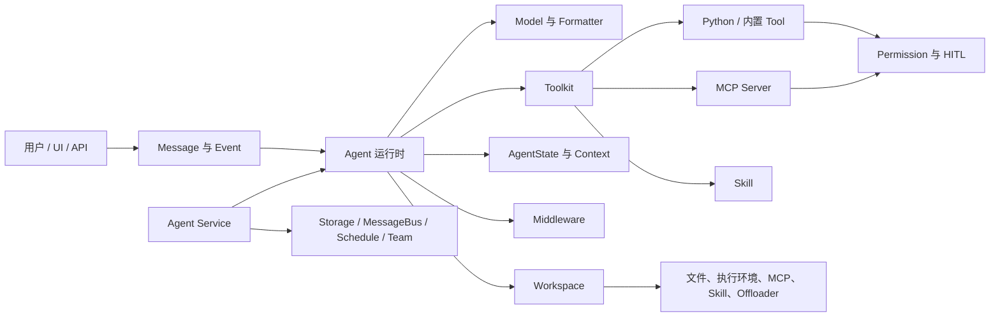

# AgentScope 2.0 模块全景与完整应用

AgentScope 2.0 不只是一个 `Agent` 类，而是一套用于构建、控制和服务化
Agent 应用的模块化运行时。本教程先建立完整的模块地图，再分别说明各模块
“是什么、负责什么、什么时候用”，最后把这些模块组装成一个可运行的
DataMuse 销售分析应用。

## 环境准备

本文固定使用以下环境，避免 Python 或 AgentScope 版本差异影响示例：

- Python 3.12
- AgentScope 2.0.4
- Node.js 20+（通过 `npx` 启动示例中的 MCP Server）

```bash
conda create -n agentscope-tutorial-py312 python=3.12 -y
conda activate agentscope-tutorial-py312
pip install "agentscope[service]==2.0.4"
export DASHSCOPE_API_KEY="your-api-key"
```

本文代码以 DashScope 为例。使用其他模型时，只需要替换 Credential 和 Model，
Agent、Tool、Permission、Middleware 等上层模块不需要改写。

## 先建立整体认识

一个 AgentScope 应用可以分成五层：



- **Agent 运行时**负责推理、行动和状态推进。
- **能力层**通过 Tool、MCP 和 Skill 告诉 Agent 能做什么以及怎么做。
- **控制层**通过 Permission、HITL、Context 和 Middleware 控制执行边界。
- **Workspace**提供文件、进程、MCP、Skill 和上下文卸载所需的工作环境。
- **Agent Service**把本地对象变成多用户、可持久化、可调度的 HTTP 服务。

## 模块地图

| 模块 | 主要入口 | 负责什么 | 什么时候需要 |
|---|---|---|---|
| Credential | `agentscope.credential` | 保存并校验模型凭证 | 接入任意外部模型或语音服务时 |
| Model | `agentscope.model` | 调用 LLM，返回统一响应 | 所有 Agent 应用 |
| Formatter | `agentscope.formatter` | 在 AgentScope `Msg` 与供应商消息格式间转换 | 一个对话中存在多个实体（Agent 或用户）时 |
| Message | `agentscope.message` | 表示用户、助手、系统消息及多模态内容块 | 所有输入、上下文和最终输出 |
| Event | `agentscope.event` | 暴露推理、文本、工具、审批等增量事件 | 流式 UI、服务端 SSE、HITL |
| Agent | `agentscope.agent` | 执行 reasoning-acting 循环 | 所有 Agent 应用 |
| State | `agentscope.state` | 保存会话、上下文、权限、任务和 middleware 状态 | 多轮对话、恢复执行、持久化 |
| Tool | `agentscope.tool` | 把 Python 或系统能力暴露给 Agent | Agent 需要读取、计算或执行操作时 |
| MCP | `agentscope.mcp` | 连接标准化外部工具服务器 | 需要接入 MCP Server 提供的工具或服务时 |
| Skill | `agentscope.skill` | 按需加载可复用的操作指南 | 需要按 Skill 中的规则、顺序或 SOP 组合工具时 |
| Permission | `agentscope.permission` | 对每次工具调用做 ALLOW、ASK 或 DENY 决策 | Agent 能产生真实副作用时 |
| Middleware | `agentscope.middleware` | 横切扩展 Agent 生命周期 | tracing、RAG、记忆、预算、TTS、审计 |
| Workspace | `agentscope.workspace` | 提供隔离工作目录、工具、MCP、Skill 和 Offloader | 文件操作、沙箱执行、服务化隔离 |
| Embedding / RAG | `agentscope.embedding`、`agentscope.rag` | 文档解析、切块、向量化、检索和上下文注入 | 回答私有或持续更新的知识时 |
| TTS | `agentscope.tts` | 把文本事件转换成音频事件 | 语音助手或无障碍输出 |
| Agent Service | `agentscope.app` | 提供 Agent、Session、Chat、SSE、Schedule 等 API | 多用户、持久化、远程调用和部署 |

下面从运行时核心开始逐层展开。

---

## 1. Credential、Model 与 Formatter

### 是什么

- `Credential` 只负责认证信息，不负责业务逻辑。
- `ChatModelBase` 的具体实现负责调用模型供应商。
- `Formatter` 负责把统一的 `Msg` 转成供应商 API 接受的消息格式。

### 什么时候用

每个 Agent 至少需要一个 Model。只有在切换供应商、自定义模型协议，或需要备用
模型时，才需要深入配置这一层。

### 最小代码

```python
import os

from agentscope.agent import Agent, ModelConfig
from agentscope.credential import DashScopeCredential
from agentscope.model import DashScopeChatModel


credential = DashScopeCredential(
    api_key=os.environ["DASHSCOPE_API_KEY"],
)

primary = DashScopeChatModel(
    credential=credential,
    model="qwen-plus",
)
backup = DashScopeChatModel(
    credential=credential,
    model="qwen-turbo",
)

agent = Agent(
    name="assistant",
    system_prompt="You are a concise assistant.",
    model=primary,
    model_config=ModelConfig(
        max_retries=2,
        fallback_model=backup,
    ),
)
```

`ModelConfig.max_retries=2` 表示主模型在初次失败后再重试两次，仍失败才切换
到 `fallback_model`。具体 Model 自己也可能有 API 层重试，两层配置不要盲目叠加。

通常不需要手动传 Formatter；模型会使用匹配的默认实现：

```python
from agentscope.formatter import DashScopeChatFormatter

model = DashScopeChatModel(
    credential=credential,
    model="qwen-plus",
    formatter=DashScopeChatFormatter(),
)
```

只有自定义供应商协议或消息组织方式时，才需要实现 `FormatterBase`。

---

## 2. Message、ContentBlock 与 Event

### 是什么

`Msg` 是可持久化的完整消息，`ContentBlock` 是消息内部的内容单元，`AgentEvent`
是一次回复执行过程中的增量事件。

常用消息和内容块包括：

- `UserMsg`、`AssistantMsg`、`SystemMsg`
- `TextBlock`、`ThinkingBlock`、`DataBlock`、`HintBlock`
- `ToolCallBlock`、`ToolResultBlock`

### 什么时候用

- 只要最终答案：使用 `await agent.reply(...)`，得到完整 `Msg`。
- 构建终端、Web UI、SSE 或审批流程：使用 `agent.reply_stream(...)` 处理事件。
- 传递图片、音频或结构化内容：使用 `DataBlock`，不要把数据硬塞进字符串。

### 消息与流式事件

```python
from agentscope.event import EventType
from agentscope.message import UserMsg


message = UserMsg(
    name="user",
    content="Summarize revenue by region.",
)

async for event in agent.reply_stream(message):
    if event.type == EventType.TEXT_BLOCK_DELTA:
        print(event.delta, end="", flush=True)
    elif event.type == EventType.TOOL_CALL_START:
        print(f"\n[tool] {event.tool_call_name}")
    elif event.type == EventType.TOOL_RESULT_END:
        print(f"[tool result] {event.state}")
    elif event.type == EventType.REPLY_END:
        print()
```

事件流是 Agent 与界面的稳定边界。UI 不需要知道 Agent 内部如何推理，只需要处理
文本、工具、数据、确认和结束事件。

`AssistantMsg.append_event(event)` 可以把事件流重新聚合为完整消息，适合网关或
自定义客户端保存最终结果。

---

## 3. Agent、AgentState 与运行配置

### 是什么

`Agent` 组合模型、工具、状态、控制配置和 middleware，并执行多轮
reasoning-acting 循环。它本身不是能力仓库，真正的能力来自 Toolkit 和
Middleware。

### 关键组装点

```python
from agentscope.agent import Agent, ContextConfig, ModelConfig, ReActConfig
from agentscope.permission import PermissionContext, PermissionMode
from agentscope.state import AgentState
from agentscope.tool import Toolkit


agent = Agent(
    name="DataMuse",
    system_prompt="You are a careful data analyst.",
    model=primary,
    toolkit=Toolkit(),
    state=AgentState(
        permission_context=PermissionContext(
            mode=PermissionMode.DEFAULT,
        ),
    ),
    model_config=ModelConfig(max_retries=2, fallback_model=backup),
    context_config=ContextConfig(
        trigger_ratio=0.8,
        reserve_ratio=0.1,
        tool_result_limit=2000,
    ),
    react_config=ReActConfig(
        max_iters=12,
        stop_on_reject=False,
    ),
)
```

这些参数分别控制：

| 参数 | 控制什么 |
|---|---|
| `model_config` | 模型重试和 fallback |
| `context_config` | 自动压缩阈值、保留比例、工具结果上限 |
| `react_config` | 单次回复最大推理轮数和拒绝后的行为 |
| `state` | 会话上下文、权限、任务、激活工具组和 middleware 状态 |
| `offloader` | 被截断内容和多模态数据的卸载位置，通常由 Workspace 提供 |

### 四个常用方法

| 方法 | 行为 | 适用情况 |
|---|---|---|
| `reply()` | 消费完整事件流并返回最终 `Msg` | 脚本、测试、无需展示过程 |
| `reply_stream()` | 逐个返回 `AgentEvent` | UI、SSE、HITL、进度展示 |
| `observe()` | 把消息放入上下文，不触发推理 | 多 Agent 之间传递结果 |
| `compress_context()` | 按配置压缩当前上下文 | 主动控制长会话上下文 |

---

## 4. Tool、Toolkit 与 ToolGroup

### 是什么

Tool 是模型可以调用的可执行接口；Toolkit 是 Agent 的能力注册表。Toolkit 可以
同时接收四类能力来源：

1. 内置 Tool，例如 `Read`、`Write`、`Bash`、`Grep`。
2. `FunctionTool` 包装的 Python 函数。
3. 自定义 `ToolBase` 子类。
4. MCP Client 暴露的远程 Tool。

Skill 也由 Toolkit 管理，但它提供的是操作指南，不是新的执行接口。

### FunctionTool

```python
from agentscope.tool import FunctionTool, Toolkit


def query_sales(region: str = "") -> str:
    """Return a compact sales summary for one region."""
    return f"Sales summary for {region or 'all regions'}"


toolkit = Toolkit(
    tools=[
        FunctionTool(
            query_sales,
            is_read_only=True,
        ),
    ],
)
```

`FunctionTool` 会从函数签名和 docstring 生成 JSON Schema。它适合快速包装已有
函数；需要精细控制输入 Schema、流式结果或权限时，使用 `ToolBase`。

### 自定义 ToolBase

```python
from typing import Any

from agentscope.message import TextBlock
from agentscope.permission import (
    PermissionBehavior,
    PermissionContext,
    PermissionDecision,
)
from agentscope.tool import ToolBase, ToolChunk


class SalesSummary(ToolBase):
    name = "SalesSummary"
    description = "Compute revenue grouped by category or region."
    input_schema = {
        "type": "object",
        "properties": {
            "group_by": {
                "type": "string",
                "enum": ["category", "region"],
            },
        },
        "required": ["group_by"],
    }
    is_concurrency_safe = True
    is_read_only = True

    async def check_permissions(
        self,
        _tool_input: dict[str, Any],
        _context: PermissionContext,
    ) -> PermissionDecision:
        return PermissionDecision(behavior=PermissionBehavior.ALLOW)

    async def call(self, group_by: str) -> ToolChunk:
        return ToolChunk(
            content=[TextBlock(text=f"Grouped sales by {group_by}")],
        )
```

当前 `ToolBase` 的业务执行入口是 `call()`；`__call__()` 由基类负责叠加 Tool
Middleware，不应在新 Tool 中绕过它。

### ToolGroup

工具很多时，把所有 Schema 每轮都发给模型会浪费上下文，也会增加误选概率：

```python
from agentscope.tool import ToolGroup, Toolkit


toolkit = Toolkit(
    tools=[always_available_tool],
    tool_groups=[
        ToolGroup(
            name="analysis",
            description="Statistical analysis tools.",
            instructions="Validate the selected dimension first.",
            tools=[sales_summary_tool],
        ),
        ToolGroup(
            name="reporting",
            description="Report generation tools.",
            tools=[report_writer_tool],
        ),
    ],
)
```

存在非 `basic` 组时，Toolkit 会自动注入 `reset_tools` 元工具。它不属于
`basic` 组，但和 `basic` 工具一样始终可见。每次调用表示“最终期望的激活状态”，
未明确设为 `True` 的非 basic 组都会停用。

---

## 5. MCP

### 是什么

MCP 把外部工具服务器转换成 AgentScope Tool。它适合连接数据库、浏览器、
知识图谱或其他独立服务，并保持能力协议与 Agent 实现解耦。

### 什么时候用

- 能力已经由 MCP Server 提供。
- 希望同一套工具被不同 Agent 框架复用。
- 工具进程需要独立部署、升级或隔离。

如果只是调用本进程里的一个 Python 函数，`FunctionTool` 更直接。

### Stdio MCP

```python
from agentscope.mcp import MCPClient, StdioMCPConfig
from agentscope.tool import Toolkit


memory = MCPClient(
    name="memory",
    is_stateful=True,
    mcp_config=StdioMCPConfig(
        command="npx",
        args=[
            "-y",
            "@modelcontextprotocol/server-memory",
        ],
    ),
    enable_tools=[
        "create_entities",
        "add_observations",
        "search_nodes",
    ],
)

await memory.connect()
try:
    toolkit = Toolkit(mcps=[memory])
finally:
    await memory.close()
```

这里使用 Memory MCP 来保存和检索结构化信息。在后面的 Workspace 场景中，
`basic` 工具已经提供 `Read`、`Write`、`Edit`、`Glob` 和 `Grep`，因此不再额外
接入功能重复的 filesystem MCP。

HTTP MCP 使用 `HttpMCPConfig(url=..., headers=...)`。MCP 工具名会被命名空间化为
`mcp__{server_name}__{tool_name}`，避免不同 Server 的同名工具冲突。

`is_stateful=True` 的 Client 需要显式维护连接生命周期；交给 Workspace 后，
Workspace 会负责初始化和关闭。MCP Server 提供的 `readOnlyHint` 也会参与
Permission 决策。

---

## 6. Skill

### 是什么

Skill 是带 YAML frontmatter 的 Markdown 操作指南。它告诉 Agent “完成某类任务
应该遵循什么步骤”，但不会新增可执行代码。

### 什么时候用

- 一项任务需要稳定的多步流程、格式或检查清单。
- 指南很长，不希望永久放进 system prompt。
- 同一套工作方法需要在多个 Agent 或 Workspace 复用。

如果需要访问数据库或执行 API，仍然要配套 Tool 或 MCP。

### SKILL.md

```markdown
---
name: report_writer
description: Create a concise Markdown sales report from verified metrics.
---

# Report Writer

1. Use a data tool to obtain every metric.
2. Separate observations from recommendations.
3. Include data scope and output path.
```

### 加载 Skill

```python
from agentscope.skill import LocalSkillLoader
from agentscope.tool import Toolkit


toolkit = Toolkit(
    skills_or_loaders=[
        LocalSkillLoader(
            directory="./skills",
            scan_subdir=True,
        ),
    ],
)
```

有可用 Skill 时，Toolkit 会暴露名为 `Skill` 的元工具。模型先看到名称和描述，
需要完整指南时再调用 `Skill(skill="report_writer")`，从而按需占用上下文。

---

## 7. Permission 与 Human-in-the-Loop

### 是什么

Permission Engine 在工具真正执行前综合判断：

1. 当前 `PermissionMode`
2. 用户配置的 allow、ask、deny rules
3. Tool 自己的 `check_permissions()` 结果
4. 调用是否只读、路径是否在允许的工作目录

最终结果是 `ALLOW`、`ASK` 或 `DENY`。`ASK` 会暂停当前回复，并产生
`REQUIRE_USER_CONFIRM` 事件。

### 五种模式

| 模式 | 核心行为 | 适用情况 |
|---|---|---|
| `DEFAULT` | 规则或 Tool 未明确允许时进入 ASK | 有交互界面的普通应用 |
| `ACCEPT_EDITS` | 工作目录内的读写和受支持文件命令自动允许 | 本地协作开发 |
| `EXPLORE` | 只读操作允许，修改操作拒绝 | 浏览代码、数据探索 |
| `BYPASS` | 跳过安全 ASK，但仍服从显式 deny/ask 规则和 Tool DENY | 完全可信的隔离沙箱 |
| `DONT_ASK` | 把所有 ASK 转成 DENY | 定时任务、后台无人值守执行 |

`BYPASS` 不是默认安全模式；它会跳过 Tool 返回的安全 ASK。无人值守但仍希望保守
执行时，优先使用 `DONT_ASK`。

### 把权限装入 Agent

```python
from agentscope.permission import (
    PermissionBehavior,
    PermissionContext,
    PermissionMode,
    PermissionRule,
)
from agentscope.state import AgentState


write_rule = PermissionRule(
    tool_name="Write",
    rule_content="reports/**",
    behavior=PermissionBehavior.ALLOW,
    source="application",
)

state = AgentState(
    permission_context=PermissionContext(
        mode=PermissionMode.DEFAULT,
        allow_rules={"Write": [write_rule]},
    ),
)
```

权限的准确接线位置是 `Agent(state=AgentState(permission_context=...))`，不是
Toolkit 构造器。

### 处理审批事件

```python
from agentscope.event import ConfirmResult, EventType, UserConfirmResultEvent


async def run_with_approval(agent, message):
    async def process(stream):
        async for event in stream:
            if event.type == EventType.TEXT_BLOCK_DELTA:
                print(event.delta, end="", flush=True)

            elif event.type == EventType.REQUIRE_USER_CONFIRM:
                results = []
                for tool_call in event.tool_calls:
                    answer = input(
                        f"Approve {tool_call.name} {tool_call.input}? [y/N] ",
                    )
                    results.append(
                        ConfirmResult(
                            confirmed=answer.lower() == "y",
                            tool_call=tool_call,
                        ),
                    )

                await process(
                    agent.reply_stream(
                        UserConfirmResultEvent(
                            reply_id=event.reply_id,
                            confirm_results=results,
                        ),
                    ),
                )

    await process(agent.reply_stream(message))
```

`UserConfirmResultEvent` 恢复的是同一次 reply，不是创建一轮新对话。外部系统代为
执行的 Tool 使用对应的 `REQUIRE_EXTERNAL_EXECUTION` 和
`ExternalExecutionResultEvent`。

---

## 8. Context 管理

### 是什么

AgentState 中的 `context` 保存未压缩消息，`summary` 保存压缩后的历史。
`ContextConfig` 控制何时压缩，以及工具结果进入模型上下文前的大小上限。

### 什么时候用

- 对话会跨很多轮持续运行。
- Tool 可能返回大文件、大表格或长日志。
- 模型上下文成本和延迟开始明显增长。

### 配置与主动压缩

```python
from agentscope.agent import ContextConfig
from agentscope.message import HintBlock


config = ContextConfig(
    trigger_ratio=0.8,
    reserve_ratio=0.1,
    tool_result_limit=2000,
)

await agent.compress_context(
    context_config=config,
    instructions=HintBlock(
        hint="Preserve decisions, verified metrics, and output paths.",
    ),
)
```

`tool_result_limit` 限制的是进入上下文的工具结果，不等于工具不能产生更大输出。
给 Agent 配置 `offloader=workspace` 后，被截断内容可以卸载到 Workspace，而不是
直接丢失。

---

## 9. Middleware

### 是什么

Middleware 在不修改 Agent 主流程的前提下拦截生命周期。适合 tracing、审计、
限额、RAG、长期记忆和 TTS 等横切能力。

### Hook 边界

| Hook | 拦截范围 |
|---|---|
| `on_reply` | 一次完整回复，包括 HITL 暂停与恢复 |
| `on_reasoning` | 一轮 reasoning |
| `on_acting` | 已完成校验和权限判断后的纯工具执行 |
| `on_model_call` | 原始模型 API 调用 |
| `on_compress_context` | 上下文压缩 |
| `on_system_prompt` | 顺序变换 system prompt |
| `list_tools()` | 声明 Middleware 提供的额外工具 |

### 自定义耗时 Middleware

```python
import time

from agentscope.middleware import MiddlewareBase


class TimingMiddleware(MiddlewareBase):
    async def on_reply(self, agent, input_kwargs, next_handler):
        started = time.perf_counter()
        try:
            async for item in next_handler(**input_kwargs):
                yield item
        finally:
            elapsed = time.perf_counter() - started
            print(f"[trace] {agent.name} reply took {elapsed:.2f}s")


agent = Agent(
    name="DataMuse",
    system_prompt="...",
    model=primary,
    middlewares=[TimingMiddleware()],
)
```

`on_acting` 看不到权限判断过程，因为它只包裹已经允许执行的 Tool 调用。需要记录
完整审批流程时，应在 `on_reply` 观察事件流。

### 内置 Middleware

| Middleware | 什么时候用 |
|---|---|
| `TracingMiddleware` | 需要 OpenTelemetry tracing |
| `ReplyBudgetControlMiddleware` | 需要限制单次回复的加权 token 预算 |
| `RAGMiddleware` | 需要静态注入或 Agent 主动检索知识库 |
| `TTSMiddleware` | 需要把文本增量转换为音频事件 |
| `AgenticMemoryMiddleware` | 需要 Agent 主动管理长期记忆 |
| `Mem0Middleware`、`ReMeMiddleware` | 接入对应长期记忆后端 |

普通库模式下，Middleware 的 `list_tools()` 不会被 `Agent` 构造器自动放进
Toolkit，需要手动执行并注册；Agent Service 在组装 Toolkit 时会自动收集。

---

## 10. Workspace

### 是什么

Workspace 是 Agent 的统一工作环境。它同时提供：

- 绑定到环境的 `Bash`、`Read`、`Write`、`Edit`、`Glob`、`Grep`
- MCP 与 Skill 的生命周期和持久化
- system prompt 中的工作目录说明
- Context 和大结果的 Offloader
- 本地目录、Docker、E2B 或 Kubernetes 隔离

### 什么时候用

只聊天或只调用纯函数时可以不使用 Workspace。一旦 Agent 需要文件、命令执行、
可恢复工作目录或服务端租户隔离，就应该引入 Workspace。

### 组装方式

```python
from agentscope.tool import Toolkit
from agentscope.workspace import LocalWorkspace


async with LocalWorkspace(
    workdir="./workspace",
    default_mcps=[memory_mcp],
    skill_paths=["./skills/report_writer"],
) as workspace:
    workspace_tools = await workspace.list_tools()
    workspace_mcps = await workspace.list_mcps()
    workspace_skills = await workspace.list_skills()

    agent = Agent(
        name="DataMuse",
        system_prompt=(
            "You are a data analyst.\n"
            + await workspace.get_instructions()
        ),
        model=primary,
        toolkit=Toolkit(
            tools=[SalesSummary(), *workspace_tools],
            mcps=workspace_mcps,
            skills_or_loaders=workspace_skills,
        ),
        offloader=workspace,
    )
```

库模式要显式把 Workspace 暴露的能力装进 Toolkit。Agent Service 的
WorkspaceManager 会在每次组装 Agent 时完成这一步。

---

## 11. Embedding、RAG 与 KnowledgeBase

### 是什么

RAG 模块把流程拆成可替换的组件：Parser 解析文档，Chunker 切块，EmbeddingModel
生成向量，VectorStore 保存和检索，KnowledgeBase 把这些组件绑定在一起，
`RAGMiddleware` 再把检索能力接入 Agent。

### 什么时候用

当答案依赖私有文档、企业制度、持续更新的资料或需要可追溯依据时使用 RAG。
固定且很短的背景信息直接放 system prompt 更简单。

### 最小组装

```python
from agentscope.embedding import DashScopeEmbeddingModel
from agentscope.middleware import RAGMiddleware
from agentscope.rag import (
    ApproxTokenChunker,
    KnowledgeBase,
    QdrantStore,
    TextParser,
)
from agentscope.tool import Toolkit


embedding = DashScopeEmbeddingModel(
    credential=credential,
    model="text-embedding-v4",
    dimensions=1024,
)
store = QdrantStore(location=":memory:")

async with store:
    knowledge = KnowledgeBase(
        name="sales-handbook",
        description="Sales definitions and reporting policies.",
        embedding_model=embedding,
        vector_store=store,
        collection="sales-handbook",
    )

    sections = await TextParser().parse(
        file=b"Revenue means paid order value after discount.",
        filename="definitions.md",
    )
    chunks = await ApproxTokenChunker(
        chunk_size=256,
        overlap=32,
    ).chunk(sections)
    await knowledge.insert_document(
        chunks,
        document_metadata={"filename": "definitions.md"},
    )

    rag = RAGMiddleware(
        knowledge_bases=[knowledge],
        parameters=RAGMiddleware.Parameters(
            mode="agentic",
            top_k=3,
        ),
    )

    agent = Agent(
        name="DataMuse",
        system_prompt="Use the knowledge base for business definitions.",
        model=primary,
        toolkit=Toolkit(tools=await rag.list_tools()),
        middlewares=[rag],
    )
```

`mode="static"` 会在每个新输入上自动检索并注入 Hint；`mode="agentic"` 会提供
`search_knowledge` Tool，让模型决定何时搜索。上例显式把 `rag.list_tools()`
加入 Toolkit，这是库模式的必要接线。

---

## 12. TTS

### 是什么

TTS Model 把文本转换成音频，`TTSMiddleware` 监听文本事件并向同一个回复流注入
`DATA_BLOCK_START`、`DATA_BLOCK_DELTA` 和 `DATA_BLOCK_END`。

### 什么时候用

语音助手、实时播报、无障碍输出或需要前端直接消费音频流时使用。

```python
from agentscope.middleware import TTSMiddleware
from agentscope.tts import DashScopeTTSModel


tts = DashScopeTTSModel(
    credential=credential,
    model="qwen3-tts-flash",
    parameters=DashScopeTTSModel.Parameters(voice="Cherry"),
    stream=True,
)

agent = Agent(
    name="voice-assistant",
    system_prompt="Reply concisely.",
    model=primary,
    middlewares=[TTSMiddleware(tts_model=tts)],
)
```

前端应按 `block_id` 聚合同一个 DataBlock 的增量音频，而不是把每个 delta 当成
独立音频文件。

---

## 13. Agent Service

### 是什么

`create_app()` 生成 FastAPI 应用，提供 Credential、Model、Agent、Session、Chat、
SSE、Workspace、KnowledgeBase、Schedule 和 Team 等服务能力。

服务模式下各对象的职责不同：

| 对象 | 保存什么 |
|---|---|
| Agent 模板 | 名称、system prompt、Context/ReAct 配置 |
| Session | Agent、模型和备用模型、权限、对话状态、知识库配置 |
| Workspace | 每个隔离单元的文件、MCP、Skill 和执行环境 |
| Storage | Agent、Session、消息、Schedule、Team 等持久数据 |
| MessageBus | SSE、跨 Session 消息、后台唤醒等实时传输 |
| 服务宿主 | Python Tool、Middleware、Credential 扩展和沙箱策略 |

### 创建服务

```python
from agentscope.app import create_app
from agentscope.app.message_bus import RedisMessageBus
from agentscope.app.storage import RedisStorage
from agentscope.app.workspace_manager import LocalWorkspaceManager


async def tool_factory(user_id, agent_id, session_id):
    del user_id, agent_id, session_id
    return [SalesSummary()]


app = create_app(
    storage=RedisStorage(host="localhost", port=6379),
    message_bus=RedisMessageBus(host="localhost", port=6379),
    workspace_manager=LocalWorkspaceManager(
        basedir="./workspaces",
        default_mcps=[memory_mcp],
        skill_paths=["./skills/report_writer"],
    ),
    extra_agent_tools=tool_factory,
    title="DataMuse Service",
)
```

`POST /agent/` 创建的是可序列化模板，不能在 JSON 里塞 Python `ToolBase` 对象。
`extra_agent_tools` 和 `extra_agent_middlewares` 才是服务端运行期能力的注入点，
并且可以按 `user_id`、`agent_id`、`session_id` 返回不同能力。

### 一次服务调用的顺序

```text
创建 Credential
    -> 创建 Agent 模板
    -> 创建 Session，并绑定 chat_model_config / fallback_chat_model_config
    -> 建立 GET /sessions/{session_id}/stream SSE
    -> POST /chat/ 触发回复
    -> 从 SSE 消费 AgentEvent
    -> 如遇 ASK，再 POST UserConfirmResultEvent 恢复同一次回复
```

`POST /chat/` 是触发器，事件从 Session Stream 返回。这样同一条流可以承载多次
回复、HITL 恢复、后台唤醒和 Team Worker 的事件投影。

---

## 14. Schedule

### 是什么

Schedule 把一个 Agent 模板、模型配置和 cron 表达式绑定起来，按计划自动创建或
复用 Session 执行任务。

### 什么时候用

日报、监控、定时资料收集、周期性数据分析等无人值守任务。

```python
body = {
    "name": "Daily Sales Summary",
    "description": "Summarize yesterday's sales and save a report.",
    "cron_expression": "0 9 * * *",
    "timezone": "Asia/Shanghai",
    "agent_id": agent_id,
    "chat_model_config": {
        "type": "dashscope_chat",
        "credential_id": credential_id,
        "model": "qwen-plus",
        "parameters": {},
    },
    "enabled": True,
    "stateful": False,
    "permission_mode": "dont_ask",
}

response = await client.post(
    "/schedule/",
    json=body,
    headers={"X-User-Id": "demo-user"},
)
response.raise_for_status()
```

- `stateful=False`：每次触发创建独立 Session，适合彼此独立的日报。
- `stateful=True`：连续触发共享上下文，适合持续跟踪同一任务。
- 默认 `DONT_ASK`：ASK 会被拒绝，避免无人值守任务永久等待确认。

定时任务应配合可重试模型、fallback 和可观测性，而不是依赖人工重跑。

---

## 15. Multi-Agent 与 Team

### 是什么

Multi-Agent 不是“多个步骤”的同义词，而是把不同工具、上下文、责任或并行任务
交给不同 Agent。库模式可以直接用 Python 编排；Agent Service 还提供 Team 与
子 Agent 工具。

### 什么时候用

- 角色拥有明显不同的工具和 system prompt。
- 上下文隔离能降低干扰或权限风险。
- 多个分支可以并行执行。
- 需要由 Leader 动态创建、邀请或调度 Worker。

单个 Agent 能清晰完成的线性任务，不要仅为了形式拆成 Multi-Agent。

### 串行与并行编排

```python
import asyncio

from agentscope.message import UserMsg


request = UserMsg(name="user", content="Analyze this month's sales.")

collected = await collector.reply(request)
await analyst.observe(collected)
analysis = await analyst.reply(
    UserMsg(name="user", content="Find the strongest business signals."),
)

region_result, category_result = await asyncio.gather(
    region_analyst.reply(request),
    category_analyst.reply(request),
)
```

`observe()` 只共享上下文，不会让接收方立刻推理。库模式下 Python 代码就是最直接
的编排层；服务模式需要持久化团队关系或动态 Worker 时，再使用 Team 能力。

---

## 16. 完整示例：DataMuse 销售分析应用

下面把核心模块组装为一个本地应用。它会：

1. 使用主模型、自动重试和备用模型。
2. 通过 MCP 查看数据目录。
3. 使用只读 Tool 计算销售指标。
4. 按需加载报告 Skill。
5. 在写报告前触发 Permission 和 HITL。
6. 使用 ContextConfig、Middleware 和 LocalWorkspace。
7. 通过事件流展示模型、工具和审批过程。

### 文件结构

```text
datamuse_demo/
├── main.py
├── data/
│   └── sales_data.csv
└── skills/
    └── report_writer/
        └── SKILL.md
```

准备一个最小 `data/sales_data.csv`：

```csv
order_id,category,region,total
1001,Electronics,North,1200.00
1002,Home,South,480.00
1003,Electronics,East,860.00
1004,Sports,North,320.00
1005,Home,East,640.00
```

`skills/report_writer/SKILL.md`：

```markdown
---
name: report_writer
description: Turn verified sales metrics into a concise Markdown report.
---

# Report Writer

1. Obtain all metrics from SalesSummary.
2. Include data scope, findings, and recommendations.
3. Never invent a number that is absent from tool results.
4. Save the final report with WriteReport.
```

### main.py

```python
import asyncio
import csv
import os
import time
from pathlib import Path
from typing import Any

from agentscope.agent import (
    Agent,
    ContextConfig,
    ModelConfig,
    ReActConfig,
)
from agentscope.credential import DashScopeCredential
from agentscope.event import (
    ConfirmResult,
    EventType,
    UserConfirmResultEvent,
)
from agentscope.mcp import MCPClient, StdioMCPConfig
from agentscope.message import TextBlock, UserMsg
from agentscope.middleware import MiddlewareBase
from agentscope.model import DashScopeChatModel
from agentscope.permission import (
    PermissionBehavior,
    PermissionContext,
    PermissionDecision,
    PermissionMode,
)
from agentscope.state import AgentState
from agentscope.tool import ToolBase, ToolChunk, Toolkit
from agentscope.workspace import LocalWorkspace


ROOT = Path(__file__).resolve().parent
DATA_DIR = ROOT / "data"
SALES_CSV = DATA_DIR / "sales_data.csv"
SKILL_DIR = ROOT / "skills" / "report_writer"
WORKSPACE_DIR = ROOT / "workspace"
REPORTS_DIR = WORKSPACE_DIR / "reports"
MEMORY_FILE = WORKSPACE_DIR / "memory.jsonl"


memory_mcp = MCPClient(
    name="memory",
    is_stateful=True,
    mcp_config=StdioMCPConfig(
        command="npx",
        args=[
            "-y",
            "@modelcontextprotocol/server-memory",
        ],
        env={"MEMORY_FILE_PATH": str(MEMORY_FILE)},
    ),
    enable_tools=[
        "create_entities",
        "add_observations",
        "search_nodes",
    ],
)


class SalesSummary(ToolBase):
    """Read-only aggregate calculation over the demo CSV."""

    name = "SalesSummary"
    description = "Compute order count and revenue grouped by a column."
    input_schema = {
        "type": "object",
        "properties": {
            "group_by": {
                "type": "string",
                "enum": ["category", "region"],
            },
        },
        "required": ["group_by"],
    }
    is_concurrency_safe = True
    is_read_only = True

    async def check_permissions(
        self,
        _tool_input: dict[str, Any],
        _context: PermissionContext,
    ) -> PermissionDecision:
        return PermissionDecision(
            behavior=PermissionBehavior.ALLOW,
            message="Read-only aggregate calculation.",
        )

    async def call(self, group_by: str) -> ToolChunk:
        with SALES_CSV.open(encoding="utf-8") as file:
            rows = list(csv.DictReader(file))

        groups: dict[str, list[dict[str, str]]] = {}
        for row in rows:
            groups.setdefault(row[group_by], []).append(row)

        lines = [f"Sales grouped by {group_by}:"]
        for key, items in sorted(groups.items()):
            revenue = sum(float(item["total"]) for item in items)
            lines.append(
                f"- {key}: {len(items)} orders, revenue ${revenue:,.2f}",
            )

        return ToolChunk(content=[TextBlock(text="\n".join(lines))])


class WriteReport(ToolBase):
    """Write a Markdown report after explicit confirmation."""

    name = "WriteReport"
    description = "Save a verified Markdown sales report to the workspace."
    input_schema = {
        "type": "object",
        "properties": {
            "filename": {"type": "string"},
            "content": {"type": "string"},
        },
        "required": ["filename", "content"],
    }
    is_concurrency_safe = False
    is_read_only = False

    def __init__(self, reports_dir: Path = REPORTS_DIR) -> None:
        super().__init__()
        self.reports_dir = reports_dir

    async def check_permissions(
        self,
        _tool_input: dict[str, Any],
        _context: PermissionContext,
    ) -> PermissionDecision:
        return PermissionDecision(
            behavior=PermissionBehavior.ASK,
            message="Writing a report changes the workspace.",
        )

    async def call(self, filename: str, content: str) -> ToolChunk:
        safe_name = Path(filename).name
        if not safe_name.endswith(".md"):
            safe_name += ".md"

        self.reports_dir.mkdir(parents=True, exist_ok=True)
        target = self.reports_dir / safe_name
        target.write_text(content, encoding="utf-8")
        return ToolChunk(
            content=[TextBlock(text=f"Report saved to {target}")],
        )


class TimingMiddleware(MiddlewareBase):
    """Print total wall time for each reply."""

    async def on_reply(self, agent, input_kwargs, next_handler):
        started = time.perf_counter()
        try:
            async for item in next_handler(**input_kwargs):
                yield item
        finally:
            elapsed = time.perf_counter() - started
            print(f"\n[trace] {agent.name} reply took {elapsed:.2f}s")


async def process_events(agent: Agent, stream) -> None:
    """Render events and resume the same reply after approval."""
    async for event in stream:
        if event.type == EventType.TEXT_BLOCK_DELTA:
            print(event.delta, end="", flush=True)

        elif event.type == EventType.TOOL_CALL_START:
            print(f"\n[tool] {event.tool_call_name}")

        elif event.type == EventType.TOOL_RESULT_END:
            print(f"[tool result] {event.state}")

        elif event.type == EventType.REQUIRE_USER_CONFIRM:
            confirm_results = []
            for tool_call in event.tool_calls:
                print(f"\n[approval required] {tool_call.name}")
                print(f"input: {tool_call.input}")
                answer = await asyncio.to_thread(
                    input,
                    "Approve this tool call? [y/N] ",
                )
                confirm_results.append(
                    ConfirmResult(
                        confirmed=answer.strip().lower() == "y",
                        tool_call=tool_call,
                    ),
                )

            await process_events(
                agent,
                agent.reply_stream(
                    UserConfirmResultEvent(
                        reply_id=event.reply_id,
                        confirm_results=confirm_results,
                    ),
                ),
            )

        elif event.type == EventType.REPLY_END:
            print()


async def main() -> None:
    credential = DashScopeCredential(
        api_key=os.environ["DASHSCOPE_API_KEY"],
    )
    primary = DashScopeChatModel(
        credential=credential,
        model="qwen-plus",
    )
    backup = DashScopeChatModel(
        credential=credential,
        model="qwen-turbo",
    )

    async with LocalWorkspace(
        workdir=str(WORKSPACE_DIR),
        default_mcps=[memory_mcp],
        skill_paths=[str(SKILL_DIR)],
    ) as workspace:
        workspace_tools = await workspace.list_tools()
        workspace_mcps = await workspace.list_mcps()
        workspace_skills = await workspace.list_skills()
        workspace_instructions = await workspace.get_instructions()

        agent = Agent(
            name="DataMuse",
            system_prompt=(
                "You are DataMuse, a careful sales analyst. "
                "Search the memory MCP for reporting preferences before "
                "analysis, and store any new preference the user asks you "
                "to remember. "
                "Use SalesSummary for every numeric claim. Before writing, "
                "load report_writer with the Skill tool, then call "
                "WriteReport. Mention the saved path in the final answer.\n"
                + workspace_instructions
            ),
            model=primary,
            toolkit=Toolkit(
                tools=[
                    SalesSummary(),
                    WriteReport(),
                    *workspace_tools,
                ],
                mcps=workspace_mcps,
                skills_or_loaders=workspace_skills,
            ),
            state=AgentState(
                permission_context=PermissionContext(
                    mode=PermissionMode.DEFAULT,
                ),
            ),
            model_config=ModelConfig(
                max_retries=2,
                fallback_model=backup,
            ),
            context_config=ContextConfig(tool_result_limit=2000),
            react_config=ReActConfig(max_iters=12),
            middlewares=[TimingMiddleware()],
            offloader=workspace,
        )

        task = UserMsg(
            name="user",
            content=(
                "Remember that my reports should lead with category "
                "performance. Compare revenue by category and region, "
                "then write datamuse_report.md."
            ),
        )
        await process_events(agent, agent.reply_stream(task))


if __name__ == "__main__":
    asyncio.run(main())
```

### 运行

```bash
conda activate agentscope-tutorial-py312
cd datamuse_demo
python main.py
```

首次运行 Memory MCP 时，`npx` 可能需要下载对应 Server 包。运行过程中，
DataMuse 会通过 MCP 保存报告偏好，`SalesSummary` 会计算指标；`WriteReport`
会产生确认事件，批准后才会在 `workspace/reports/` 写入 Markdown 文件。

### 将同一组能力装入 Agent Service

本地示例已经验证 Agent 的能力闭环。服务化时不需要重写 Tool，而是把它们放到
`create_app()` 的运行期工厂中，并让 WorkspaceManager 接管 MCP 和 Skill：

```python
from pathlib import Path

import uvicorn

from agentscope.app import create_app
from agentscope.app.message_bus import RedisMessageBus
from agentscope.app.storage import RedisStorage
from agentscope.app.workspace_manager import LocalWorkspaceManager
from agentscope.mcp import MCPClient, StdioMCPConfig

from main import SKILL_DIR, SalesSummary, WriteReport


SERVICE_WORKSPACES = Path("./service_workspaces").resolve()
SERVICE_MEMORY_FILE = SERVICE_WORKSPACES / "memory.jsonl"

memory_mcp = MCPClient(
    name="memory",
    is_stateful=True,
    mcp_config=StdioMCPConfig(
        command="npx",
        args=[
            "-y",
            "@modelcontextprotocol/server-memory",
        ],
        env={"MEMORY_FILE_PATH": str(SERVICE_MEMORY_FILE)},
    ),
    enable_tools=[
        "create_entities",
        "add_observations",
        "search_nodes",
    ],
)


async def datamuse_tools(user_id, agent_id, session_id):
    del user_id, session_id
    reports_dir = SERVICE_WORKSPACES / agent_id / "reports"
    return [SalesSummary(), WriteReport(reports_dir=reports_dir)]


app = create_app(
    storage=RedisStorage(host="localhost", port=6379),
    message_bus=RedisMessageBus(host="localhost", port=6379),
    workspace_manager=LocalWorkspaceManager(
        basedir=str(SERVICE_WORKSPACES),
        default_mcps=[memory_mcp],
        skill_paths=[str(SKILL_DIR)],
    ),
    extra_agent_tools=datamuse_tools,
    title="DataMuse Service",
)


if __name__ == "__main__":
    uvicorn.run(app, host="0.0.0.0", port=8000)
```

这里完成的是“能力装配层”。客户端再通过 Agent Service API 创建 Credential、
Agent 模板和 Session，即可通过 REST 触发任务，并通过 SSE 消费与本地模式相同的
AgentEvent。

---

## 如何选择模块

面对一个新需求，可以按下面的顺序判断：

1. 先用 Model、Agent、Message 构成最小闭环。
2. 需要执行能力时，优先判断是 Python Tool、MCP 还是 Skill。
3. 只要存在副作用，就定义 Permission，并为 ASK 接好 HITL。
4. 对话变长或工具结果变大时，再配置 Context 和 Workspace Offloader。
5. tracing、RAG、记忆、预算和 TTS 放进 Middleware，不污染业务 Agent。
6. 需要多用户、持久化、远程调用或定时任务时，再进入 Agent Service。
7. 只有责任、工具、上下文或并行性确实需要拆分时，才使用 Multi-Agent。

AgentScope 2.0 的核心不是把所有模块一次性打开，而是让这些模块拥有清晰边界，
并能按应用复杂度逐层组合。
