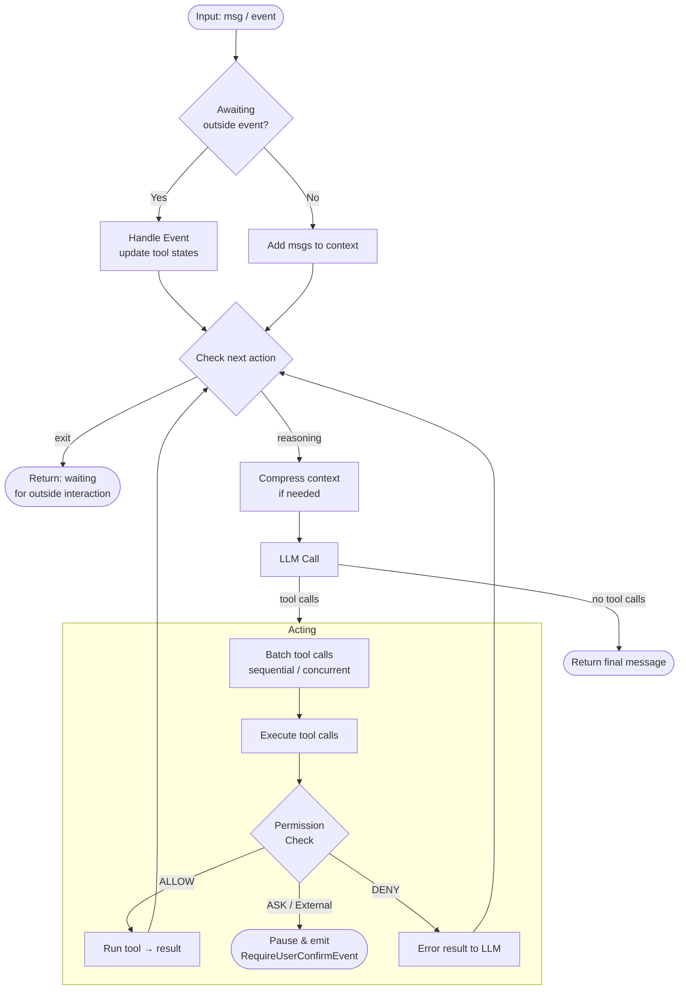

## Overview

`Agent` is the core abstraction in AgentScope — a **stateless** reasoning-acting loop engine that integrates models, tools, the permission system, human-in-the-loop, context management, middlewares, state management, and the event system into a single unified interface.

Its primary responsibilities are:

- Accepting input messages or events, invoking tools to complete tasks
- Managing context, including context compression and offloading
- Providing middleware hooks at key lifecycle stages for custom logic
- Automatically managing concurrent and sequential tool execution

### Core Interfaces

The main interfaces of the `Agent` class are as follows:

| Method                             | Description                                                           |
|------------------------------------|-----------------------------------------------------------------------|
| `reply(inputs)`                    | Run the reasoning-acting loop and return the final `Msg`              |
| `reply_stream(inputs)`             | Same as `reply`, but yields `AgentEvent` objects as they are produced |
| `observe(msgs)`                    | Add messages to context without triggering reasoning                  |
| `compress_context(context_config)` | Compress the context if token count exceeds the threshold             |

### Main Loop

The agent runs a reasoning-acting loop on every `reply` call. The diagram below shows the main control flow.



## Configure Agent

Pass parameters to `Agent(...)` at initialization. The examples below cover the most common setups.

<CodeGroup>

```python Minimal Setup
from agentscope.agent import Agent
from agentscope.model import DashScopeChatModel
from agentscope.credential import DashScopeCredential

agent = Agent(
    name="my_agent",
    system_prompt="You are a helpful assistant.",
    model=DashScopeChatModel(
        credential=DashScopeCredential(api_key="YOUR_API_KEY"),
        model="qwen-max",
    ),
)
```

```python With Tools / MCP / Skills
import os
from agentscope.agent import Agent
from agentscope.tool import Toolkit, Bash, Edit, Grep, Read, Write
from agentscope.mcp import MCPClient, HttpMCPConfig
from agentscope.model import DashScopeChatModel
from agentscope.credential import DashScopeCredential

agent = Agent(
    name="my_agent",
    system_prompt="You are a helpful assistant.",
    model=DashScopeChatModel(
        credential=DashScopeCredential(api_key="YOUR_API_KEY"),
        model="qwen-max",
    ),
    toolkit=Toolkit(
        tools=[Bash(), Edit(), Grep(), Read(), Write()],
        mcps=[
            MCPClient(
                name="amap",
                is_stateful=False,
                mcp_config=HttpMCPConfig(
                    url=f"https://mcp.amap.com/mcp?key={os.environ['AMAP_API_KEY']}",
                ),
            ),
        ],
        skills_or_loaders=["./skills"],
    ),
)
```

```python With Custom Context Config
from agentscope.agent import Agent
from agentscope.agent import ContextConfig
from agentscope.model import DashScopeChatModel
from agentscope.credential import DashScopeCredential

agent = Agent(
    name="my_agent",
    system_prompt="You are a helpful assistant.",
    model=DashScopeChatModel(
        credential=DashScopeCredential(api_key="YOUR_API_KEY"),
        model="qwen-max",
    ),
    context_config=ContextConfig(
        trigger_ratio=0.7,       # compress when 70% of context is used
        reserve_ratio=0.2,       # keep the most recent 20% after compression
        tool_result_limit=1000,  # truncate tool results at 1000 tokens
    ),
)
```

</CodeGroup>

### Parameters

| Parameter | Type | Default | Description |
|-----------|------|---------|-------------|
| `name` | `str` | required | Agent identifier, used in messages and logs |
| `system_prompt` | `str` | required | The agent's base system prompt |
| `model` | `ChatModelBase` | required | The LLM used for reasoning |
| `toolkit` | `Toolkit \| None` | `None` | Manages tools, MCP clients, skills, and tool groups |
| `state` | `AgentState \| None` | auto-created | Holds context, permission context, and session state |
| `offloader` | `Offloader \| None` | `None` | Offloads compressed context and tool results; must implement the `Offloader` protocol |
| `middlewares` | `list[MiddlewareBase] \| None` | `None` | Applied at reply, reasoning, acting, model call, and system prompt hooks |
| `model_config` | `ModelConfig` | default | Retry count and fallback model |
| `context_config` | `ContextConfig` | default | Context compression thresholds and tool result limits |
| `react_config` | `ReActConfig` | default | Max iterations and rejection handling |

## Run the Agent

Both `reply` and `reply_stream` accept the same `inputs` parameter and drive the same reasoning-acting loop. The difference is in how results are delivered.

The `inputs` parameter accepts:

- A single `Msg` or a list of `Msg` objects — starts a new reply
- A `UserConfirmResultEvent` or `ExternalExecutionResultEvent` — resumes from a paused state
- `None` — continue from the current state without new input

### reply

`reply` consumes all events internally and returns the final `Msg` when the agent finishes or pauses for outside interaction.

```python
import asyncio
from agentscope.message import UserMsg

async def main():
    msg = UserMsg(name="user", content="What files are in the current directory?")
    result = await agent.reply(msg)
    print(result.get_text_content())

asyncio.run(main())
```

### reply_stream

`reply_stream` yields `AgentEvent` objects as they are produced, letting you stream text output, tool call progress, and lifecycle events to the user in real time.

```python
async def main():
    msg = UserMsg(name="user", content="Summarize the README.")
    async for event in agent.reply_stream(msg):
        if hasattr(event, "delta"):
            print(event.delta, end="", flush=True)

asyncio.run(main())
```

### observe

Use `observe` to inject messages into the agent's context without triggering a reply — useful in multi-agent setups where one agent needs to see another's output.

```python
await agent.observe(other_agent_msg)
```

## Compress Context

The agent automatically compresses its context when the token count exceeds `context_config.trigger_ratio × model.context_length`. Compression summarizes older messages and, if an `offloader` is configured, offloads them to disk.

You can also trigger compression manually:

```python
from agentscope.agent import ContextConfig

# Use the agent's default config
await agent.compress_context()

# Or pass a custom config for this call only
await agent.compress_context(
    ContextConfig(trigger_ratio=0.6, reserve_ratio=0.2)
)
```

<Note>
If the system prompt alone exceeds the compression threshold, `compress_context` raises a `RuntimeError`. Keep system prompts concise or increase the model's context length.
</Note>

Tool results that exceed `tool_result_limit` tokens are truncated automatically. If an `offloader` is set, the truncated portion is offloaded and the agent receives a path reference it can read on demand.

## Human-in-the-Loop

The agent pauses execution and emits special events when it encounters two situations: a tool call that requires **user confirmation** (permission system returns ASK), or a tool marked as **external execution** (the result must come from outside the agent). In both cases, you resume the agent by passing a result event back via `reply`.

### User Confirmation

When the permission system determines a tool call needs user approval, the agent emits a `RequireUserConfirmEvent` and pauses.

<Steps>
  <Step title="Receive the RequireUserConfirmEvent">
    Use `reply_stream` to detect the pause. The event has the following structure:

    <ParamField path="reply_id" type="str" required>
      ID of the current reply, used to resume the agent.
    </ParamField>
    <ParamField path="tool_calls" type="list[ToolCallBlock]" required>
      Tool calls pending user confirmation. Each `ToolCallBlock` contains:
      <Expandable>
        <ParamField path="id" type="str">Unique identifier for this tool call.</ParamField>
        <ParamField path="name" type="str">The tool name (e.g. `"Bash"`, `"Write"`).</ParamField>
        <ParamField path="input" type="str">JSON-encoded input parameters.</ParamField>
        <ParamField path="suggested_rules" type="list[PermissionRule]">Auto-generated permission rules the user can accept to allow similar future calls.</ParamField>
      </Expandable>
    </ParamField>

    ```python
    from agentscope.event import RequireUserConfirmEvent

    async for event in agent.reply_stream(msg):
        if isinstance(event, RequireUserConfirmEvent):
            for tc in event.tool_calls:
                print(f"Tool: {tc.name}, Input: {tc.input}")
                print(f"Suggested rules: {tc.suggested_rules}")
    ```
  </Step>
  <Step title="Build the confirmation result">
    For each pending tool call, create a `ConfirmResult` indicating whether to allow or deny it. You can also modify the tool call input or accept suggested permission rules:

    ```python
    from agentscope.event import ConfirmResult, UserConfirmResultEvent

    confirm_results = []
    for tc in event.tool_calls:
        confirm_results.append(ConfirmResult(
            confirmed=True,           # or False to deny
            tool_call=tc,             # pass back (optionally modified)
            rules=tc.suggested_rules, # accept rules for future auto-allow
        ))
    ```
  </Step>
  <Step title="Resume the agent">
    Pass the `UserConfirmResultEvent` back to `reply` or `reply_stream`:

    ```python
    confirm_event = UserConfirmResultEvent(
        reply_id=event.reply_id,
        confirm_results=confirm_results,
    )
    result = await agent.reply(confirm_event)
    ```

    - **Confirmed** tool calls execute immediately and the agent continues reasoning
    - **Denied** tool calls produce an error result visible to the LLM, which may retry with a different approach
    - **Accepted rules** are persisted to the permission engine — matching future calls are auto-allowed without prompting again
  </Step>
</Steps>

### External Tool Execution

When the agent calls a tool with `is_external_tool = True`, it emits a `RequireExternalExecutionEvent` and pauses. The tool's logic runs outside the agent — typically by a human operator or an external system.

<Steps>
  <Step title="Receive the RequireExternalExecutionEvent">
    The event has the following structure:

    <ParamField path="reply_id" type="str" required>
      ID of the current reply, used to resume the agent.
    </ParamField>
    <ParamField path="tool_calls" type="list[ToolCallBlock]" required>
      Tool calls to be executed externally. Each `ToolCallBlock` contains:
      <Expandable>
        <ParamField path="id" type="str">Unique identifier for this tool call.</ParamField>
        <ParamField path="name" type="str">The external tool name.</ParamField>
        <ParamField path="input" type="str">JSON-encoded input parameters.</ParamField>
      </Expandable>
    </ParamField>

    ```python
    from agentscope.event import RequireExternalExecutionEvent

    async for event in agent.reply_stream(msg):
        if isinstance(event, RequireExternalExecutionEvent):
            for tc in event.tool_calls:
                print(f"Execute externally: {tc.name}({tc.input})")
    ```
  </Step>
  <Step title="Execute externally and build results">
    Run the operation outside the agent and wrap the results as `ToolResultBlock` objects:

    ```python
    from agentscope.message import ToolResultBlock, TextBlock, ToolResultState
    from agentscope.event import ExternalExecutionResultEvent

    execution_results = []
    for tc in event.tool_calls:
        # Perform the actual operation (API call, human action, etc.)
        output = await run_external_operation(tc.name, tc.input)

        execution_results.append(ToolResultBlock(
            id=tc.id,
            name=tc.name,
            output=[TextBlock(text=output)],
            state=ToolResultState.SUCCESS,
        ))
    ```
  </Step>
  <Step title="Resume the agent">
    Pass the `ExternalExecutionResultEvent` back to resume:

    ```python
    external_event = ExternalExecutionResultEvent(
        reply_id=event.reply_id,
        execution_results=execution_results,
    )
    result = await agent.reply(external_event)
    ```

    The results are injected into the agent's context and reasoning continues from where it left off.
  </Step>
</Steps>

<Tip>
Use `reply_stream` when building interactive UIs — it lets you detect pause events in real time and prompt the user immediately. Use `reply` when you have pre-built automation that handles events programmatically.
</Tip>

## Persist Agent State

`AgentState` is a Pydantic model that holds everything needed to resume an agent exactly where it left off — conversation context, compression summary, permission rules, tool state, and the current reply position. Because it is a plain Pydantic model, it serialises to JSON and can be stored in any backend.

`RedisStorage` is the built-in storage backend. It organises state under a `(user_id, agent_id, session_id)` key hierarchy and exposes two focused methods for the hot path:

| Method | Description |
|--------|-------------|
| `get_session(user_id, agent_id, session_id)` | Load a `SessionRecord` whose `.state` field is the saved `AgentState` |
| `update_session_state(user_id, agent_id, session_id, state)` | Persist the updated `AgentState` back to Redis after a reply |

```python
import asyncio
from agentscope.agent import Agent
from agentscope.state import AgentState
from agentscope.model import DashScopeChatModel
from agentscope.credential import DashScopeCredential
from agentscope.message import UserMsg
from agentscope.app.storage import RedisStorage

USER_ID = "user_123"
AGENT_ID = "agent_456"
SESSION_ID = "session_789"

async def main():
    async with RedisStorage(host="localhost", port=6379) as storage:
        # Load state from storage, fall back to a fresh state if not found
        record = await storage.get_session(
            user_id=USER_ID,
            agent_id=AGENT_ID,
            session_id=SESSION_ID,
        )
        state = record.state if record else AgentState()

        # Create the agent with the restored state
        agent = Agent(
            name="my_agent",
            system_prompt="You are a helpful assistant.",
            model=DashScopeChatModel(
                credential=DashScopeCredential(api_key="YOUR_API_KEY"),
                model="qwen-max",
            ),
            state=state,
        )

        # Run a reply turn
        result = await agent.reply(
            UserMsg(name="user", content="Continue where we left off."),
        )
        print(result.get_text_content())

        # Persist the updated state back to Redis
        await storage.update_session_state(
            user_id=USER_ID,
            agent_id=AGENT_ID,
            session_id=SESSION_ID,
            state=agent.state,
        )

asyncio.run(main())
```

<Note>
`update_session_state` raises `KeyError` if the session does not exist yet. Use `upsert_session` to create the session record on the first turn, then switch to `update_session_state` for subsequent turns.
</Note>

## Further Reading

<CardGroup cols={2}>
  <Card title="Permission System" href="/v2/building-blocks/permission-system">
    Control which tools the agent can call and under what conditions.
  </Card>
  <Card title="Middleware" href="/v2/building-blocks/middleware">
    Intercept and modify agent behavior at reply, reasoning, acting, and model call hooks.
  </Card>
</CardGroup>
