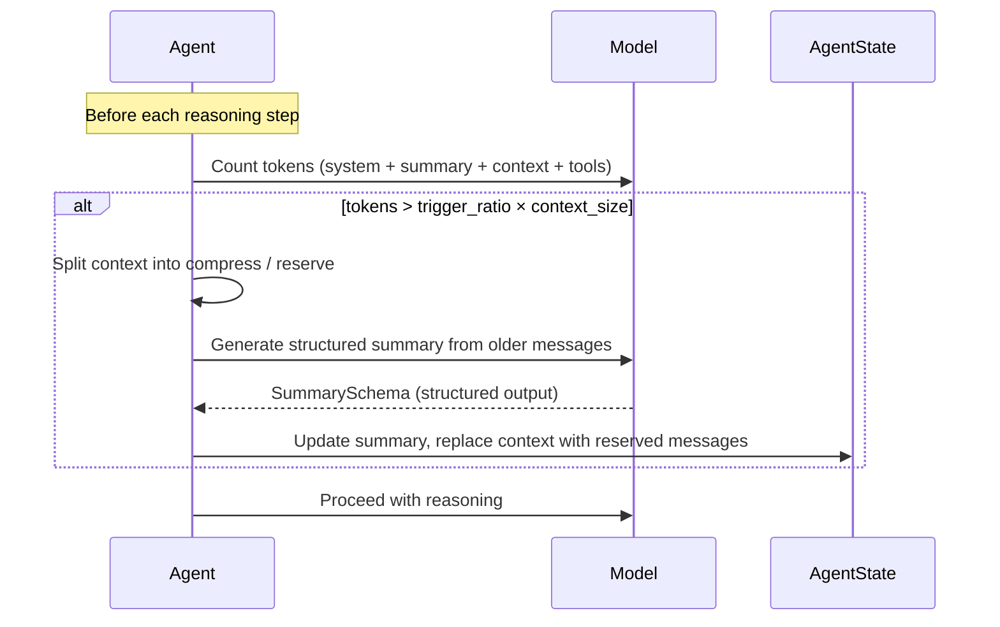

The context is the working memory of an agent — the sequence of messages (user inputs, assistant responses, tool calls and results) that the LLM sees on each reasoning step. As conversations grow, this context eventually exceeds the model's capacity.

AgentScope provides three mechanisms to keep agents running indefinitely without losing critical information:

- **Context compression** — summarizes older messages into a structured summary when the token count approaches the model's limit
- **Tool result compression** — truncates oversized tool outputs before they enter the context
- **Context offloading** — persists compressed content to external storage for later retrieval

## Assemble the System Prompt

Before each model call, the agent assembles the full input from several sources:

```
┌─────────────────────────────────────────────────────┐
│                   Model Input                         │
├─────────────────────────────────────────────────────┤
│  1. System Prompt                                    │
│     ├── Base system prompt                           │
│     ├── Skill instructions (from Toolkit)            │
│     └── Middleware transforms (on_system_prompt)     │
├─────────────────────────────────────────────────────┤
│  2. Summary (compressed history, if any)             │
├─────────────────────────────────────────────────────┤
│  3. Context (recent uncompressed messages)           │
└─────────────────────────────────────────────────────┘
```

The agent builds this input via `_prepare_model_input()` before every model call. The system prompt is assembled in `_get_system_prompt()`:

1. Start with the base `system_prompt` passed at agent creation
2. Append skill instructions — a list of available skills (name + description) so the agent knows what skills it can invoke
3. Apply `on_system_prompt` middlewares sequentially — each middleware receives the current prompt string and returns a transformed version

<Tip>
Use the `on_system_prompt` middleware hook to inject dynamic context like workspace instructions, time-sensitive information, or environment details without modifying the base prompt.
</Tip>

## Compact Context

AgentScope automatically manages context size through `ContextConfig`, which controls two mechanisms: **context compression** (summarizing older messages) and **tool result truncation** (capping oversized tool outputs). Both activate transparently — the agent continues working without interruption.

### Configure ContextConfig

```python
from agentscope import Agent
from agentscope.agent import ContextConfig

agent = Agent(
    name="my_agent",
    system_prompt="...",
    model=model,
    toolkit=toolkit,
    context_config=ContextConfig(
        trigger_ratio=0.8,
        reserve_ratio=0.1,
        tool_result_limit=3000,
    ),
)
```

| Parameter            | Default         | Description                                                                                                       |
|----------------------|-----------------|-------------------------------------------------------------------------------------------------------------------|
| `trigger_ratio`      | `0.8`           | Context compression activates when token usage exceeds this ratio of the model's context size (maximum value 0.9) |
| `reserve_ratio`      | `0.1`           | Proportion of context tokens to keep as recent messages after compression                                         |
| `tool_result_limit`  | `3000`          | Maximum tokens per tool result; outputs exceeding this are truncated                                              |
| `compression_prompt` | *(built-in)*    | The prompt that guides the model to generate the summary                                                          |
| `summary_template`   | *(built-in)*    | String template for formatting the summary into the context                                                       |
| `summary_schema`     | `SummarySchema` | JSON Schema that constrains the model's structured summary output                                                 |

### Context Compression

Before each reasoning step, the agent counts the total tokens (system prompt + summary + context + tool schemas). When the count exceeds `trigger_ratio × context_size`, the compression process activates:



The compression process:

1. **Context splitting** — messages are split into older messages (to compress) and recent messages (to reserve), preserving tool call/result pairs intact
2. **Summary generation** — the model generates a structured summary from the older messages
3. **State update** — the summary replaces the compressed messages; reserved messages become the new context

The structured summary contains five fields designed to preserve critical information for task continuation:

| Field | Purpose |
|-------|---------|
| `task_overview` | The user's core request and success criteria |
| `current_state` | What has been completed, files modified, artifacts produced |
| `important_discoveries` | Technical constraints, decisions, errors encountered |
| `next_steps` | Specific actions needed to complete the task |
| `context_to_preserve` | User preferences, domain-specific details, promises made |

<Note>
The remaining 10% between `trigger_ratio` (max 0.9) and the full context size is reserved for the compression model call itself — the model needs room to generate the summary.
</Note>

### Tool Result Truncation

After each tool execution, the agent checks whether the result exceeds `tool_result_limit` tokens. If it does, the result is split into a reserved portion (kept in context) and an offloaded portion (persisted to workspace storage if available).

A truncation marker is appended so the agent knows the output was incomplete:

```
<<<TRUNCATED>>>
<system-reminder>The remaining content has been omitted for limited context.</system-reminder>
```

<Warning>
Setting `tool_result_limit` too low may cause the agent to miss critical information in tool outputs. Setting it too high risks filling the context with a single result, leaving insufficient room for reasoning.
</Warning>

## Offload Context to Storage

When context is compressed or tool results are truncated, the removed content is not lost — it can be offloaded to external storage via the workspace. This enables the agent to retrieve historical context when needed, supporting long-running tasks that span many interactions.

Context offloading serves two purposes:

1. **Auditability** — the full history of compressed context is preserved for debugging or review
2. **Agentic retrieval** — the agent can use its file tools (Read, Grep, Glob) to search through offloaded content when it needs to recall details that were compressed away

### WorkspaceBase Interface

The `WorkspaceBase` abstract class defines the offloading contract. Any workspace implementation must provide these two methods:

| Method | Description |
|--------|-------------|
| `offload_context(session_id, msgs)` | Persist compressed messages to storage; returns the storage path |
| `offload_tool_result(session_id, tool_result)` | Persist a truncated tool result to storage; returns the storage path |

### Built-in: LocalWorkspace

The `LocalWorkspace` implementation stores offloaded content as local files:

<Tree>
  <Tree.Folder name="{workdir}" defaultOpen>
    <Tree.Folder name="data" defaultOpen>
      <Tree.File name="{sha256}.png" />
    </Tree.Folder>
    <Tree.Folder name="sessions" defaultOpen>
      <Tree.Folder name="{session_id}" defaultOpen>
        <Tree.File name="context.jsonl" />
        <Tree.File name="tool_result-{tool_id}.txt" />
      </Tree.Folder>
    </Tree.Folder>
    <Tree.Folder name="skills">
      <Tree.File name="..." />
    </Tree.Folder>
  </Tree.Folder>
</Tree>

- `context.jsonl` — compressed messages appended as JSON Lines on each compression cycle
- `tool_result-{id}.txt` — plain text extraction of truncated tool outputs
- `data/` — multimodal files (images, etc.) deduplicated by SHA-256 content hash

### Create a Custom Workspace

To offload context to a different backend (e.g., a database, cloud storage, or vector store), subclass `WorkspaceBase` and implement the offloading methods:

```python
from agentscope.workspace import WorkspaceBase
from agentscope.message import Msg, ToolResultBlock
from typing import Any, Literal

class S3Workspace(WorkspaceBase):
    type: Literal["s3"] = "s3"
    bucket: str
    prefix: str

    async def initialize(self) -> None:
        # Set up S3 client, create bucket prefix, etc.
        ...

    async def close(self) -> None:
        # Clean up connections
        ...

    async def offload_context(
        self,
        session_id: str,
        msgs: list[Msg],
        **kwargs: Any,
    ) -> str:
        key = f"{self.prefix}/sessions/{session_id}/context.jsonl"
        content = "\n".join(m.model_dump_json() for m in msgs)
        await self._upload(self.bucket, key, content)
        return f"s3://{self.bucket}/{key}"

    async def offload_tool_result(
        self,
        session_id: str,
        tool_result: ToolResultBlock,
        **kwargs: Any,
    ) -> str:
        key = f"{self.prefix}/sessions/{session_id}/tool_result-{tool_result.id}.txt"
        # Extract text content from tool result blocks
        ...
        return f"s3://{self.bucket}/{key}"
```

<Note>
Context offloading requires a workspace to be attached to the agent. Without a workspace, compressed messages and truncated tool results are discarded after removal from the context window.
</Note>

## Further Reading

<CardGroup cols={2}>
  <Card title="Agent" icon="robot" href="/v2/building-blocks/agent">
    The ReAct loop and how context flows through reasoning steps
  </Card>
  <Card title="Middleware" icon="layer-group" href="/v2/building-blocks/middleware">
    Intercept model calls and system prompt composition with middleware hooks
  </Card>
  <Card title="Tool" icon="wrench" href="/v2/building-blocks/tool">
    Tools that produce results subject to compression
  </Card>
  <Card title="Permission System" icon="shield" href="/v2/building-blocks/permission-system">
    How permission context integrates with agent state
  </Card>
</CardGroup>
