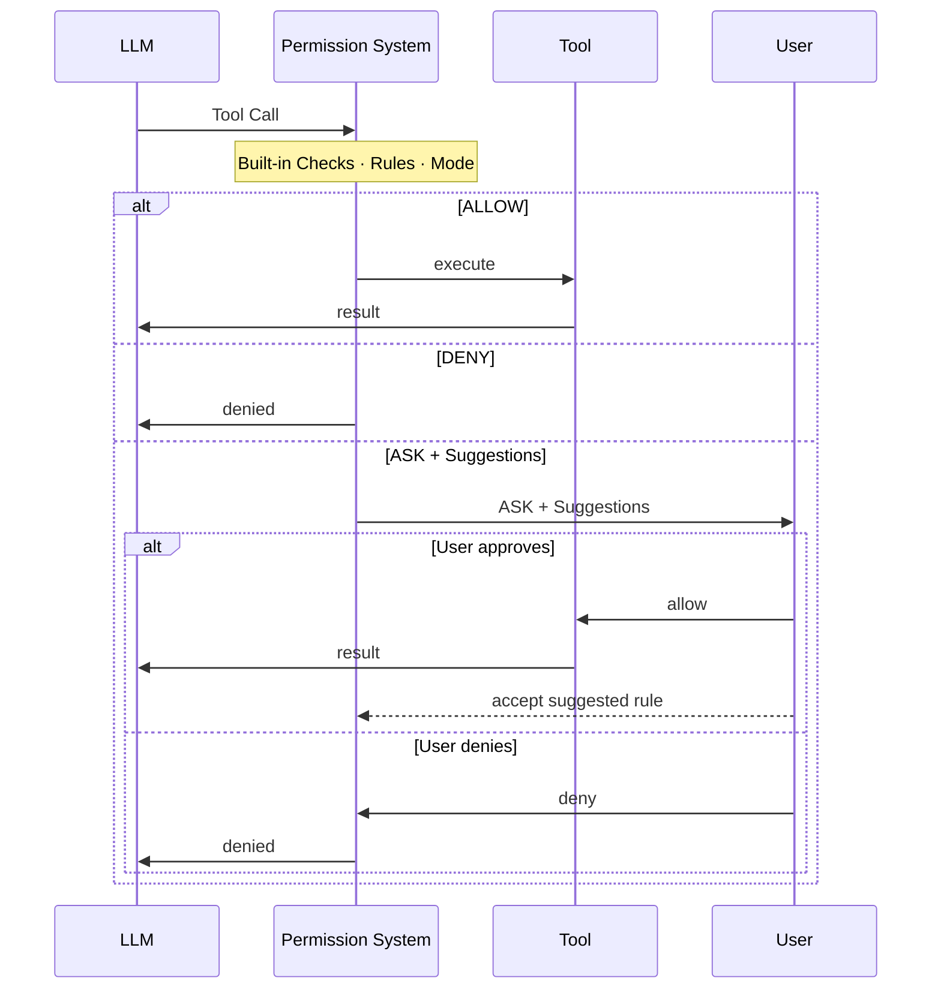
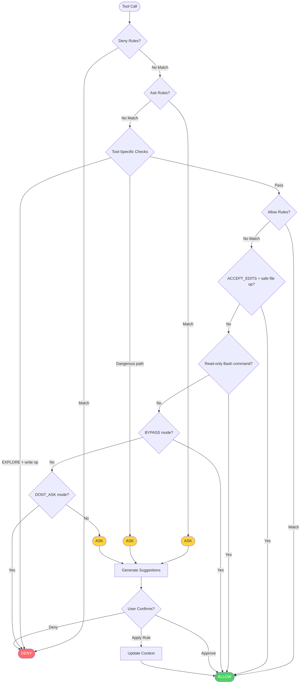

## Overview

The permission system intercepts every tool call an agent makes and produces one of three decisions: **allow** the tool to execute, **deny** it, or **ask the user** for confirmation.

Age system combines static configuration with dynamic runtime analysis. Three components drive the decision together:

- **Rules** — explicit allow/deny/ask patterns per tool and command, evaluated with highest priority. Rules have two sources: statically pre-configured in `PermissionContext`, or dynamically added when the user accepts a **suggested rule** during an ASK prompt. Suggestions are auto-generated from the current tool call, so accepting one means future identical calls are handled automatically without prompting again.
- **Mode** — a static global policy set at configuration time; determines default behavior for all calls that match no rules (e.g., `EXPLORE` makes the agent read-only; `DONT_ASK` silently denies unmatched calls).
- **Built-in checks** — dynamic runtime analysis performed by the tools themselves against actual call inputs: read-only command detection (parsing the bash command at call time) and dangerous path protection (checking the real file path or command target). Because these are runtime checks rather than pre-configured patterns, they are bypass-immune and cannot be overridden by mode or rules.



<AccordionGroup>
  <Accordion title="Detailed decision flow">

  </Accordion>
</AccordionGroup>

<Note>
Deny rules and dangerous path checks are **bypass-immune** — they apply even in `BYPASS` mode.
</Note>

## Permission Mode

AgentScope supports the following modes, each suited to a different deployment scenario.

| Mode | Behavior | Use Case |
|------|----------|----------|
| `DEFAULT` | All ops require explicit rules or user confirmation | Most secure, recommended default |
| `ACCEPT_EDITS` | Auto-allow file ops in working directories | Active development with user present |
| `EXPLORE` | Read-only: allow reads, deny all writes and commands | Code exploration, planning |
| `BYPASS` | Allow everything (deny/ask rules still apply) | Fully trusted sandbox |
| `DONT_ASK` | Convert all ASK → DENY | Unattended / scheduled execution |

Set the mode via `AgentState.permission_context` when creating the agent, or update it at runtime.

<CodeGroup>
```python At initialization
from agentscope import Agent
from agentscope.state import AgentState
from agentscope.permission import PermissionContext, PermissionMode

agent = Agent(
    name="my_agent",
    system_prompt="...",
    model=model,
    state=AgentState(
        permission_context=PermissionContext(
            mode=PermissionMode.DEFAULT,
        )
    ),
)
```

```python At runtime
# Switch to read-only mode on the fly
agent.state.permission_context.mode = PermissionMode.EXPLORE

# Switch to unattended mode for batch execution
agent.state.permission_context.mode = PermissionMode.DONT_ASK
```

```python ACCEPT_EDITS with working directory
from agentscope.permission import AdditionalWorkingDirectory

agent = Agent(
    name="my_agent",
    system_prompt="...",
    model=model,
    state=AgentState(
        permission_context=PermissionContext(
            mode=PermissionMode.ACCEPT_EDITS,
            working_directories={
                "/my/project": AdditionalWorkingDirectory(
                    path="/my/project",
                    source="userSettings",
                )
            },
        )
    ),
)
```
</CodeGroup>

## Permission Rules

A `PermissionRule` maps a specific tool and call pattern to one of three behaviors: `ALLOW`, `DENY`, or `ASK`.

Each rule consists of the following fields. When the permission engine evaluates a rule, it calls the tool's `match_rule()` method with `rule_content` and the actual call input to determine whether the rule applies.

<ParamField path="tool_name" type="str" required>
  Tool this rule applies to: `"Bash"`, `"Read"`, `"Write"`, `"Edit"`, or any custom tool name.
</ParamField>

<ParamField path="rule_content" type="str | None" required>
  Match pattern — semantics depend on `tool_name`:
  - **Bash**: wildcard prefix pattern (`npm run:*` matches `npm run build`, `npm run test`)
  - **Read / Write / Edit**: glob pattern (`src/**/*.py` matches any `.py` under `src/`)
  - **Other tools**: exact JSON-serialized parameter match
</ParamField>

<ParamField path="behavior" type="PermissionBehavior" required>
  `ALLOW`, `DENY`, or `ASK`
</ParamField>

<ParamField path="source" type="str" required>
  Origin of the rule: `"userSettings"`, `"projectSettings"`, `"session"`, etc.
</ParamField>

### Pattern Examples

`rule_content` is consumed by each tool's `match_rule()` method and auto-generated by `ToolBase.generate_suggestions()`. Because both methods are part of the tool interface, each tool can define its own pattern syntax and matching logic independently.

For AgentScope's built-in tools, the patterns are as follows:

<Tabs>
  <Tab title="Bash">
    Matches against the **`command`** parameter. Pattern format is `COMMAND_PREFIX:*` — the prefix is the leading token of the command, and `*` matches any arguments that follow.

    | Pattern | Matches | Does Not Match |
    |---------|---------|----------------|
    | `npm run:*` | `npm run build`, `npm run test` | `npm install` |
    | `git commit:*` | `git commit -m "fix"` | `git push` |
    | `rm:*` | `rm file.txt`, `rm -rf /tmp/x` | `ls` |

    ```python
    PermissionRule(
        tool_name="Bash",
        rule_content="npm run:*",
        behavior=PermissionBehavior.ALLOW,
        source="userSettings",
    )
    ```
  </Tab>
  <Tab title="File Tools (Read / Write / Edit)">
    Matches against the **`file_path`** parameter using a glob pattern via `fnmatch`.

    | Pattern | Matches |
    |---------|---------|
    | `src/**` | Any file under `src/` |
    | `src/**/*.py` | Python files under `src/` |
    | `config.json` | Exact file match |

    ```python
    PermissionRule(
        tool_name="Write",
        rule_content="src/**",
        behavior=PermissionBehavior.ALLOW,
        source="userSettings",
    )
    ```
  </Tab>
</Tabs>

### Configuring Rules

**At initialization** — pass rules into `PermissionContext` when creating the agent:

```python
from agentscope import Agent
from agentscope.state import AgentState
from agentscope.permission import (
    PermissionContext, PermissionMode, PermissionRule, PermissionBehavior
)

agent = Agent(
    name="my_agent",
    system_prompt="...",
    model=model,
    state=AgentState(
        permission_context=PermissionContext(
            mode=PermissionMode.DEFAULT,
            allow_rules={
                "Bash": [PermissionRule(tool_name="Bash", rule_content="npm run:*",
                                        behavior=PermissionBehavior.ALLOW, source="userSettings")],
                "Write": [PermissionRule(tool_name="Write", rule_content="src/**",
                                         behavior=PermissionBehavior.ALLOW, source="userSettings")],
            },
            deny_rules={
                "Bash": [PermissionRule(tool_name="Bash", rule_content="rm:*",
                                        behavior=PermissionBehavior.DENY, source="userSettings")],
            },
        )
    ),
)
```

**At runtime via suggestions** — when the permission system returns ASK, it auto-generates suggested rules from the current call. Pass accepted rules back in `UserConfirmResultEvent.rules`; the agent adds them to the engine automatically:

```python
from agentscope.event import UserConfirmResultEvent

# The ASK decision includes suggested_rules generated from the current call.
# To accept a suggestion, include it in the result event:
result = UserConfirmResultEvent(
    confirmed=True,
    rules=[suggested_rule],  # accepted rules are persisted to the engine
)
```
## Built-in Checks

Each tool implements a `check_permissions()` method that runs against the actual call inputs at runtime. These checks are bypass-immune — they apply regardless of mode or rules. AgentScope's built-in tools cover three areas:

- **Dangerous path protection** — `Write`, `Edit`, and `Bash` check whether the target file or command touches sensitive paths. Always triggers ASK, even in `BYPASS` mode.
- **Read-only command detection** — `Bash` parses the command string to detect read-only operations and auto-allows them.
- **ACCEPT_EDITS mode** — `Write` and `Edit` auto-allow operations on files within configured working directories.

Custom tools can implement their own checks by overriding `check_permissions()`:

```python
from agentscope.tool import ToolBase
from agentscope.permission import PermissionContext, PermissionDecision, PermissionBehavior

class MyTool(ToolBase):
    name = "MyTool"
    is_read_only = False

    async def check_permissions(
        self,
        tool_input: dict,
        context: PermissionContext,
    ) -> PermissionDecision:
        target = tool_input.get("target")

        # Custom safety check: block operations on production resources
        if target and target.startswith("prod-"):
            return PermissionDecision(
                behavior=PermissionBehavior.ASK,
                message=f"Operation targets production resource: {target}",
            )

        # Return PASSTHROUGH to let the engine continue with rules/mode
        return PermissionDecision(behavior=PermissionBehavior.PASSTHROUGH)
```

### Read-Only Commands

Common read-only bash commands are auto-allowed without any rules. A compound command (`&&`, `||`, `;`, `|`) is read-only only if **all** subcommands are read-only. Output redirections (`>`, `>>`) always make a command non-read-only.

<AccordionGroup>
  <Accordion title="Full read-only command list">
    | Category | Commands |
    |----------|----------|
    | Git | `git status`, `git log`, `git diff`, `git show`, `git branch`, `git blame`, `git grep`, `git reflog`, `git config --list` |
    | Files | `ls`, `cat`, `head`, `tail`, `grep`, `rg`, `find`, `tree`, `stat`, `wc`, `pwd`, `which` |
    | Docker | `docker ps`, `docker images`, `docker logs`, `docker inspect`, `docker info` |
    | GitHub CLI | `gh repo view`, `gh issue list`, `gh pr list`, `gh status` |
    | Package managers | `npm list`, `pip list`, `pip show`, `node --version`, `python --version` |
  </Accordion>
</AccordionGroup>

### Dangerous Path Protection

<Warning>
Operations targeting the following paths always trigger an ASK, even in `BYPASS` mode.
</Warning>

| Category | Paths |
|----------|-------|
| Shell configs | `.bashrc`, `.zshrc`, `.bash_profile`, `.profile` |
| Git configs | `.gitconfig`, `.gitmodules` |
| SSH | `.ssh/config`, `.ssh/authorized_keys`, `id_rsa`, `id_ed25519` |
| Credentials | `.env`, `.env.local`, `.npmrc`, `.pypirc`, `.aws/credentials` |
| Directories | `.git/`, `.ssh/`, `.claude/`, `.vscode/`, `.aws/`, `.kube/` |

## Common Recipes

The following examples show how to configure `AgentState.permission_context` for common deployment scenarios. Each recipe combines a mode with rules to match a specific use case.

<CodeGroup>
```python Read-only exploration
# EXPLORE mode: agent can read, grep, and glob freely,
# but all writes and bash commands are denied automatically.
agent = Agent(
    name="explorer",
    system_prompt="...",
    model=model,
    state=AgentState(
        permission_context=PermissionContext(mode=PermissionMode.EXPLORE)
    ),
)
# Agents can read/grep/glob freely; all writes and bash commands are denied
```

```python Unattended automation
from agentscope.permission import PermissionRule, PermissionBehavior

agent = Agent(
    name="ci_agent",
    system_prompt="...",
    model=model,
    state=AgentState(
        permission_context=PermissionContext(
            mode=PermissionMode.DONT_ASK,
            allow_rules={
                "Bash": [
                    PermissionRule(tool_name="Bash", rule_content="npm run:*",
                                   behavior=PermissionBehavior.ALLOW, source="project"),
                    PermissionRule(tool_name="Bash", rule_content="git commit:*",
                                   behavior=PermissionBehavior.ALLOW, source="project"),
                ],
            },
        )
    ),
)
# Only explicitly allowed commands run; everything else is denied silently
```

```python Block dangerous commands
agent = Agent(
    name="my_agent",
    system_prompt="...",
    model=model,
    state=AgentState(
        permission_context=PermissionContext(
            mode=PermissionMode.BYPASS,
            deny_rules={
                "Bash": [
                    PermissionRule(tool_name="Bash", rule_content="rm:*",
                                   behavior=PermissionBehavior.DENY, source="userSettings"),
                    PermissionRule(tool_name="Bash", rule_content="git push:*",
                                   behavior=PermissionBehavior.DENY, source="userSettings"),
                ],
            },
        )
    ),
)
# Everything allowed except rm and git push (deny rules are bypass-immune)
```
</CodeGroup>