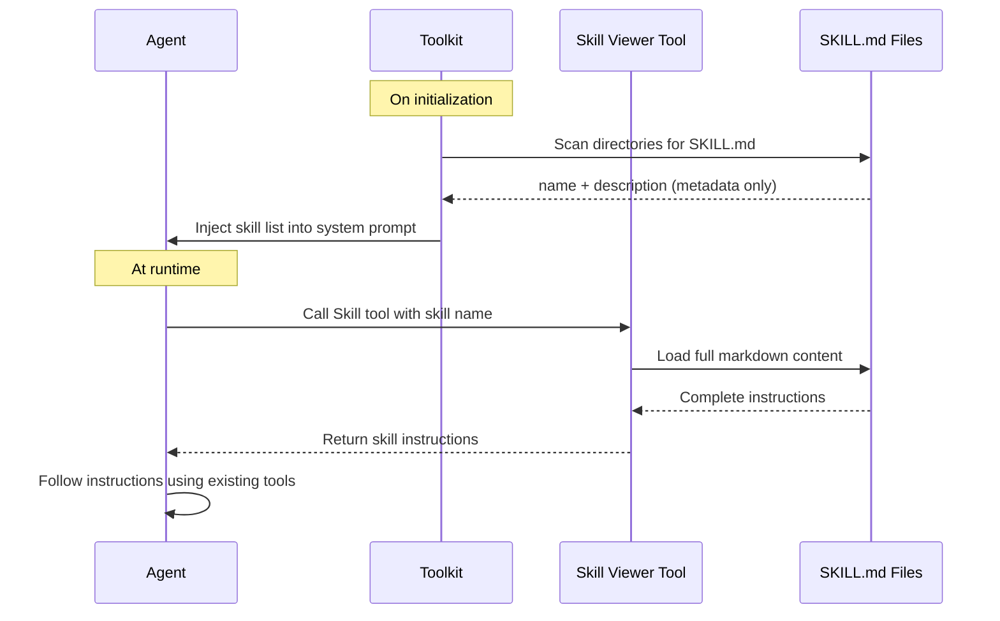

Tools are the primary mechanism for agents to interact with the outside world in AgentScope. A tool encapsulates a discrete capability — executing shell commands, reading files, calling APIs — and exposes it to the agent through a structured JSON schema interface.

AgentScope supports three categories of tools:

- **Tool** — Python-based tools that implement the `ToolBase` interface or wrap plain functions
- **MCP** — Tools sourced from [Model Context Protocol](https://modelcontextprotocol.io/) servers
- **Skills** — Markdown-based instruction sets that guide agents through multi-step workflows

## Python Tool

AgentScope provides the `ToolBase` abstract class as the foundation for all tools. Each tool declares its schema, permission behavior, and execution logic.

### ToolBase Interface

The following tables describe the attributes and methods on `ToolBase`.

**Attributes**

| Attribute | Type | Description |
|---|---|---|
| `name` | `str` | The tool name presented to the agent |
| `description` | `str` | Agent-oriented description of what the tool does |
| `input_schema` | `dict` | JSON Schema defining the tool's parameters |
| `is_concurrency_safe` | `bool` | Whether the tool can be called in parallel |
| `is_read_only` | `bool` | Whether the tool only reads data without side effects |
| `is_external_tool` | `bool` | If `True`, execution is delegated externally (see [External Execution Tools](#external-execution-tools)) |
| `is_state_injected` | `bool` | If `True`, the agent state is injected via `_agent_state` argument |

**Methods**

| Method | Required | Description |
|---|---|---|
| `check_permissions(tool_input: dict, context: PermissionContext)` | Yes | Runtime permission check before execution; returns `PermissionDecision` |
| `match_rule(rule_content: str \| None, tool_input: dict)` | Optional | Custom rule-matching logic for the permission system; returns `bool` |
| `generate_suggestions(tool_input: dict)` | Optional | Generate suggested permission rules from a tool call; returns `list[PermissionRule]` |
| `__call__(**kwargs)` | Optional | The tool's execution logic; returns `ToolChunk` or `AsyncGenerator[ToolChunk]`. Not needed for external execution tools. |

### Built-in Tools

AgentScope ships with a set of built-in tools covering common agent operations:

| Tool | Description | Read-Only |
|------|-------------|-----------|
| `Bash` | Execute shell commands | No |
| `Read` | Read file contents with line numbers | Yes |
| `Write` | Create or overwrite files | No |
| `Edit` | Perform exact string replacements in files | No |
| `Glob` | Find files by glob pattern | Yes |
| `Grep` | Search file contents using ripgrep | Yes |
| `TaskCreate` | Create a structured task for progress tracking | No |
| `TaskGet` | Retrieve task details by ID | Yes |
| `TaskList` | List all tasks and their status | Yes |
| `TaskUpdate` | Update task status or metadata | No |
| `reset_tools` | Activate/deactivate tool groups (meta tool) | No |
| `Skill` | View skill instructions | Yes |

#### Bash

The `Bash` tool executes shell commands and returns stdout/stderr. It implements all three optional interface methods to provide fine-grained permission control.

**`check_permissions()`** — performs a layered safety analysis on the command string:

1. **Injection risk detection** — identifies dynamic shell structures (`$(...)`, backticks, process substitution) that cannot be statically analyzed → ASK
2. **Read-only command detection** — auto-allows safe commands (`git status`, `ls`, `cat`, `grep`, `docker ps`, etc.) including compound commands where all subcommands are read-only → ALLOW
3. **Dangerous command patterns** — detects destructive operations (e.g., `chmod 777`, `mkfs`) → ASK
4. **Sed constraint check** — blocks in-place `sed -i` on dangerous files → ASK
5. **Dangerous path protection** — checks if the command operates on sensitive config files (`.bashrc`, `.ssh/`, `.env`) → ASK
6. **Dangerous removal detection** — catches `rm`/`rmdir` targeting critical system paths (`/`, `~`, `/usr`) → ASK
7. **ACCEPT_EDITS mode** — auto-allows filesystem commands (`mkdir`, `touch`, `rm`, `mv`, `cp`, `sed`) when the mode is active → ALLOW

**`match_rule()`** — uses prefix-based wildcard matching against the command string:

| Pattern | Matches | Does Not Match |
|---------|---------|----------------|
| `npm run:*` | `npm run build`, `npm run test` | `npm install` |
| `git commit:*` | `git commit -m "fix"` | `git push` |
| `rm:*` | `rm file.txt`, `rm -rf /tmp/x` | `ls` |

**`generate_suggestions()`** — extracts command prefixes (first two tokens) and generates prefix rules. For example, `git commit -m "fix bug"` produces the suggestion `git commit:*`.

```python
from agentscope.tool import Bash

bash = Bash(
    additional_dangerous_files=[".secrets"],
    additional_dangerous_directories=[".credentials"],
)
```

#### File Tools (Read, Write, Edit)

The file tools work together with an enforced read-before-write rule: `Write` and `Edit` require the target file to have been read via `Read` first. This prevents blind overwrites and ensures the agent always operates on current file state.

| Tool | Operation | Key Behavior |
|------|-----------|--------------|
| `Read` | Read file contents | Returns content with line numbers; supports offset/limit for large files; results are cached in agent state |
| `Write` | Create or overwrite a file | Fails if the file exists but has not been read first |
| `Edit` | Replace exact strings in a file | Fails if `old_string` is not found or is not unique (unless `replace_all=True`); requires prior read |

**`check_permissions()`** — `Write` and `Edit` share the same permission logic:

1. **Dangerous path protection** (bypass-immune) — operations on sensitive files (`.bashrc`, `.env`, `.ssh/`) always trigger ASK, even in BYPASS mode
2. **ACCEPT_EDITS mode** — auto-allows operations on files within configured working directories
3. **PASSTHROUGH** — falls through to the permission engine for rule matching

`Read` is read-only and always returns PASSTHROUGH (the engine handles EXPLORE mode auto-allow).

**`match_rule()`** — all three tools use `fnmatch` glob matching against the `file_path` parameter:

| Pattern | Matches |
|---------|---------|
| `src/**` | Any file under `src/` |
| `src/**/*.py` | Python files under `src/` |
| `config.json` | Exact file match |

**`generate_suggestions()`** — suggests a glob pattern covering the parent directory. For example, editing `/project/src/main.py` generates the suggestion `src/**`.

### Creating a Custom Tool

To create a custom tool, subclass `ToolBase` and implement the required methods:

```python
from agentscope.tool import ToolBase, ToolChunk
from agentscope.permission import (
    PermissionContext, PermissionDecision, PermissionBehavior,
)
from agentscope.message import TextBlock

class WebSearch(ToolBase):
    name = "WebSearch"
    description = "Search the web for information on a given query."
    input_schema = {
        "type": "object",
        "properties": {
            "query": {
                "type": "string",
                "description": "The search query.",
            },
        },
        "required": ["query"],
    }
    is_concurrency_safe = True
    is_read_only = True

    async def check_permissions(
        self, tool_input: dict, context: PermissionContext,
    ) -> PermissionDecision:
        return PermissionDecision(
            behavior=PermissionBehavior.ALLOW,
            message="Web search is read-only.",
        )

    async def __call__(self, query: str) -> ToolChunk:
        results = await do_search(query)
        return ToolChunk(
            content=[TextBlock(text=results)],
        )
```

### Registering Functions as Tools

For simpler cases, you can register a plain Python function directly via `Toolkit.register_function()` without subclassing `ToolBase`. The toolkit automatically extracts the name, description, and input schema from the function signature and docstring.

```python
from agentscope.tool import Toolkit

toolkit = Toolkit()

def get_weather(city: str, unit: str = "celsius") -> str:
    """Get the current weather for a city.

    Args:
        city: The city name to look up.
        unit: Temperature unit, either "celsius" or "fahrenheit".
    """
    return f"The weather in {city} is 22°{unit[0].upper()}"

toolkit.register_function(get_weather)
```

<Note>
Function tools default to `ASK` permission behavior — the user must explicitly allow each call. Use `ToolBase` subclasses when you need custom permission logic.
</Note>

### External Execution Tools

An external execution tool is a tool whose actual execution happens outside the agent runtime — typically by a human operator or an external system. When the agent calls an external tool, it emits a `RequireExternalExecutionEvent` and pauses until the result is provided via `ExternalExecutionResultEvent`.

This pattern is the foundation of the [human-in-the-loop](/v2/building-blocks/human-in-the-loop) workflow, where certain actions require human approval or manual execution.

To create an external execution tool, set `is_external_tool = True`. You do not need to implement `__call__`:

```python
from agentscope.tool import ToolBase
from agentscope.permission import (
    PermissionContext, PermissionDecision, PermissionBehavior,
)

class HumanApproval(ToolBase):
    name = "HumanApproval"
    description = "Request human approval for a sensitive operation."
    input_schema = {
        "type": "object",
        "properties": {
            "action": {
                "type": "string",
                "description": "The action requiring approval.",
            },
            "reason": {
                "type": "string",
                "description": "Why this action needs approval.",
            },
        },
        "required": ["action", "reason"],
    }
    is_concurrency_safe = True
    is_read_only = False
    is_external_tool = True

    async def check_permissions(
        self, tool_input: dict, context: PermissionContext,
    ) -> PermissionDecision:
        return PermissionDecision(
            behavior=PermissionBehavior.ALLOW,
            message="External tool dispatch is always allowed.",
        )
```

## MCP

AgentScope integrates with [Model Context Protocol (MCP)](https://modelcontextprotocol.io/) servers, allowing you to connect to any MCP-compatible tool provider. The framework handles protocol negotiation, tool discovery, and result conversion automatically.

Key capabilities:

- **Stateful connections** (STDIO or HTTP) — persistent session with explicit `connect()` / `close()` lifecycle
- **Stateless connections** (HTTP only) — ephemeral session created per tool call, no lifecycle management needed
- **Automatic tool naming** — MCP tools are namespaced as `mcp__{server_name}__{tool_name}` to avoid conflicts
- **Read-only hint support** — tools annotated as `readOnlyHint` in MCP are auto-allowed by the permission system

### Registering MCP Tools

<CodeGroup>
```python Stateful (STDIO)
from agentscope.mcp import MCPClient, StdioMCPConfig
from agentscope.tool import Toolkit

client = MCPClient(
    name="filesystem",
    is_stateful=True,
    mcp_config=StdioMCPConfig(
        command="mcp-server-filesystem",
        args=["--root", "/my/project"],
    ),
)

await client.connect()

toolkit = Toolkit()
await toolkit.register_mcp(client)
```

```python Stateful (HTTP)
from agentscope.mcp import MCPClient, HttpMCPConfig
from agentscope.tool import Toolkit

client = MCPClient(
    name="weather",
    is_stateful=True,
    mcp_config=HttpMCPConfig(
        url="https://api.weather.com/mcp",
        headers={"Authorization": "Bearer xxx"},
    ),
)

await client.connect()

toolkit = Toolkit()
await toolkit.register_mcp(client)
```

```python Stateless (HTTP)
from agentscope.mcp import MCPClient, HttpMCPConfig
from agentscope.tool import Toolkit

client = MCPClient(
    name="search",
    is_stateful=False,
    mcp_config=HttpMCPConfig(url="https://api.search.com/mcp"),
)

toolkit = Toolkit()
await toolkit.register_mcp(client)
```
</CodeGroup>

You can selectively register tools from an MCP server using `enable_funcs` or `disable_funcs`:

```python
await toolkit.register_mcp(
    client,
    group_name="search",
    enable_funcs=["web_search", "image_search"],
)
```

<Tip>
To remove all tools from an MCP server, use `await toolkit.remove_mcp_clients(["server_name"])`.
</Tip>

## Skills

Skills are markdown-based instruction sets that extend agent capabilities without writing new tool code. Each skill is a directory containing a `SKILL.md` file with frontmatter metadata and detailed instructions.

Unlike tools, skills are not callable directly. The agent uses the built-in `Skill` viewer tool to read a skill's instructions, then follows those instructions using its existing tools.

### Registering Skills

Pass skill directories to the `Toolkit` constructor or use `LocalSkillLoader` for more control:

<CodeGroup>
```python Directory path (simple)
from agentscope.tool import Toolkit

toolkit = Toolkit(
    skills=["/path/to/skills"],
)
```

```python LocalSkillLoader (with subdirectory scanning)
from agentscope.tool import Toolkit
from agentscope.skill import LocalSkillLoader

loader = LocalSkillLoader(
    directory="/path/to/skills",
    scan_subdir=True,
)

toolkit = Toolkit(skills=[loader])
```
</CodeGroup>

### How Skills Work

The following diagram illustrates the skill execution flow:



<Note>
Skills are NOT tools — the agent cannot call a skill directly. It must first use the `Skill` viewer tool to read the instructions, then execute the steps described within.
</Note>

## Agentic Tool Management

The **meta tool** (`reset_tools`) allows agents to self-manage their equipped tools at runtime by activating or deactivating tool groups. This keeps the agent's context focused — only the tools relevant to the current task are exposed.

### Tool Groups

Tools can be organized into named groups. Tools in the `"basic"` group are always available. Other groups must be explicitly activated by the agent via the meta tool.

```python
from agentscope.tool import Toolkit, Bash, Read, Write, Edit

toolkit = Toolkit(tools=[Bash(), Read(), Write(), Edit()])

toolkit.create_tool_group(
    group_name="database",
    description="Tools for database operations",
    instructions="Always wrap mutations in a transaction.",
    tools=[db_query_tool, db_migrate_tool],
)

toolkit.create_tool_group(
    group_name="deployment",
    description="Tools for deploying services",
    instructions="Confirm the target environment before deploying.",
    tools=[deploy_tool, rollback_tool],
)
```

### How the Meta Tool Works

When tool groups are registered, the toolkit automatically exposes the `reset_tools` meta tool to the agent. The agent calls it with boolean flags indicating which groups should be active:

```
┌─────────────────────────────────────────────────────┐
│                    Agent Context                      │
├─────────────────────────────────────────────────────┤
│  basic (always active)                               │
│  ┌───────┐ ┌──────┐ ┌───────┐ ┌──────┐            │
│  │ Bash  │ │ Read │ │ Write │ │ Edit │            │
│  └───────┘ └──────┘ └───────┘ └──────┘            │
├─────────────────────────────────────────────────────┤
│  database (activated by agent)                       │
│  ┌──────────┐ ┌─────────────┐                      │
│  │ db_query │ │ db_migrate  │                      │
│  └──────────┘ └─────────────┘                      │
├─────────────────────────────────────────────────────┤
│  deployment (inactive)                               │
│  ┌────────┐ ┌──────────┐                           │
│  │ deploy │ │ rollback │  ← hidden from agent      │
│  └────────┘ └──────────┘                           │
└─────────────────────────────────────────────────────┘
```

<Warning>
The meta tool input represents the **final state** of all groups, not incremental changes. Any group not explicitly set to `True` will be deactivated, regardless of its previous state.
</Warning>

When the agent activates a group, the meta tool returns the group's `instructions` — usage guidelines that the agent must follow when using those tools. This allows you to attach domain-specific rules to each tool group.

## Further Reading

<CardGroup cols={2}>
  <Card title="Agent" icon="robot" href="/v2/building-blocks/agent">
    How agents orchestrate tool calls in the ReAct loop
  </Card>
  <Card title="Permission System" icon="shield" href="/v2/building-blocks/permission-system">
    Fine-grained control over which tools can execute and when
  </Card>
  <Card title="Middleware" icon="layer-group" href="/v2/building-blocks/middleware">
    Intercept and transform tool calls with onion-style middleware
  </Card>
  <Card title="Human-in-the-Loop" icon="user" href="/v2/building-blocks/human-in-the-loop">
    External execution tools and human approval workflows
  </Card>
</CardGroup>
