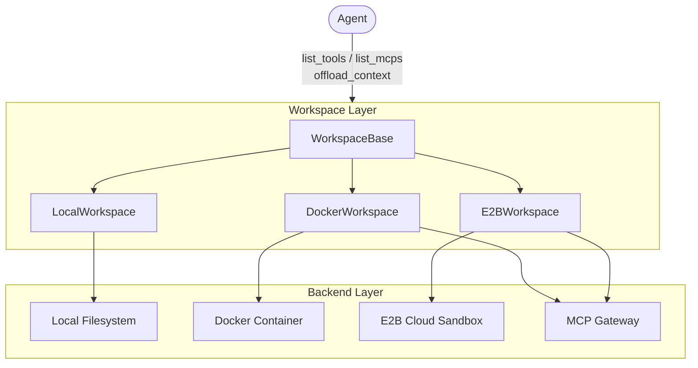
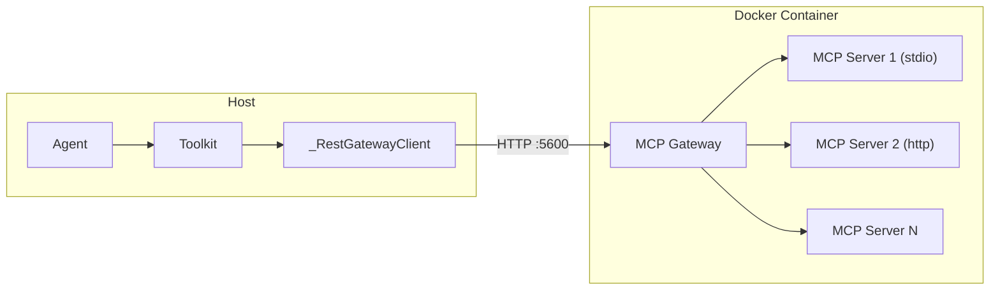
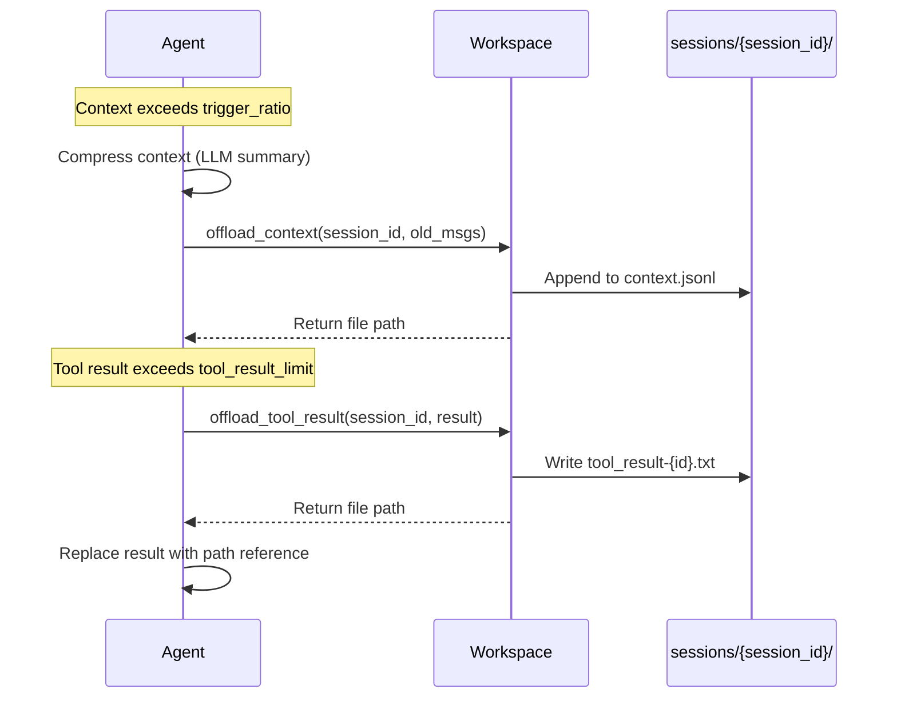
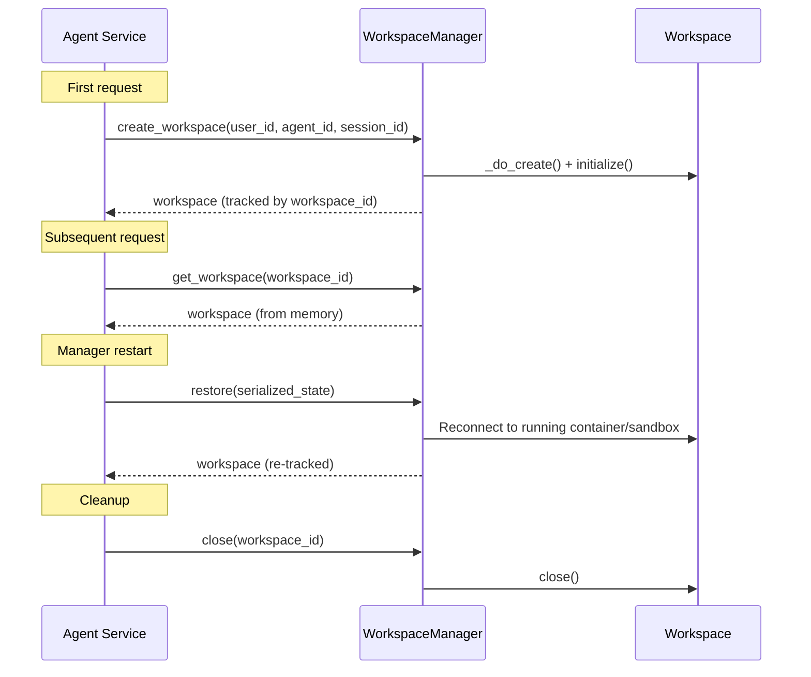
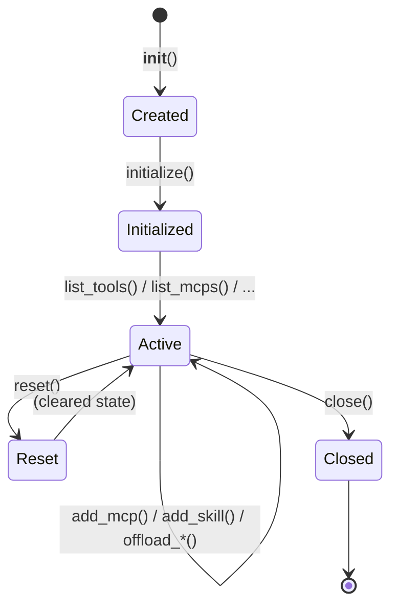
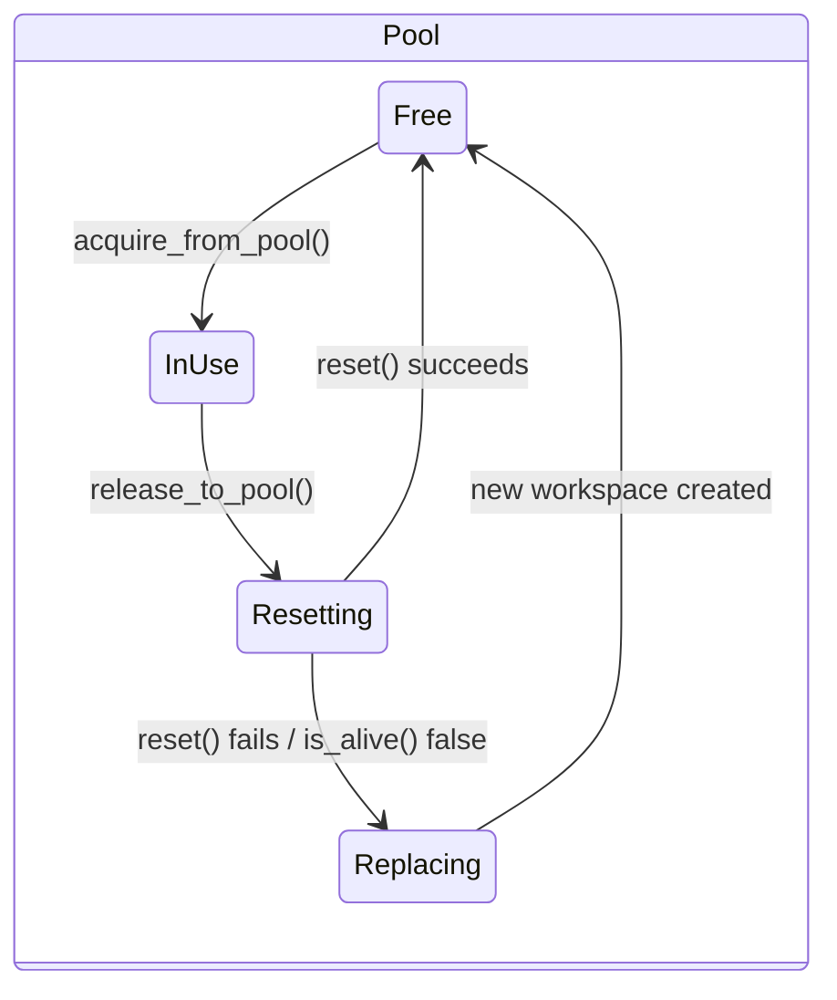

Workspace is the execution environment abstraction in AgentScope. It provides agents with tools, MCP servers, skills, and context persistence — regardless of whether the underlying backend is a local directory, a Docker container, or an E2B cloud sandbox.

The workspace is designed for composability: the agent does not depend on the workspace directly. Instead, the workspace surfaces tools and instructions that the agent consumes through its toolkit and system prompt. The same agent code runs unmodified across all three backends.

### Capabilities

| Capability | Description |
|------------|-------------|
| Tool provisioning | Built-in file/shell tools (local) or in-container MCP gateway (Docker/E2B) |
| MCP management | Dynamic add/remove of MCP servers at runtime with persistent state |
| Skill management | Install, index, deduplicate, and serve reusable skill directories |
| Context offloading | Persist compressed context and large tool results for agentic retrieval |
| State export/restore | Serialize workspace identity for reconnection after manager restart |
| Warm pool | Pre-created workspace instances for parallel RL rollout with auto-replacement |

<Note>
The workspace itself does **not** execute agent logic. It provides the environment (tools, MCPs, skills, file storage) that the agent operates in. The agent interacts with the workspace indirectly through its toolkit and the context offloading APIs.
</Note>

## Architecture



The three-layer design separates concerns:

- **Agent Layer** — consumes tools, MCPs, and instructions; delegates execution
- **Workspace Layer** — unified interface (`WorkspaceBase`) with three implementations
- **Backend Layer** — actual execution substrate (host FS, Docker SDK, E2B SDK, MCP Gateway)

## Three Workspace Backends

| | LocalWorkspace | DockerWorkspace | E2BWorkspace |
|---|---|---|---|
| **Backend** | Host filesystem | Docker container (docker-py) | E2B cloud sandbox (AsyncSandbox) |
| **Tools** | Built-in Bash, Edit, Glob, Grep, Read, Write | In-container MCP Gateway | In-sandbox MCP Gateway |
| **MCP management** | Direct MCPClient list, persisted to `.mcp` | Gateway REST admin API | Gateway REST admin API |
| **Network** | No isolation | host -> container:5600 | host -> sandbox HTTPS |
| **Skill deployment** | Filesystem copy | docker cp (tar) | E2B file write |
| **Best for** | Local dev, agent services | Production, isolation | Cloud training, RL rollout |

## Using LocalWorkspace

`LocalWorkspace` operates directly on a host directory. MCP clients run on the host. Tools are built-in Python implementations (Bash, Edit, Glob, Grep, Read, Write).

```python
from agentscope.workspace import LocalWorkspace

workspace = LocalWorkspace(
    workdir="/data/my_workspace",
    skill_paths=["./skills/web-search", "./skills/code-review"],
)
await workspace.initialize()
```

### Parameters

<ParamField path="workdir" type="str" required>
  Absolute path to the workspace root directory. Created if it doesn't exist.
</ParamField>
<ParamField path="skill_paths" type="list[str] | None" default="None">
  Local directories to seed as skills on first initialization. Each must contain a `SKILL.md`.
</ParamField>
<ParamField path="default_mcps" type="list[MCPClient] | None" default="None">
  MCP clients to use when no persisted `.mcp` file exists. On subsequent initializations, the workspace restores MCPs from the `.mcp` file instead.
</ParamField>
<ParamField path="instructions" type="str" default="built-in">
  Custom system prompt fragment injected into the agent's context. Supports `{workdir}` placeholder.
</ParamField>

### Directory Layout

```
{workdir}/
├── .mcp                        # persisted MCP client configs (JSON)
├── data/                       # offloaded binary data (images, etc.)
├── skills/                     # installed skill directories
│   └── {skill_name}/
│       └── SKILL.md
└── sessions/
    └── {session_id}/
        ├── context.jsonl       # offloaded compressed context
        └── tool_result-{id}.txt
```

### MCP State Persistence

`LocalWorkspace` persists the MCP client list to a `.mcp` file in the workspace root. On initialization:

1. If `.mcp` exists — restore MCPs from the file (ignoring `default_mcps`)
2. If `.mcp` does not exist — use `default_mcps`
3. After `add_mcp` / `remove_mcp` — the `.mcp` file is updated immediately

This ensures MCP configuration survives workspace restarts without requiring the caller to re-register servers.

## Using DockerWorkspace

`DockerWorkspace` runs an isolated Docker container with an in-container MCP Gateway that aggregates tools from multiple MCP servers into a single REST endpoint.

```python
from agentscope.workspace import DockerWorkspace, MCPServerConfig

workspace = DockerWorkspace(
    image="python:3.11-slim",
    mcp_servers=[
        MCPServerConfig(
            name="filesystem",
            command="mcp-server-filesystem",
            args=["/workspace"],
        ),
        MCPServerConfig(
            name="code-runner",
            command="mcp-server-code",
            args=["--lang", "python"],
        ),
    ],
    startup_commands=["pip install numpy pandas"],
    env={"PYTHONPATH": "/workspace"},
)
await workspace.initialize()
```

### Parameters

<ParamField path="image" type="str" default="ubuntu:22.04">
  Docker image to use for the container.
</ParamField>
<ParamField path="mcp_servers" type="list[MCPServerConfig] | None" default="None">
  MCP servers to run inside the container via the gateway.
</ParamField>
<ParamField path="working_dir" type="str" default="/workspace">
  Working directory inside the container.
</ParamField>
<ParamField path="gateway_port" type="int" default="5600">
  Port the in-container MCP gateway listens on.
</ParamField>
<ParamField path="exposed_ports" type="list[int] | None" default="None">
  Additional container ports to expose to the host.
</ParamField>
<ParamField path="volumes" type="dict[str, str] | None" default="None">
  Host-to-container volume mounts (`{host_path: container_path}`).
</ParamField>
<ParamField path="env" type="dict[str, str] | None" default="None">
  Environment variables set inside the container.
</ParamField>
<ParamField path="startup_commands" type="list[str] | None" default="None">
  Shell commands run after container creation (before gateway starts). Failures raise `RuntimeError`.
</ParamField>

### MCP Gateway

The gateway is a lightweight Python process running inside the container. It connects to all configured MCP servers and exposes a unified REST API to the host.



The gateway provides:
- **Tool aggregation** — all upstream tools exposed through a single endpoint
- **Name conflict resolution** — duplicate tool names are prefixed with `server_name___tool_name`
- **Bearer token auth** — per-workspace random token generated at startup
- **Health check** — `GET /health` endpoint for readiness probing
- **Dynamic add/remove** — `POST /mcp/add` and `POST /mcp/remove` admin endpoints

## Using E2BWorkspace

`E2BWorkspace` uses [E2B](https://e2b.dev/) cloud sandboxes for fully isolated, ephemeral environments. The architecture is identical to `DockerWorkspace` (in-sandbox MCP gateway), but uses the E2B SDK for provisioning.

```python
from agentscope.workspace import E2BWorkspace, MCPServerConfig

workspace = E2BWorkspace(
    template="base",
    api_key="your-e2b-api-key",
    timeout_seconds=300,
    mcp_servers=[
        MCPServerConfig(
            name="filesystem",
            command="mcp-server-filesystem",
            args=["/home/user"],
        ),
    ],
)
await workspace.initialize()
```

### Parameters

<ParamField path="template" type="str" default="base">
  E2B sandbox template name.
</ParamField>
<ParamField path="api_key" type="str" default="">
  E2B API key. Can also be set via `E2B_API_KEY` environment variable.
</ParamField>
<ParamField path="timeout_seconds" type="int" default="300">
  Sandbox auto-shutdown timeout in seconds.
</ParamField>
<ParamField path="mcp_servers" type="list[MCPServerConfig] | None" default="None">
  MCP servers to run inside the sandbox via the gateway.
</ParamField>
<ParamField path="working_dir" type="str" default="/home/user">
  Working directory inside the sandbox.
</ParamField>
<ParamField path="env" type="dict[str, str] | None" default="None">
  Environment variables set inside the sandbox.
</ParamField>
<ParamField path="metadata" type="dict[str, str] | None" default="None">
  Metadata attached to the sandbox for external tracking.
</ParamField>
<ParamField path="startup_commands" type="list[str] | None" default="None">
  Shell commands run after sandbox creation.
</ParamField>

## Connecting Workspace to Agent

The workspace provides tools, MCPs, skills, and instructions that you wire into an `Agent`. The agent consumes these resources — it does not hold a reference to the workspace itself (except for context offloading).

```python
from agentscope import Agent
from agentscope.workspace import LocalWorkspace
from agentscope.model import DashScopeChat

model = DashScopeChat(model_name="qwen-max")

workspace = LocalWorkspace(workdir="./my_workspace")
await workspace.initialize()

agent = Agent(
    name="coder",
    system_prompt="You are a coding assistant.",
    model=model,
    tools=await workspace.list_tools(),
    mcps=await workspace.list_mcps(),
    workspace=workspace,
)
```

<Note>
Passing `workspace=` to `Agent` enables automatic context offloading. When context compression triggers, the agent persists old messages and oversized tool results to the workspace's `sessions/` directory for on-demand retrieval.
</Note>

## Dynamic MCP Management

All three workspace backends support adding and removing MCP servers at runtime.

### Adding an MCP Server

```python
from agentscope.workspace import MCPServerConfig

# stdio transport
await workspace.add_mcp(MCPServerConfig(
    name="browser",
    protocol="stdio",
    command="mcp-server-browser",
    args=["--headless"],
))

# http transport
await workspace.add_mcp(MCPServerConfig(
    name="search-api",
    protocol="http",
    url="http://localhost:8080/mcp",
))
```

### Removing an MCP Server

```python
await workspace.remove_mcp("browser")
```

<Accordion title="MCPServerConfig">
  | Field | Type | Default | Description |
  |-------|------|---------|-------------|
  | `name` | `str` | required | Unique identifier for this MCP server |
  | `protocol` | `str` | `"stdio"` | Transport protocol: `"stdio"` or `"http"` |
  | `command` | `str` | `""` | Process command (stdio transport) |
  | `args` | `list[str]` | `[]` | Command arguments (stdio transport) |
  | `env` | `dict[str, str]` | `{}` | Environment variables (stdio transport) |
  | `url` | `str` | `""` | Service endpoint (http transport) |
  | `headers` | `dict[str, str]` | `{}` | HTTP headers (http transport) |
  | `timeout` | `float` | `30.0` | Request timeout in seconds |
</Accordion>

For `LocalWorkspace`, changes are persisted to the `.mcp` file immediately. For `DockerWorkspace` and `E2BWorkspace`, changes go through the gateway's admin REST API and take effect without restarting the container/sandbox.

## Dynamic Skill Management

Skills are reusable instruction sets stored as directories containing a `SKILL.md` file with YAML front matter. The workspace handles installation, content-hash deduplication, index maintenance, and reconciliation with manual filesystem changes.

### Adding a Skill

```python
await workspace.add_skill("./my-skills/web-search")
```

The skill directory must contain a `SKILL.md`:

```markdown
---
name: Web Search
description: Search the web for real-time information using multiple engines.
---

## Instructions

Use the `search` tool to query the web. Always verify information
from at least two sources before presenting results.
```

### Removing a Skill

```python
await workspace.remove_skill("Web Search")
```

### How Skill Discovery Works (LocalWorkspace)

`LocalWorkspace` discovers skills by scanning the `skills/` directory:

1. **Directory scanning** — `list_skills()` reads all subdirectories, loads each `SKILL.md`, and returns valid skills
2. **Content-hash deduplication** — on `add_skill()`, a SHA-256 hash of the `SKILL.md` content is compared against existing skills; duplicates are silently skipped
3. **Manual changes** — skills can be manually added or removed from the `skills/` directory; changes are picked up automatically on the next `list_skills()` call

For `DockerWorkspace` and `E2BWorkspace`, skills are deployed by copying the directory into the container/sandbox via the respective SDK (tar archive or file write).

## Context Offloading

When an agent's context exceeds its model's capacity, the workspace persists compressed context and oversized tool results to storage. The agent receives a file path reference that it can read on demand.

### Offload Flow



### Binary Data Handling

Messages containing base64-encoded binary data (images, files) are automatically decoded and saved to the `data/` directory during offloading. The base64 content is replaced with a `file://` URL reference, reducing serialization overhead.

## Workspace Manager

For services that manage multiple workspace instances (multi-user APIs, RL training), use a `WorkspaceManager`. It handles creation, tracking, restore, and pool management.



### LocalWorkspaceManager

Creates workspaces on the local filesystem with TTL-based cache eviction. Workspaces are keyed by `agent_id` — sessions of the same agent share the same working directory.

```python
from agentscope.workspace import LocalWorkspaceManager

manager = LocalWorkspaceManager(
    basedir="/data/workspaces",
    default_mcps=[],
    skill_paths=["./skills/coding"],
    ttl=3600.0,
)
await manager.initialize()

ws = await manager.create_workspace(
    user_id="user-1",
    agent_id="agent-42",
    session_id="session-abc",
)
```

<ParamField path="basedir" type="str" default="/tmp/agentscope_workspaces">
  Root directory under which per-agent work directories are created.
</ParamField>
<ParamField path="default_mcps" type="list[MCPClient] | None" default="None">
  MCP clients seeded into brand-new workspaces.
</ParamField>
<ParamField path="skill_paths" type="list[str] | None" default="None">
  Skill directories seeded into brand-new workspaces.
</ParamField>
<ParamField path="ttl" type="float" default="3600.0">
  Seconds before an idle cached workspace is evicted.
</ParamField>

### DockerWorkspaceManager

Creates Docker-container workspaces with shared default configuration. Supports pool mode for parallel rollout.

```python
from agentscope.workspace import DockerWorkspaceManager, MCPServerConfig

manager = DockerWorkspaceManager(
    image="python:3.11-slim",
    default_mcp_servers=[
        MCPServerConfig(name="fs", command="mcp-server-fs", args=["/workspace"]),
    ],
    default_startup_commands=["pip install numpy"],
)
await manager.initialize()
```

### E2BWorkspaceManager

Creates E2B cloud-sandbox workspaces. Credentials (`api_key`, `domain`) are managed at the manager level and excluded from serialized workspace state.

```python
from agentscope.workspace import E2BWorkspaceManager, MCPServerConfig

manager = E2BWorkspaceManager(
    template="base",
    api_key="your-e2b-api-key",
    timeout_seconds=300,
    default_mcp_servers=[
        MCPServerConfig(name="fs", command="mcp-server-fs", args=["/home/user"]),
    ],
)
await manager.initialize()
```

### Manager API

| Method | Description |
|--------|-------------|
| `create_workspace(user_id, agent_id, session_id)` | Create and track a new workspace |
| `get_workspace(workspace_id)` | Look up a live workspace (O(1) in-memory) |
| `restore(state)` | Reconnect to a running container/sandbox from serialized state |
| `close(workspace_id)` | Close and un-track a single workspace |
| `close_all()` | Close all workspaces, pool, and release resources |
| `list_workspaces()` | Return all tracked workspace IDs |

All managers support `async with` for automatic cleanup:

```python
async with DockerWorkspaceManager(image="python:3.11") as manager:
    ws = await manager.create_workspace("u1", "agent-1", "s1")
    # ... use workspace ...
# close_all() called automatically
```

## Warm Pool

The workspace manager includes a built-in warm pool for parallel RL rollout and high-throughput scenarios. Pre-created workspaces are recycled across episodes, eliminating container/sandbox startup latency.

### Enabling the Pool

```python
manager = DockerWorkspaceManager(image="python:3.11")
await manager.initialize()
await manager.enable_pool(capacity=8)
```

`enable_pool` creates `capacity` workspaces upfront and places them in a free queue. It is idempotent — calling it again after the pool is enabled is a no-op.

### Acquire / Release Cycle

```python
ws = await manager.acquire_from_pool(timeout=30.0)

try:
    # ... run agent rollout ...
    result = await agent.reply(msg)
finally:
    await manager.release_to_pool(ws)
```

On release, the manager:
1. Checks workspace liveness via `is_alive()`
2. Calls `workspace.reset()` to clear session data and temporary files
3. If alive and reset succeeds — returns to the free queue
4. If dead or reset fails — destroys the workspace and creates a fresh replacement

### Pool Operations

| Method | Description |
|--------|-------------|
| `enable_pool(capacity=4)` | Create and warm the pool |
| `acquire_from_pool(timeout=None)` | Get a free workspace (blocks until available) |
| `release_to_pool(workspace)` | Return workspace; auto-replaces if dead |
| `resize_pool(new_size)` | Grow or shrink the pool dynamically |
| `get_pool_state()` | Returns `{"capacity", "free", "in_use"}` counts |

### Parallel Rollout Example

```python
import asyncio
from agentscope import Agent
from agentscope.workspace import E2BWorkspaceManager, MCPServerConfig
from agentscope.message import UserMsg
from agentscope.model import DashScopeChat

async def run_parallel_rollout(tasks, num_workers=32):
    model = DashScopeChat(model_name="qwen-max")

    manager = E2BWorkspaceManager(
        template="base",
        api_key="your-api-key",
        default_mcp_servers=[
            MCPServerConfig(name="fs", command="mcp-server-fs", args=["/home/user"]),
        ],
    )
    await manager.initialize()
    await manager.enable_pool(capacity=num_workers)

    async def single_rollout(task):
        ws = await manager.acquire_from_pool(timeout=60)
        try:
            agent = Agent(
                name="coder",
                system_prompt="You are a coding agent.",
                model=model,
                mcps=await ws.list_mcps(),
                workspace=ws,
            )
            return await agent.reply(
                UserMsg(name="user", content=task.prompt),
            )
        finally:
            await manager.release_to_pool(ws)

    results = await asyncio.gather(*[single_rollout(t) for t in tasks])
    await manager.close_all()
    return results
```

<Tip>
Use `resize_pool` to dynamically adjust capacity based on workload. The pool grows by creating new workspaces and shrinks by closing idle ones from the free queue.
</Tip>

## Lifecycle Summary



For pool-managed workspaces:



## State Export and Restore

Workspaces can serialize their identity for later reconnection — useful when a manager process restarts but containers/sandboxes are still running.

```python
# Export
state = await workspace.export_state()
# state.backend_type = "docker"
# state.payload = {"container_id": "abc123", "workspace_id": "...", ...}

# Persist state externally (database, Redis, etc.)
db.save(session_id, state)

# Restore (after manager restart)
state = db.load(session_id)
workspace = await manager.restore(state)
```

Each backend exports different data:

| Backend | Exported Fields |
|---------|----------------|
| Local | `workspace_id`, `workdir` |
| Docker | `container_id`, `workspace_id`, `working_dir`, `image`, `gateway_port`, `mcp_servers` |
| E2B | `sandbox_id`, `workspace_id`, `working_dir` |

## Further Reading

<CardGroup cols={2}>
  <Card title="Agent" icon="robot" href="/v2/building-blocks/agent">
    Core agent abstraction and the ReAct reasoning-acting loop
  </Card>
  <Card title="Agent Service" icon="server" href="/v2/building-blocks/agent-service">
    Deploy agents as HTTP services with workspace management
  </Card>
  <Card title="Tool" icon="wrench" href="/v2/building-blocks/tool">
    Built-in and custom tools including MCP integration
  </Card>
  <Card title="Context" icon="database" href="/v2/building-blocks/context">
    Context compression and workspace offloading mechanics
  </Card>
</CardGroup>
