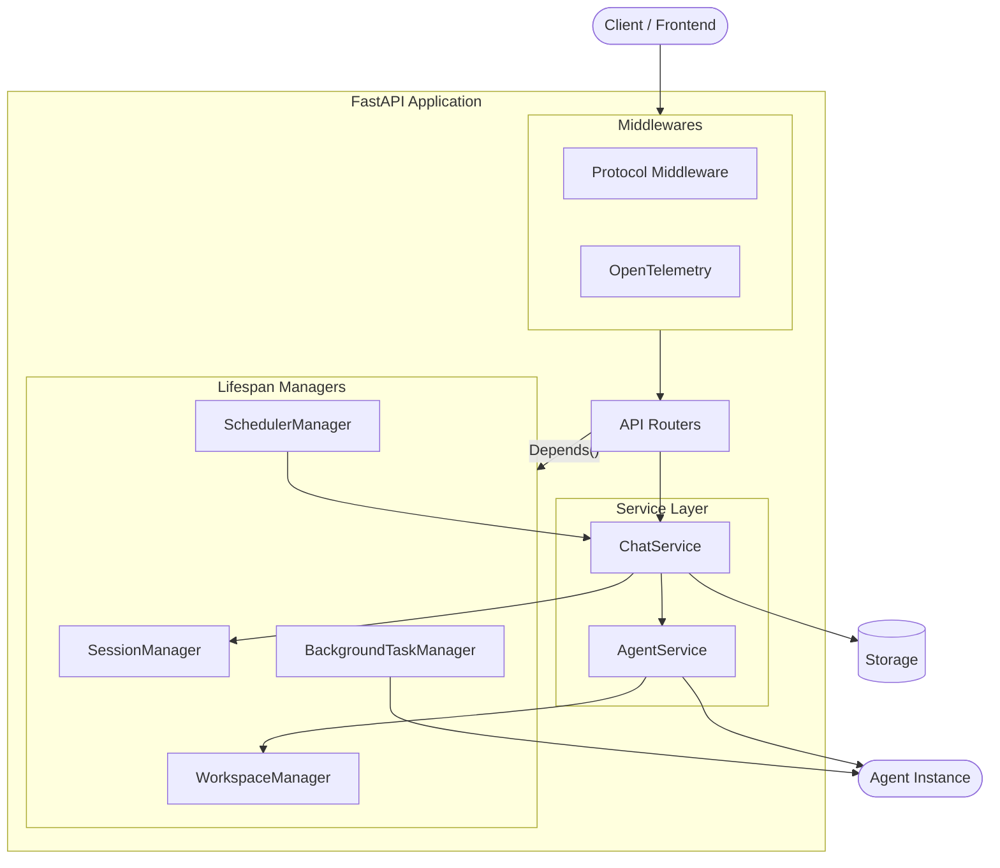
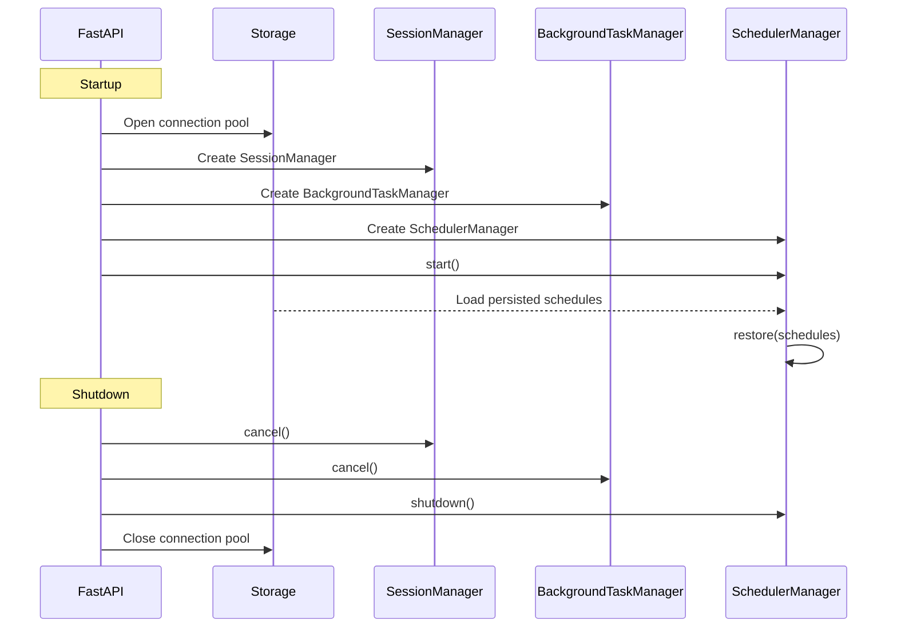
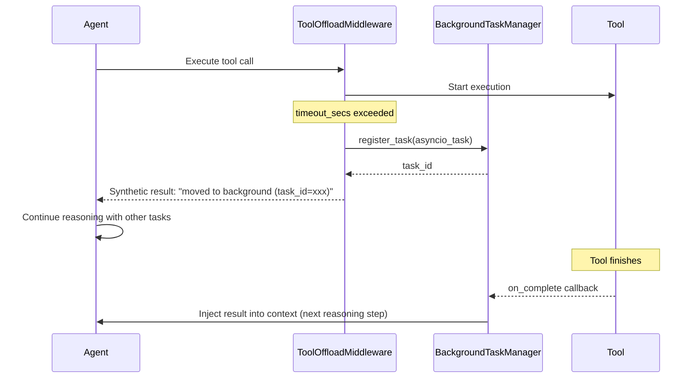
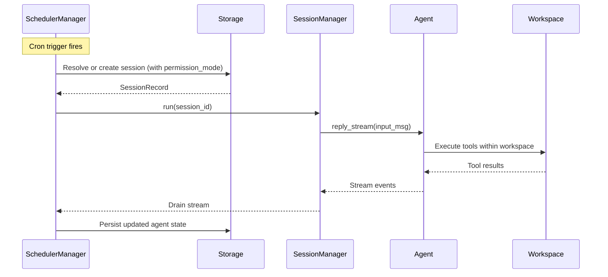

Agent Service is a production-ready HTTP service layer built on [FastAPI](https://fastapi.tiangolo.com/). It exposes your agents through a streaming API, handles session persistence, background task offloading, cron scheduling, and protocol adaptation — all through a single `create_app()` factory function.

The service is designed for extensibility: plug in your own authentication, storage backend, workspace strategy, or protocol adapter without modifying framework code.

### Capabilities

| Capability | Description |
|------------|-------------|
| Streaming chat | SSE-based streaming of `AgentEvent` objects in real time |
| Session management | Persistent sessions with state serialization across requests |
| Session replay | Late-joining clients receive full event history via buffered replay |
| Background task offloading | Long-running tool calls move to background with automatic result injection |
| Cron scheduling | Time-based agent execution with stateful or stateless sessions |
| Credential management | Secure storage and retrieval of model provider API keys |
| Protocol adaptation | Middleware-based conversion to external protocols (AG-UI, A2A, etc.) |
| Workspace management | Pluggable workspace isolation (built-in: per-agent; extensible to per-session or per-user) |

You can also use the built-in middlewares, managers, dependencies, and storage implementations as building blocks to assemble a fully custom service tailored to your infrastructure.

<Note>
The service does **not** include a built-in user authentication system. It provides a placeholder `X-User-ID` header dependency that you replace with your own auth middleware (JWT, OAuth, session tokens, etc.).
</Note>

## Architecture



## Create the Application

Use `create_app()` to build a fully configured FastAPI application. All built-in routers are registered automatically.

```python
import uvicorn
from agentscope.app import create_app, RedisStorage, LocalWorkspaceManager

storage = RedisStorage(host="localhost", port=6379)

workspace_manager = LocalWorkspaceManager(
    basedir="/data/workspaces",
    ttl=3600.0,
)

app = create_app(
    storage=storage,
    workspace_manager=workspace_manager,
)

uvicorn.run(app, host="0.0.0.0", port=8000)
```

### create_app Parameters

<ParamField path="storage" type="StorageBase" required>
  The storage backend for persisting agents, sessions, credentials, messages, and schedules. Its lifecycle (`__aenter__` / `__aexit__`) is managed by the app lifespan.
</ParamField>
<ParamField path="workspace_manager" type="WorkspaceManagerBase | None" default="None">
  Manages per-session workspaces (file storage, MCP servers, skills). When provided, workspaces are created and cached with TTL-based eviction.
</ParamField>
<ParamField path="extra_credentials" type="list[Type[CredentialBase]] | None" default="None">
  Additional credential types to register. Each class is registered with `CredentialFactory` before the app starts.
</ParamField>
<ParamField path="extra_middlewares" type="list[Middleware] | None" default="None">
  Additional ASGI middlewares (e.g., protocol adapters, CORS, auth).
</ParamField>

You can also mount the AgentScope app onto an existing FastAPI application:

```python
from fastapi import FastAPI

root = FastAPI()
agentscope_app = create_app(storage=RedisStorage())
root.mount("/agentscope", agentscope_app)
```

## Application Lifespan

On startup, the lifespan initializes all application-wide managers and restores persisted state. On shutdown, it gracefully cancels in-flight work.



## Core Components

| Component | Description |
|-----------|-------------|
| `SessionManager` | Serializes concurrent requests per session and provides real-time event replay and fan-out |
| `BackgroundTaskManager` | Tracks offloaded tool executions and injects results back into agent context |
| `SchedulerManager` | Cron-based agent execution with APScheduler, supporting stateful and stateless sessions |
| `WorkspaceManager` | Manages workspace lifecycle with pluggable isolation strategies and TTL-based caching |

### SessionManager

The `SessionManager` serializes concurrent requests for the same session and provides real-time event fan-out to multiple subscribers.

- **Serialization** — at most one active agent run per `session_id` at a time; additional requests queue on an `asyncio.Lock`
- **Replay buffer** — every event produced during a run is buffered so that clients joining mid-execution receive the full event history
- **Fan-out** — events are pushed to all active SSE subscriber queues simultaneously

```python
async with session_manager.run(session_id) as run:
    async for event in agent.reply_stream(msg):
        await run.publish(event)
        yield f"data: {event.model_dump_json()}\n\n"
```

<Tip>
Use `session_manager.subscribe(session_id)` to build a separate stream endpoint that replays buffered events and then streams new ones — useful for reconnecting clients.
</Tip>

### BackgroundTaskManager

The `BackgroundTaskManager` tracks long-running tool executions that have been offloaded from the agent's main loop. When a tool exceeds its timeout, the `ToolOffloadMiddleware` moves it to the background and injects the result back into context when ready.

- **Task registry** — tracks running asyncio tasks so they can be cancelled via the `TaskStop` tool
- **Completion callbacks** — when a background task finishes, its result is pushed into the agent's context before the next reasoning step
- **Agent-facing tool** — exposes `TaskStop` so the agent can cancel background tasks programmatically



### SchedulerManager

The `SchedulerManager` provides cron-based agent execution powered by [APScheduler](https://apscheduler.readthedocs.io/). Schedules survive server restarts via storage persistence.

When a schedule fires, it triggers an **agent task** — the target agent runs within its workspace to complete the assigned work. The execution happens inside a chat session:

- **Stateful schedules** — reuse a fixed session across all fires so conversation context accumulates between executions
- **Stateless schedules** — create a fresh session on every fire for clean-slate execution
- **Permission mode** — users specify a `permission_mode` when creating a schedule, controlling which tools the agent can use and at what permission level during execution (e.g., `BYPASS` for fully autonomous, `ASK` for human-gated)
- **Agent tools** — exposes `ScheduleCreate`, `ScheduleList`, `ScheduleView`, and `ScheduleStop` so agents can self-schedule future work



<Tip>
Use stateful schedules for recurring tasks that build on previous results (e.g., daily report generation). Use stateless schedules for independent, idempotent tasks (e.g., health checks, cleanup jobs).
</Tip>

### WorkspaceManager

The `WorkspaceManager` provides workspace lifecycle management with TTL-based caching. The isolation granularity depends on the implementation — the built-in `LocalWorkspaceManager` uses **per-agent** isolation (sessions of the same agent share one workspace), but you can extend it to per-session or per-user isolation by implementing `WorkspaceManagerBase`.

```python
from agentscope.app import LocalWorkspaceManager

workspace_manager = LocalWorkspaceManager(
    basedir="/data/workspaces",
    default_mcps=[],
    skill_paths=["/path/to/skills"],
    ttl=3600.0,
)
```

<Note>
The built-in `LocalWorkspaceManager` creates workspaces keyed by `agent_id` — all sessions for the same agent share the same working directory. To implement session-level or user-level isolation, subclass `WorkspaceManagerBase` and override `get_workspace` with your own keying strategy.
</Note>

## Storage

The `StorageBase` abstract class defines the persistence contract. All CRUD operations for agents, sessions, credentials, messages, and schedules go through this interface.

AgentScope ships with `RedisStorage` as the built-in implementation:

```python
from agentscope.app import RedisStorage

storage = RedisStorage(
    host="localhost",
    port=6379,
    db=0,
    password="your-password",
)
```

The storage manages the following data models:

| Record | Description |
|--------|-------------|
| `AgentRecord` | Agent configuration (name, system prompt, context config, react config) |
| `SessionRecord` | Session state including `AgentState`, model config, and workspace binding |
| `CredentialRecord` | Encrypted model provider API keys |
| `ScheduleRecord` | Cron schedule definitions with execution history |
| `Msg` | Persisted messages per session with pagination support |

## Protocol Middleware

Protocol middlewares intercept the SSE event stream and convert `AgentEvent` objects into external protocol formats. This allows you to serve the same agent through different frontend protocols without modifying the core service.

AgentScope ships with `AGUIProtocolMiddleware` for the [AG-UI](https://docs.ag-ui.com/) protocol:

```python
from fastapi.middleware import Middleware
from agentscope.app import create_app, AGUIProtocolMiddleware

app = create_app(
    storage=storage,
    extra_middlewares=[
        Middleware(AGUIProtocolMiddleware),
    ],
)
```

You can also add observability middlewares like OpenTelemetry tracing:

```python
from fastapi.middleware import Middleware
from opentelemetry.instrumentation.fastapi import FastAPIInstrumentMiddleware
from agentscope.app import create_app, AGUIProtocolMiddleware

app = create_app(
    storage=storage,
    extra_middlewares=[
        Middleware(AGUIProtocolMiddleware),
        Middleware(FastAPIInstrumentMiddleware),
    ],
)
```

### Create a Custom Protocol Middleware

Subclass `ProtocolMiddlewareBase` and implement the `_convert_to_protocol` method:

```python
from agentscope.app import ProtocolMiddlewareBase
from agentscope.event import AgentEvent

class MyProtocolMiddleware(ProtocolMiddlewareBase):
    def _convert_to_protocol(self, event: AgentEvent) -> dict:
        # Convert AgentEvent to your protocol format
        return {"type": event.type, "data": event.model_dump()}
```

The middleware automatically:
1. Intercepts `StreamingResponse` objects from the chat endpoint
2. Deserializes each SSE frame back into an `AgentEvent`
3. Calls `_convert_to_protocol()` to produce the target format
4. Re-serializes and yields the converted frame

## Extend Authentication

The built-in `get_current_user_id` dependency extracts the caller identity from the `X-User-ID` request header. This is a placeholder — replace it with your own authentication logic.

```python
from fastapi import Depends, HTTPException, Header, status

async def get_current_user_id(
    authorization: str = Header(...),
) -> str:
    """Validate JWT token and return user ID."""
    try:
        payload = decode_jwt(authorization.removeprefix("Bearer "))
        return payload["sub"]
    except InvalidTokenError:
        raise HTTPException(
            status_code=status.HTTP_401_UNAUTHORIZED,
            detail="Invalid authentication token.",
        )
```

<Warning>
The default `X-User-ID` header provides no authentication. Always replace it with a secure mechanism before deploying to production.
</Warning>

## API Reference

{/* API protocol documentation will be added here */}

## Further Reading

<CardGroup cols={2}>
  <Card title="Agent" icon="robot" href="/v2/building-blocks/agent">
    Core agent abstraction and the ReAct loop
  </Card>
  <Card title="Message & Event" icon="envelope" href="/v2/building-blocks/message-and-event">
    Event streaming and message reconstruction
  </Card>
  <Card title="Tool" icon="wrench" href="/v2/building-blocks/tool">
    Built-in and custom tools including external execution
  </Card>
  <Card title="Context" icon="database" href="/v2/building-blocks/context">
    Context compression and workspace offloading
  </Card>
</CardGroup>
