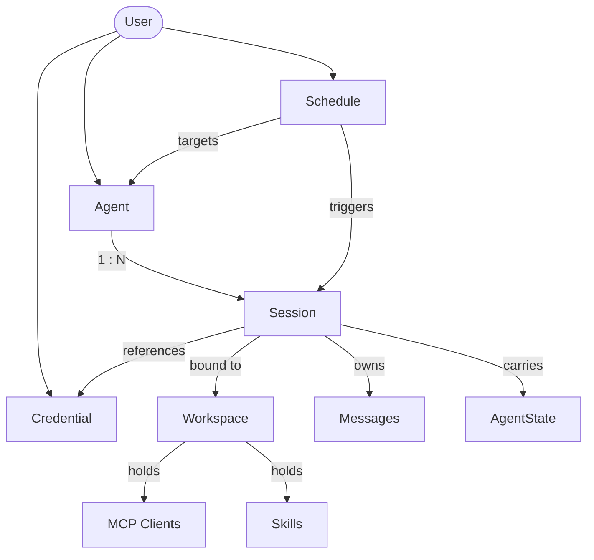

Agent Service is the FastAPI-based hosting layer that turns AgentScope agents into a **multi-tenant, multi-session HTTP service**. It owns everything *around* the agent — request routing, per-user resource lifecycle, session state, persistence, scheduling, and tool offloading — so that the agent code you wrote against [`Agent`](/v2/building-blocks/agent) can serve production traffic without being rewritten.

What sets it apart:

- **Production backbone for live agents** — agent runs, background tasks, schedules, and the tool/MCP/skill/workspace lifecycle are managed end-to-end, with session streams that fan out to multiple subscribers and replay buffered history on reconnect.
- **Schema-driven frontend** — credentials publish JSON schemas and models expose declarative cards (input/output types, context size, parameter schemas), so the UI can render forms and capability badges without coupling to provider-specific code.
- **Multi-tenant by construction** — credentials, agents, sessions, schedules, and messages are all owned by the request's `user_id`, and ownership is enforced at the routing layer — one deployment serves many users with no per-tenant code paths.
- **Modular and extensible** — authentication, chat protocols, workspace isolation strategy, storage backend, and the set of model providers and credential types are all open at the boundary, swappable without touching framework code.

It does **not** include user authentication, a frontend, or a managed runtime — the service is what you deploy behind your own auth gateway to expose AgentScope agents to your users. The agent business logic, model providers, and tool implementations remain yours; the service handles the operational concerns of serving them at scale.

### Capabilities

| Capability | Description |
|------------|-------------|
| Streaming chat | SSE-based streaming of `AgentEvent` objects in real time |
| Session management | Persistent sessions with state serialization across requests |
| Session replay | Late-joining clients receive full event history via buffered replay |
| Background task offloading | Long-running tool calls move to background with automatic result injection |
| Cron scheduling | Time-based agent execution with stateful or stateless sessions |
| Credential management | Secure storage and retrieval of model provider API keys |
| Protocol adaptation | Middleware-based conversion to external protocols (AG-UI, A2A, etc.) |
| Workspace management | Pluggable workspace isolation (built-in: per-agent; extensible to per-session or per-user) |

You can also use the built-in middlewares, managers, dependencies, and storage implementations as building blocks to assemble a fully custom service tailored to your infrastructure.

<Note>
The service does **not** include a built-in user authentication system. It provides a placeholder `X-User-ID` header dependency that you replace with your own auth middleware (JWT, OAuth, session tokens, etc.).
</Note>

## Resource Model

Every operation in Agent Service is scoped to a `user_id` resolved from the request. Below that boundary, the service manages six resource types whose relationships define both the REST surface and the runtime behavior:



Understanding this graph upfront makes the REST API self-explanatory — most endpoints just create, list, or mutate one of these resources for the authenticated user.

### User

Agent Service models no user system of its own. `user_id` is an opaque tenant identifier resolved through the `get_current_user_id` dependency — replace it with a one-function adapter to whatever identity system you use (JWT, OAuth2, session cookies, SSO, API tokens). See [User authentication](#user-authentication).

### Credential

A credential is the connection configuration for a model provider (DashScope, OpenAI, Anthropic, Ollama, …) — an API key plus any provider-specific settings. A user can register multiple credentials per provider — separate keys for LLM, TTS, or Realtime services, or a personal key alongside a team key — and reuse one credential across many agents and sessions so key rotation happens in one place.

New providers are added by subclassing `CredentialBase` and registering through `create_app(extra_credentials=[...])`; they become usable to clients with no further work.

### Agent

An agent record captures who the agent is — a display name, the system prompt that defines its persona, and runtime configuration such as how it manages context and runs its ReAct loop. The same agent can be driven by different LLMs across many sessions: identity belongs to the agent, model and runtime state belong to the session.

### Workspace

A workspace is the agent's runtime environment — a file-system-like working area, the unified set of tools, MCPs, and skills available in it, and a place to offload compressed context for agentic search. Implementations range from the local filesystem (`LocalWorkspace`) to sandboxes (`DockerWorkspace`, `E2BWorkspace`); the `WorkspaceManager` decides how workspaces map to users, agents, and sessions — per-user, per-agent (the built-in default), or per-session isolation are all valid policies.

### Session

A session is one ongoing exchange between a user and an agent. It carries:

- **Agent state** — working memory, in-flight reply, permission context; persisted after every turn.
- **Message transcript** — the persisted user/assistant exchange the frontend renders; distinct from the context window the model sees, which is reconstructed per turn from agent state.
- **LLM configuration** — provider, model, parameters, and the credential to call it with. Because it lives on the session, the same agent can run under different models in different sessions.
- **Permission level** — bounds which tools the agent may invoke.

### Schedule

A schedule fires an agent on a cron expression. Each fire runs inside a session — either fresh per execution (stateless) or reused so context accumulates across fires (stateful). Schedules persist and survive server restarts.

<Tip>
The shape to remember: **agents are reusable templates, sessions are the unit of runtime state**, and the model binding lives on the session.
</Tip>

## Quickstart

The minimum to get a service running is a storage backend and a workspace manager. The examples below boot a service on port 8000 backed by Redis — pick the workspace backend that matches where you want the agent's tools to execute.

<CodeGroup>

```python Local filesystem
import uvicorn
from agentscope.app import create_app, RedisStorage, LocalWorkspaceManager

# Persistence layer for agents, sessions, credentials, messages, and schedules.
# Its connection pool is opened on app startup and closed on shutdown.
storage = RedisStorage(host="localhost", port=6379)

# Workspace lifecycle — working directory, MCP clients, skills.
# The built-in manager isolates per agent: sessions of the same agent
# share one workspace. Idle workspaces are evicted after `ttl` seconds.
workspace_manager = LocalWorkspaceManager(
    basedir="/data/workspaces",
    ttl=3600.0,
)

app = create_app(
    storage=storage,
    workspace_manager=workspace_manager,
)

uvicorn.run(app, host="0.0.0.0", port=8000)
```

```python Docker sandbox
import uvicorn
from agentscope.app import create_app, RedisStorage
from agentscope.app._manager import DockerWorkspaceManager

# Persistence layer for agents, sessions, credentials, messages, and schedules.
storage = RedisStorage(host="localhost", port=6379)

# Each workspace runs inside its own local Docker container for isolation.
# Per-user/per-agent host workdirs live under `basedir` and are bind-mounted
# into each container.
workspace_manager = DockerWorkspaceManager(basedir="/data/docker-workspaces")

app = create_app(storage=storage, workspace_manager=workspace_manager)
uvicorn.run(app, host="0.0.0.0", port=8000)
```

```python E2B
import uvicorn
from agentscope.app import create_app, RedisStorage
from agentscope.app._manager import E2BWorkspaceManager

# Persistence layer for agents, sessions, credentials, messages, and schedules.
storage = RedisStorage(host="localhost", port=6379)

# Each workspace runs inside a remote E2B cloud sandbox.
# Provide `api_key` here or set the `E2B_API_KEY` environment variable.
workspace_manager = E2BWorkspaceManager()

app = create_app(storage=storage, workspace_manager=workspace_manager)
uvicorn.run(app, host="0.0.0.0", port=8000)
```

</CodeGroup>

### create_app parameters

<ParamField path="storage" type="StorageBase" required>
  The storage backend for persisting agents, sessions, credentials, messages, and schedules. Its lifecycle (`__aenter__` / `__aexit__`) is managed by the app lifespan.
</ParamField>
<ParamField path="workspace_manager" type="WorkspaceManagerBase | None" default="None">
  Manages workspaces (file storage, MCP servers, skills) with TTL-based caching. The built-in `LocalWorkspaceManager` isolates per agent; see [Workspace implementation and isolation](#workspace-implementation-and-isolation) for other strategies.
</ParamField>
<ParamField path="extra_credentials" type="list[Type[CredentialBase]] | None" default="None">
  Additional credential types to register. Each class is registered with `CredentialFactory` before the app starts.
</ParamField>
<ParamField path="extra_middlewares" type="list[Middleware] | None" default="None">
  Additional ASGI middlewares (e.g., protocol adapters, CORS, auth).
</ParamField>
<ParamField path="title" type="str" default="AgentScope">
  OpenAPI title shown in the docs UI.
</ParamField>
<ParamField path="version" type="str" default="2.0.0">
  API version shown in the docs UI.
</ParamField>

<Warning>
The default `X-User-ID` header provides no authentication. Replace it with a real auth integration before deploying — see [User authentication](#user-authentication).
</Warning>

### Typical operation flow

Once the server is running, drive it through the resources defined in the resource model. The flow below is the path a chat session usually takes — each step is one or two REST calls.

<Steps>
  <Step title="Create an agent">
    Register the agent's identity — display name, system prompt, and runtime configuration. The same agent can drive many sessions under different models.

    ```http
    POST /agent
    ```
  </Step>
  <Step title="Create and configure a credential">
    Discover each provider's form fields with `GET /credential/schemas`, then save the API key. One credential can be reused across many sessions and agents.

    ```http
    GET  /credential/schemas
    POST /credential
    ```
  </Step>
  <Step title="Create a session and select a model">
    Create a session bound to the agent and attach a model configuration — provider, model name, parameters, and the credential to call it with. The session owns the runtime state from here on.

    ```http
    POST /sessions
    ```
  </Step>
  <Step title="Configure MCPs and skills (optional)">
    Attach MCP clients and skills to the session's workspace if the agent needs tools beyond its built-ins.

    ```http
    POST /workspace/mcp
    POST /workspace/skill
    ```
  </Step>
  <Step title="Start chatting">
    Stream agent events over SSE by posting a user `Msg` to `/chat`. Late-joining clients can reconnect to the same session and replay buffered events.

    ```http
    POST /chat
    ```
  </Step>
</Steps>

A minimal chat call with the `X-User-ID` header and a single user message:

```bash
curl -N -X POST http://localhost:8000/chat \
  -H "X-User-ID: alice" \
  -H "Content-Type: application/json" \
  -d '{
    "agent_id": "agent-xxx",
    "session_id": "session-xxx",
    "input": {
      "name": "alice",
      "role": "user",
      "content": [{"type": "text", "text": "Hello"}]
    }
  }'
```

For a **scheduled run**, complete steps 1 and 2, then create a schedule that targets the agent — the scheduler creates the session (stateful or stateless) and triggers the run on the cron expression you provide. No `/chat` call is needed; the agent runs autonomously when the cron fires.

```http
POST /schedule
```

## API Overview

The service exposes the resources from the resource model as REST endpoints, plus the streaming chat endpoint. The table below groups them by category; full request and response shapes are documented in the service's OpenAPI specification.

| Category | Endpoints | Description |
|----------|-----------|-------------|
| Chat | `POST /chat` | Stream agent events for a session over SSE; supports replay and multi-subscriber fan-out. |
| Sessions | `GET/POST/PATCH/DELETE /sessions` | Create and manage chat sessions, including model binding and permission level. |
| Messages | `GET /sessions/{id}/messages` | Paginated message transcript for a session. |
| Agents | `GET/POST/PATCH/DELETE /agent` | Manage agent records — display name, system prompt, runtime config. |
| Credentials | `GET/POST/PATCH/DELETE /credential` | CRUD for per-provider API keys and connection configs. |
| Credential schemas | `GET /credential/schemas` | Discover all registered credential types and their JSON parameter schemas for form rendering. |
| Models | `GET /model?provider=<name>` | List candidate models for a provider, with their declarative `ModelCard` (capabilities and parameter schemas). |
| Schedules | `GET/POST/PATCH/DELETE /schedule` | Manage cron-based agent execution, stateful or stateless. |
| Background tasks | `GET /background-tasks` | Inspect offloaded tool executions. |
| Workspace MCPs | `GET/POST /workspace/mcp`, `DELETE /workspace/mcp/{mcp_name}` | Manage MCP clients attached to the session's workspace. |
| Workspace skills | `GET/POST /workspace/skill`, `DELETE /workspace/skill/{skill_name}` | Manage skills available in the session's workspace. |

## Customization

The service is open at every infrastructure boundary. The sections below describe what is built in and how to plug in your own.

### Agent chat protocol

The chat endpoint emits AgentScope's native [`AgentEvent`](/v2/building-blocks/message-and-event) stream over SSE. To serve the same agent under a different frontend protocol, install a protocol middleware that intercepts the SSE stream and rewrites each frame.

AgentScope ships with `AGUIProtocolMiddleware` for the [AG-UI](https://docs.ag-ui.com/) protocol. Install it via `extra_middlewares`:

```python
from fastapi.middleware import Middleware
from agentscope.app import create_app, AGUIProtocolMiddleware

app = create_app(
    storage=storage,
    extra_middlewares=[
        Middleware(AGUIProtocolMiddleware),
    ],
)
```

To add a new protocol, subclass `ProtocolMiddlewareBase` and implement `_convert_to_protocol`:

```python
from agentscope.app import ProtocolMiddlewareBase
from agentscope.event import AgentEvent

class MyProtocolMiddleware(ProtocolMiddlewareBase):
    def _convert_to_protocol(self, event: AgentEvent) -> dict:
        # Convert AgentEvent to your protocol's frame format.
        return {"type": event.type, "data": event.model_dump()}
```

The middleware automatically intercepts `StreamingResponse` objects from the chat endpoint, deserializes each SSE frame back into an `AgentEvent`, calls `_convert_to_protocol()` to produce the target format, and re-serializes the converted frame.

### User authentication

The built-in `get_current_user_id` dependency extracts the caller identity from the `X-User-ID` request header — a placeholder, not authentication. Override it with your own dependency to integrate any identity system.

JWT bearer token:

```python
from fastapi import Header, HTTPException, status

async def get_current_user_id(
    authorization: str = Header(...),
) -> str:
    try:
        payload = decode_jwt(authorization.removeprefix("Bearer "))
        return payload["sub"]
    except InvalidTokenError:
        raise HTTPException(
            status_code=status.HTTP_401_UNAUTHORIZED,
            detail="Invalid authentication token.",
        )
```

OAuth2 password flow:

```python
from fastapi import Depends, HTTPException, status
from fastapi.security import OAuth2PasswordBearer

oauth2_scheme = OAuth2PasswordBearer(tokenUrl="token")

async def get_current_user_id(token: str = Depends(oauth2_scheme)) -> str:
    user = await verify_oauth_token(token)
    if user is None:
        raise HTTPException(status_code=status.HTTP_401_UNAUTHORIZED)
    return user.id
```

Wire your override by replacing the dependency on the FastAPI app:

```python
from agentscope.app._deps import get_current_user_id as default_dependency

app.dependency_overrides[default_dependency] = get_current_user_id
```

<Warning>
The default `X-User-ID` header provides no authentication. Always replace it with a secure mechanism before deploying to production.
</Warning>

### Workspace implementation and isolation

Two independent axes are configurable:

- **Workspace backend** — what runtime environment the agent runs in. Built-in implementations include `LocalWorkspace`, `DockerWorkspace`, and `E2BWorkspace`. New backends implement the workspace interface and can wrap container images, sandboxes, or remote VMs.
- **Isolation strategy** — how workspaces map to users, agents, and sessions. The built-in `LocalWorkspaceManager` keys workspaces by `agent_id`: all sessions of the same agent share one workspace. To switch to per-user or per-session isolation, subclass `WorkspaceManagerBase` and override `get_workspace` with your own keying strategy.

```python
from agentscope.app import WorkspaceManagerBase
from agentscope.workspace import WorkspaceBase


class PerSessionWorkspaceManager(WorkspaceManagerBase):
    async def get_workspace(
        self,
        user_id: str,
        agent_id: str,
        session_id: str,
        workspace_id: str,
    ) -> WorkspaceBase:
        # Resolve an initialized workspace; key by session_id for per-session isolation.
        ...

    async def create_workspace(
        self,
        user_id: str,
        agent_id: str,
        session_id: str,
    ) -> WorkspaceBase:
        # Allocate a fresh workspace and register it in the cache.
        ...

    async def close(self, workspace_id: str) -> None:
        # Close and evict a single workspace.
        ...

    async def close_all(self) -> None:
        # Close every cached workspace; called on app shutdown.
        ...
```

### API credentials

A new credential type is a pair of classes: a `CredentialBase` subclass that captures the connection config (and publishes its JSON schema for form rendering), and a `ChatModelBase` subclass that implements the actual streaming chat protocol against the provider's API. The credential class is the entry point — it tells the service which chat model class to instantiate.

```python
from agentscope.credential import CredentialBase
from agentscope.model import ChatModelBase

class MyProviderChatModel(ChatModelBase):
    # Implement the streaming chat interface against the provider's API.
    ...

class MyProviderCredential(CredentialBase):
    api_key: str
    endpoint: str = "https://api.my-provider.com"

    @classmethod
    def get_chat_model_class(cls):
        return MyProviderChatModel
```

Register the credential class with the app — it becomes immediately usable by clients:

```python
app = create_app(
    storage=storage,
    extra_credentials=[MyProviderCredential],
)
```

The service automatically exposes the credential's JSON schema under `GET /credential/schemas`, and `GET /model?provider=<name>` routes to the chat model class returned by `get_chat_model_class()`.

### Provider models

The model list returned by `GET /model?provider=<name>` is built from `ModelCard` instances — declarative metadata records that tell the frontend how to display each model and what request parameters are valid. Each chat model exposes its catalog through `list_models()`, which by default loads `ModelCard` entries from YAML files in the provider's model directory; `ModelCard.from_yaml()` parses each YAML and merges its overrides into the base parameter schema supplied by the chat model's parameters class.

A model card carries the following fields:

| Field | Description |
|-------|-------------|
| `name` | Provider-side model identifier. |
| `label` | Display name shown in the UI. |
| `status` | One of `active`, `deprecated`, `sunset`. |
| `deprecated_at` | Deprecation timestamp, if any. |
| `input_types` | MIME types the model accepts (e.g., `text/plain`, `image/png`, `video/mp4`). |
| `output_types` | MIME types the model emits (e.g., `text/plain`, `application/x-thinking`). |
| `context_size` | Maximum context window in tokens. |
| `output_size` | Maximum output tokens. |
| `parameter_schema` | JSON schema for the request parameters, auto-merged with per-model overrides. |
| `parameters_overrides` | Per-model deltas applied on top of the base parameter schema. |

Example YAML for a multimodal model that accepts text, images, and video and emits text plus thinking traces:

```yaml qwen3.6-plus.yaml
name: qwen3.6-plus
label: Qwen3.6-Plus
status: active

input_types:
  - text/plain
  - application/x-thinking
  - image/bmp
  - image/jpeg
  - image/png
  - image/tiff
  - image/webp
  - image/heic
  - video/mp4

output_types:
  - text/plain
  - application/x-thinking

context_size: 1000000
output_size: 65536

parameter_overrides:
  max_tokens: {"maximum": 65536}
```

To add a new model under an existing provider, drop a YAML file alongside the others in the provider's model directory — the loader picks it up automatically and the new entry shows up in `GET /model?provider=<name>`.

### Storage backend

The `StorageBase` abstract class defines the persistence contract for agents, sessions, credentials, messages, and schedules. AgentScope ships with `RedisStorage` as the built-in implementation:

```python
from agentscope.app import RedisStorage

storage = RedisStorage(
    host="localhost",
    port=6379,
    db=0,
    password="your-password",
)
```

To use another database, implement the same interface:

```python
from agentscope.app.storage import StorageBase


class PostgresStorage(StorageBase):
    async def __aenter__(self):
        # Open connection pool.
        ...

    async def __aexit__(self, exc_type, exc_val, exc_tb):
        # Close connection pool.
        ...

    # Implement CRUD methods for each record type:
    # agents, sessions, credentials, messages, schedules.
    ...

app = create_app(storage=PostgresStorage(dsn="postgresql://..."))
```

The records the storage layer manages:

| Record | Description |
|--------|-------------|
| `AgentRecord` | Agent configuration (name, system prompt, context config, react config). |
| `SessionRecord` | Session state including `AgentState`, model config, and workspace binding. |
| `CredentialRecord` | Encrypted model provider API keys. |
| `ScheduleRecord` | Cron schedule definitions with execution history. |
| `Msg` | Persisted messages per session with pagination support. |

## Service Internals

For developers who need to extend or embed the actual implementation of Agent Service in AgentScope, this section describes how the FastAPI app is wired together — what runs at startup, which managers hold runtime state, where middlewares sit in the request path, and how routers get hold of those resources.


### Lifespan

The lifespan context manager runs once per process. On startup it opens the storage connection pool, instantiates the in-memory managers, and restores persisted schedules so they survive restarts. On shutdown it cancels in-flight sessions and background tasks, waits for the scheduler to drain, and closes the storage pool.

### Managers

Four managers are bound to the FastAPI app state during the lifespan and shared across all requests:

| Manager | Responsibility |
|---------|----------------|
| `SessionManager` | Per-session serialization (one active run per `session_id`), buffered SSE replay, and multi-subscriber fan-out. |
| `BackgroundTaskManager` | Registry for tool calls offloaded by `ToolOffloadMiddleware`; injects results back into agent context when they finish. |
| `SchedulerManager` | APScheduler-backed cron execution; resolves the target session (stateful or stateless) and drives the run through `ChatService`. |
| `WorkspaceManager` | Workspace lifecycle and TTL-based caching; the isolation key (per-agent, per-user, per-session) is decided by the subclass. |

### Middlewares

ASGI middlewares wrap every request. The two categories used in practice are **protocol middlewares** (e.g., `AGUIProtocolMiddleware`), which intercept SSE responses from the chat endpoint and rewrite each frame into the target protocol, and **observability middlewares** (e.g., OpenTelemetry tracing), which run unmodified through `extra_middlewares`.

### Dependencies

Routers receive application state through FastAPI's `Depends()`. The standard injectables are:

| Dependency | Returns |
|------------|---------|
| `get_current_user_id` | The caller's user id — overridable to integrate any auth system. |
| `get_storage` | The `StorageBase` instance bound to the app. |
| `get_session_manager` | The lifespan-bound `SessionManager`. |
| `get_workspace_manager` | The lifespan-bound `WorkspaceManager`. |
| `get_background_task_manager` | The lifespan-bound `BackgroundTaskManager`. |
| `get_scheduler_manager` | The lifespan-bound `SchedulerManager`. |

## Further Reading

<CardGroup cols={2}>
  <Card title="Agent" icon="robot" href="/v2/building-blocks/agent">
    Core agent abstraction and the ReAct loop
  </Card>
  <Card title="Message & Event" icon="envelope" href="/v2/building-blocks/message-and-event">
    Event streaming and message reconstruction
  </Card>
  <Card title="Tool" icon="wrench" href="/v2/building-blocks/tool">
    Built-in and custom tools including external execution
  </Card>
  <Card title="Context" icon="database" href="/v2/building-blocks/context">
    Context compression and workspace offloading
  </Card>
</CardGroup>
