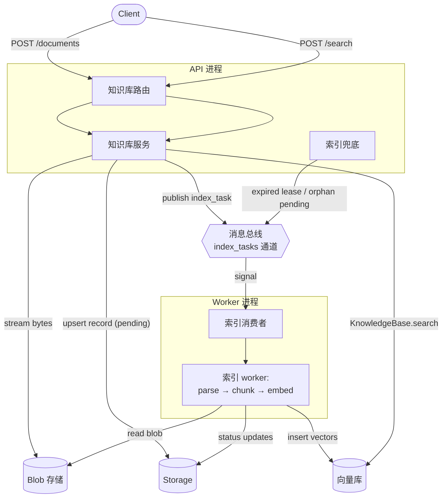

[RAG](/versions/2.0.3/zh/building-blocks/rag) 章节中介绍了 AgentScope 中的 RAG 模块的拓展和使用方法。本章介绍智能体服务（Agent service）中提供的**多租户、可分布式部署**的 RAG 服务层。服务层在 building blocks 的基础上，围绕「多租户」「分布式」「易接入」提供以下能力：

| 能力 | 说明 |
|------|------|
| 多租户隔离的知识库 | 每个用户拥有独立命名空间，多个知识库互不干扰，**天然适合多用户 SaaS 场景，无需自己做权限隔离** |
| 完整的知识库 / 文档管理 | 提供知识库与文档的全量 CRUD 接口，删除时自动级联清理向量、记录与原始文件，**避免长跑后的脏数据与孤儿文件** |
| 异步上传 + 实时进度反馈 | 上传请求立即返回，索引在后台流转，并暴露批量状态查询接口，**前端可以做秒级响应的进度条与失败提示，不阻塞用户操作** |
| 可插拔的文件对象存储 | 支持本地 / S3 / 自实现的对象存储后端，**大文件不必常驻内存，分布式部署时多个 worker 也能共享同一份文件源，迁移到云上零改造** |
| 分布式索引与横向扩容 | 解析 / 切块 / 嵌入可独立部署成多份 worker，**当文档量或解析成本上来时，按需扩 worker 即可，不影响 API 的请求吞吐** |
| 内置容灾与自愈 | 任务 lease、心跳续约、周期性扫描重派全部内置，**worker 崩溃、网络抖动、重复入队都不会让任务卡死，运维成本接近零** |
| 嵌入模型自动适配 | 创建知识库时自动过滤出与向量库维度兼容的模型，**用户无须关心维度匹配，前端选项即是可用项，杜绝选错模型导致的索引失败** |
| 开箱即用的 REST API 与前端 UI | 所有能力以完整 REST 端点暴露，并配套官方前端实现，**接入方拿来即用，不必再写一遍上传 / 检索 / 进度页** |

## 快速开始

下面的步骤把 RAG 服务跑起来——后端 + 官方前端，串通后即可在 UI 里创建知识库、上传文档、做检索。

<Steps>
  <Step title="配置并启动 RAG 服务">
    给 `create_app` 传入与 RAG 相关的几个组件即可开启 `/knowledge_bases` 全部端点。下面的最小示例分别演示**本地 blob 存储**与 **S3 blob 存储**两种配置——前提是 Redis、Qdrant 已经在本地（或可访问的地址上）准备好：

    <CodeGroup>

    ```python 本地 blob 存储
    import uvicorn

    from agentscope.app import create_app
    from agentscope.app.rag.blob_store import LocalBlobStore
    from agentscope.app.rag.knowledge_base_manager import CollectionPerKbManager
    from agentscope.app.message_bus import RedisMessageBus
    from agentscope.app.storage import RedisStorage
    from agentscope.app.workspace_manager import LocalWorkspaceManager
    from agentscope.rag import (
        ApproxTokenChunker,
        ImageParser,
        PDFParser,
        PPTParser,
        QdrantStore,
        TextParser,
    )

    storage = RedisStorage(host="localhost", port=6379)
    message_bus = RedisMessageBus(host="localhost", port=6379)
    workspace_manager = LocalWorkspaceManager(basedir="/data/workspaces")

    vector_store = QdrantStore(url="http://localhost:6333")
    kb_manager = CollectionPerKbManager(
        storage=storage,
        vector_store=vector_store,
    )

    app = create_app(
        storage=storage,
        message_bus=message_bus,
        workspace_manager=workspace_manager,
        knowledge_base_manager=kb_manager,
        # 按 IANA 媒体类型路由：文本 / PDF / PPT / 图片各走对应解析器
        knowledge_parsers=[
            TextParser(),
            PDFParser(),
            PPTParser(),
            ImageParser(),
        ],
        knowledge_chunker=ApproxTokenChunker(chunk_size=512, overlap=50),
        blob_store=LocalBlobStore(root_dir="/data/blobs"),
    )

    uvicorn.run(app, host="0.0.0.0", port=8000)
    ```

    ```python S3 blob 存储
    import uvicorn

    from agentscope.app import create_app
    from agentscope.app.rag.blob_store import S3BlobStore
    from agentscope.app.rag.knowledge_base_manager import CollectionPerKbManager
    from agentscope.app.message_bus import RedisMessageBus
    from agentscope.app.storage import RedisStorage
    from agentscope.app.workspace_manager import LocalWorkspaceManager
    from agentscope.rag import (
        ApproxTokenChunker,
        ImageParser,
        PDFParser,
        PPTParser,
        QdrantStore,
        TextParser,
    )

    storage = RedisStorage(host="localhost", port=6379)
    message_bus = RedisMessageBus(host="localhost", port=6379)
    workspace_manager = LocalWorkspaceManager(basedir="/data/workspaces")

    vector_store = QdrantStore(url="http://localhost:6333")
    kb_manager = CollectionPerKbManager(
        storage=storage,
        vector_store=vector_store,
    )

    app = create_app(
        storage=storage,
        message_bus=message_bus,
        workspace_manager=workspace_manager,
        knowledge_base_manager=kb_manager,
        knowledge_parsers=[
            TextParser(),
            PDFParser(),
            PPTParser(),
            ImageParser(),
        ],
        knowledge_chunker=ApproxTokenChunker(chunk_size=512, overlap=50),
        blob_store=S3BlobStore(bucket="my-rag-bucket"),
    )

    uvicorn.run(app, host="0.0.0.0", port=8000)
    ```

    </CodeGroup>

    其中与 RAG 相关的 `create_app` 参数如下；不传 `knowledge_base_manager` 时整组知识库端点不会被注册。

    <ParamField path="knowledge_base_manager" type="KnowledgeBaseManagerBase | None" default="None">
      知识库生命周期的拥有者，绑定一个向量库实例（其连接生命周期由 manager 代理）。内置实现 `CollectionPerKbManager` 采用「每个知识库一个 collection」的隔离策略，允许各知识库自由选择嵌入维度。
    </ParamField>
    <ParamField path="knowledge_parsers" type="list[ParserBase] | dict[str, ParserBase] | None" default="[TextParser()]">
      注册到上传链路的 parser 列表，按各 parser 声明的 `supported_media_types` 路由上传文件。`list` 形式下，后注册的同类型 parser 覆盖前者（覆盖会打 warning）；`dict` 形式 `media_type → parser` 表示显式路由（适合同一 parser 绑定多个类型或自定义别名）。
    </ParamField>
    <ParamField path="knowledge_chunker" type="ChunkerBase | None" default="ApproxTokenChunker()">
      全部知识库共用的切块策略。生产场景按嵌入模型上下文窗口调整 `chunk_size` 与 `overlap`。
    </ParamField>
    <ParamField path="blob_store" type="BlobStoreBase | None" default="LocalBlobStore('./blobs')">
      上传文件落地的二进制存储。本地存储适合单机；分布式部署请用 S3 或自实现的共享后端，因为 worker 必须与 API 共享同一份文件源。
    </ParamField>
    <ParamField path="enable_index_worker" type="bool" default="True">
      `True` 时 API 进程内同时跑解析 / 切块 / 嵌入（单进程模式）；`False` 时 API 只接收上传与入队任务，索引交给独立 worker（分布式模式），详见下文「部署形态」。
    </ParamField>
  </Step>

  <Step title="启动官方前端">
    AgentScope 仓库的 [`examples/web_ui`](https://github.com/agentscope-ai/agentscope/tree/main/examples/web_ui) 目录提供与上面后端配套的 React 前端，直接拉起即可：

    ```bash
    cd examples/web_ui
    pnpm install
    pnpm dev
    ```

    打开 dev server 输出的 URL（通常是 `http://localhost:5173`），前端会自动连接到 8000 端口的服务。
  </Step>

  <Step title="在前端操作">
    打开前端后，可以在 UI 里完成新建知识库、上传文档、查看处理进度、做检索测试等全套操作。

    {/* TODO: 知识库列表 / 新建知识库 截图 */}
    {/* TODO: 上传文档 + 状态进度 截图 */}
    {/* TODO: 检索测试 截图 */}
  </Step>
</Steps>

## 部署形态

上一节的快速开始把 API 与索引跑在**同一个进程**里，对本地开发和小流量场景足够用；但生产环境里，解析 / 切块 / 嵌入是 CPU 与 IO 双重密集的链路，跟 HTTP 请求挤在同一个进程会出现两个问题：

1. **资源相互挤占**：一份大 PDF 进来，事件循环被解析卡住，同进程内其他 API 请求一起变慢；
2. **扩容颗粒度过粗**：唯一的横向扩缩单位是「API 副本」，但真正吃资源的只有索引链路，整体扩等于在浪费资源。

为此，服务层支持把索引链路抽出来跑成独立的 **worker** 进程——专门订阅消息总线、从 blob 拉文件、跑「解析 → 切块 → 嵌入 → 入库」全流程，与 API 解耦后可以独立扩缩、独立挂重型解析依赖。下表对照两种部署形态，方便按流量与运维复杂度选型：

| 维度 | 单进程部署 | 分布式部署 |
|------|-----------|---------|
| 进程拓扑 | API + 索引同进程 | API + N 个 worker |
| 资源隔离 | 解析重时会挤占请求线程 | API 不受解析负载影响 |
| 扩容方式 | 整体扩 API 副本 | API 与 worker 独立扩 |
| 部署复杂度 | 一份配置即可 | 需要发布两套镜像 / 服务 |
| 适用场景 | 本地、原型、轻流量 | 生产、解析 / 嵌入是瓶颈 |

### 单进程部署

`create_app` 的 `enable_index_worker` 默认为 `True`，API 进程在 lifespan 里自动起一个内置的 worker 协程，无需额外配置——这就是「快速开始」演示的形态。如果之前显式关掉过，传回 `True` 即可：

```python
app = create_app(
    ...,
    enable_index_worker=True,   # 默认值，可省略
)
```

### 分布式部署

API 进程关掉内置 worker，只负责接收上传、入队任务、跑兜底自愈；一个或多个 worker 进程独立启动，订阅同一条消息总线通道并拉取任务。

API 端：

```python
app = create_app(
    storage=storage,
    message_bus=message_bus,
    workspace_manager=workspace_manager,
    knowledge_base_manager=kb_manager,
    blob_store=blob_store,
    enable_index_worker=False,   # ← 不在 API 进程内起 worker
)
```

Worker 端有两种启动方式：

- **CLI 方式**：通过 `python -m agentscope.app.rag.index_worker`，配合环境变量 `AGENTSCOPE_WORKER_BOOTSTRAP=module:callable` 指向一个返回后端字典的工厂。运维直接拷贝同一份 systemd / k8s 单元即可批量扩容；
- **库方式**：在自己的入口脚本里调用 `agentscope.app.rag.index_worker.run_worker(...)`（也可直接 `from agentscope.app.rag import run_worker` 导入），与 `create_app` 拼出来的后端共享同一组实例。

下面给出库方式的最小示例。**关键约定**：API 与 worker 必须挂同一份 storage / 消息总线 / blob store / 知识库 manager 的**配置**——它们共享 vector store collection、共享 blob URI、共享文档 lease，任何一项不一致都会导致索引失败或数据错位。

```python
import asyncio
import os

from agentscope.app.rag import run_worker
from agentscope.app.rag.blob_store import S3BlobStore
from agentscope.app.rag.knowledge_base_manager import CollectionPerKbManager
from agentscope.app.message_bus import RedisMessageBus
from agentscope.app.storage import RedisStorage
from agentscope.rag import (
    ApproxTokenChunker,
    ImageParser,
    PDFParser,
    PPTParser,
    QdrantStore,
    TextParser,
)


async def main() -> None:
    storage = RedisStorage(url=os.environ["REDIS_URL"])
    message_bus = RedisMessageBus(url=os.environ["REDIS_URL"])
    blob_store = S3BlobStore(bucket=os.environ["S3_BUCKET"])
    vector_store = QdrantStore(url=os.environ["QDRANT_URL"])
    kb_manager = CollectionPerKbManager(
        storage=storage,
        vector_store=vector_store,
    )

    await run_worker(
        storage=storage,
        message_bus=message_bus,
        blob_store=blob_store,
        knowledge_base_manager=kb_manager,
        # 与 API 端保持完全一致的 parser 列表
        parsers=[
            TextParser(),
            PDFParser(),
            PPTParser(),
            ImageParser(),
        ],
        chunker=ApproxTokenChunker(),
        worker_max_concurrency=4,   # 单个 worker 并发处理的文档上限
        consumer_max_batch=32,      # 单次信号最多拉取的任务条数
    )


if __name__ == "__main__":
    asyncio.run(main())
```

CLI 方式所需的 bootstrap 工厂只是把上面的 `run_worker(...)` 调用拆成「构造 kwargs」和「调用」两步——把要传给 `run_worker` 的关键字参数作为 dict 返回即可：

```python
# mydeploy/worker_bootstrap.py
import os

from agentscope.app.rag.blob_store import S3BlobStore
from agentscope.app.rag.knowledge_base_manager import CollectionPerKbManager
from agentscope.app.message_bus import RedisMessageBus
from agentscope.app.storage import RedisStorage
from agentscope.rag import (
    ApproxTokenChunker,
    ImageParser,
    PDFParser,
    PPTParser,
    QdrantStore,
    TextParser,
)


def bootstrap() -> dict:
    storage = RedisStorage(url=os.environ["REDIS_URL"])
    message_bus = RedisMessageBus(url=os.environ["REDIS_URL"])
    vector_store = QdrantStore(url=os.environ["QDRANT_URL"])
    return {
        "storage": storage,
        "message_bus": message_bus,
        "blob_store": S3BlobStore(bucket=os.environ["S3_BUCKET"]),
        "knowledge_base_manager": CollectionPerKbManager(
            storage=storage,
            vector_store=vector_store,
        ),
        "parsers": [
            TextParser(),
            PDFParser(),
            PPTParser(),
            ImageParser(),
        ],
        "chunker": ApproxTokenChunker(),
    }
```

然后这样启动：

```bash
AGENTSCOPE_WORKER_BOOTSTRAP=mydeploy.worker_bootstrap:bootstrap \
    python -m agentscope.app.rag.index_worker
```

<Note>
向量库本身的高可用 / 多副本由所选向量库后端负责；服务层只持有连接句柄。把 Qdrant 指向集群、把 S3 指向跨区桶，即可在不动应用代码的前提下完成存储侧扩展。
</Note>

## 运行原理

服务层的核心设计是**用消息总线（event bus）把「上传」与「索引」彻底解耦**——前者是同步链路、追求毫秒级返回，后者是异步链路、可重、可分布式。两条链路只通过 bus 上的一条 `index_tasks` 通道通信，因此同一份代码既能在「快速开始」里跑成单进程，也能在「分布式部署」里跨多机扩容，业务逻辑完全相同。

围绕这条 bus 的几个角色：

| 角色 | 所在进程 | 与 bus 的关系 | 职责 |
|------|---------|--------------|------|
| 知识库服务（API） | API 进程 | **发布**索引任务 | 接收 HTTP 请求，流式写 blob、落 `pending` 记录，向 bus 推任务 |
| 索引消费者 | Worker 进程（或 API 进程内置） | **订阅**索引信号 | 监听 bus 信号、批量拉取任务、转交给索引 worker |
| 索引 worker | Worker 进程（或 API 进程内置） | 拿到任务后跑全流程 | 抢 lease → 解析 → 切块 → 嵌入 → 写向量库 → 标记 `ready` |
| 索引兜底（sweeper） | API 进程 | **重新发布**卡住的任务 | 周期性扫描超时 lease / 长期 `pending` 记录，重新入队 |

下图展示一份文档从上传到可检索的完整路径，所有跨进程通信都经过 bus，因此把 worker 抽出来部署不需要改任何配线：



链路要点：

- **上传链路**（API 进程）：路由把请求交给知识库服务，后者把文件**流式**写进 blob 存储、落一条 `pending` 记录，然后向 bus 推一条索引任务；HTTP 立刻返回，**不在请求体里跑解析 / 嵌入**。
- **索引链路**（worker 进程，可内置在 API 中也可独立部署）：索引消费者订阅 bus 信号、批量拉取任务、转交给索引 worker 跑「抢 lease → 解析 → 切块 → 嵌入 → 入库 → 标记 ready」全流程。索引内部统一通过 `KnowledgeBaseManagerBase.get_knowledge(...)` 拿到一个 `KnowledgeBase` 运行时句柄，再调用 `insert_document(...)` 完成嵌入 + 入库，与 library 模式跑的是同一条逻辑。
- **自愈链路**（始终在 API 进程）：索引兜底周期性发现超时 lease 或长时间未被处理的 `pending` 记录，重新向 bus 入队；worker 侧的 CAS lease 保证不会重复处理。

### 文档状态机

文档记录的 `status` 字段在生命周期内严格按以下顺序流转，前端可以根据它渲染进度条或失败提示：

| 状态 | 触发点 | 含义 |
|------|--------|------|
| `pending` | 上传完成 | 已上传到 blob 存储、记录已落盘，等待 worker 拉取 |
| `parsing` | worker 取得 lease 后 | 正在从 blob 流出字节并交给 parser |
| `chunking` | parser 返回后 | 正在切块 |
| `indexing` | chunker 返回后 | 正在嵌入并写入向量库 |
| `ready` | 向量库写入成功 | 文档已可检索；`chunk_count` 字段在此刻填充 |
| `error` | 任意阶段抛异常 | 错误被简化为单行写入 `error` 字段；blob 与记录保留以便前端复盘 / 用户重传 |

### 容错与自愈

服务层围绕 bus + lease 做了几项让长跑更省心的设计：

- **lease + CAS 防重入**：worker 接到任务后先用 storage 层的 CAS 抢 lease，重复入队或多 worker 抢同一文档都只会执行一次；
- **lease 自动续约**：lease 默认 90 秒，worker 内置心跳每 45 秒续一次，长文档解析不会超时；
- **race 检测**：worker 同时跑流水线与心跳；心跳一旦发现 lease 被夺（sweeper 误判 / 网络抖动），立即取消流水线，避免和接管 worker 同时写入向量库；
- **兜底重派**：lease 过期（worker 崩溃）或 `pending` 超过宽限期（API 推送失败）的文档会被周期性重新入队；
- **错误隔离到记录上**：任意阶段抛异常都会被写到记录的 `error` 字段，前端可见，blob 与记录不会自动清理，便于排查后重传；
- **删除链路幂等**：先删向量库、再删记录、最后删 blob，任意中途失败重试都不会留下状态不一致。

<Warning>
parser 默认在事件循环线程内运行。如果引入 PDF / Office 等 CPU 密集型 parser（例如 `PDFParser`、`PPTParser`），**务必**给 worker 传 `parser_executor=ProcessPoolExecutor(...)`，否则会阻塞同进程内的其他 asyncio 任务（在单进程部署中会拖慢 API 响应）。
</Warning>

## REST API 概览

服务层在 `/knowledge_bases` 前缀下暴露完整的 CRUD + 上传 + 检索端点。下表按职责分组，请求 / 响应的字段细节由 OpenAPI 文档给出：

| 类别 | 端点 | 说明 |
|------|------|------|
| 能力发现 | `GET /knowledge_bases/embedding_models` | 列出当前用户的凭证下，与向量库维度策略兼容的嵌入模型 |
| 能力发现 | `GET /knowledge_bases/supported_content_types` | 列出当前 API 已挂载的解析器支持的 IANA media types 与文件扩展名，前端用作 `<input accept>` |
| 能力发现 | `GET /knowledge_bases/middleware/parameters_schema` | 获取 `RAGMiddleware.Parameters` 的 JSON Schema，前端用作动态表单 |
| 知识库 CRUD | `POST/GET/PATCH/DELETE /knowledge_bases` | 知识库的增查改删；删除会级联清理 collection、文档记录和 blob |
| 文档管理 | `GET/POST/DELETE /knowledge_bases/{kb_id}/documents` | 列出 / 上传 / 删除文档；上传后立即返回 `pending` |
| 状态轮询 | `GET /knowledge_bases/{kb_id}/documents/status?ids=a,b,c` | 批量查询若干文档当前状态，前端用于轮询渲染进度 |
| 检索 | `POST /knowledge_bases/{kb_id}/search` | 自然语言查询，返回 top-K 检索结果 |

<Tip>
上传与检索走的是**同一个**知识库句柄——服务层的 `POST /search` 端点底层调用 `KnowledgeBaseService.search`，再委派给 `KnowledgeBase.search`，这与 library 模式、`RAGMiddleware` 调用的是同一条链路。也就是说，前端用 `/search` 端点排查检索效果，与智能体推理时拿到的内容是一致的。
</Tip>

## 延伸阅读

<CardGroup cols={2}>
  <Card title="RAG" icon="cubes" href="/versions/2.0.3/zh/building-blocks/rag" cta="查看 library 用法" arrow>
    了解 parser / chunker / vector store / middleware 的原子接口与 library 模式用法。
  </Card>
  <Card title="架构" icon="sitemap" href="/versions/2.0.3/zh/deploy/agent-service" cta="查看 create_app 全局参数" arrow>
    `create_app` 的全局参数、lifespan、依赖注入与 ASGI 中间件层。
  </Card>
  <Card title="中间件" icon="layer-group" href="/versions/2.0.3/zh/building-blocks/middleware" cta="了解中间件机制" arrow>
    `RAGMiddleware` 借助哪些钩子注入检索结果。
  </Card>
  <Card title="嵌入模型" icon="cube" href="/versions/2.0.3/zh/building-blocks/model" cta="查看模型列表" arrow>
    嵌入模型卡 / 维度约束，决定知识库可选哪些模型。
  </Card>
</CardGroup>
