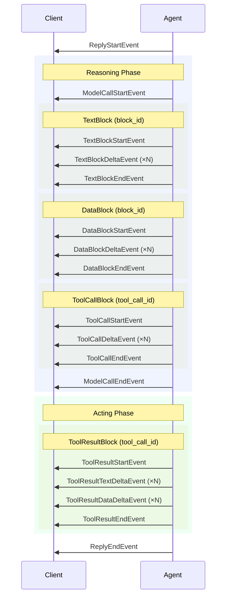

Message and Event are the two fundamental data structures in AgentScope.

- **Message** — the unit of inter-agent communication and persistence. Each `Msg` represents a complete conversation turn that is stored in context and exchanged between agents.
- **Event** — the unit of frontend interaction and streaming. Events carry incremental progress updates (text tokens, tool call fragments, permission requests) and drive real-time UIs and human-in-the-loop workflows.

A sequence of events produced during a single `reply` call accumulates into exactly one assistant `Msg`. This guarantees that the complete message state is always recoverable from its event stream.

## Message

A `Msg` represents a single turn in a conversation — a user input, an assistant response, or a system instruction, carrying structured content as a list of typed blocks.

<Tip>
	One assistant message corresponds to one complete `reply` cycle of the agent (repeated reasoning and acting until a final response is produced).
</Tip>

### Structure

The `Msg` class has the following core fields:

| Field         | Type                                | Description                                       |
|---------------|-------------------------------------|---------------------------------------------------|
| `id`          | `str`                               | Unique message identifier                         |
| `name`        | `str`                               | Name of the sender                                |
| `role`        | `"user" \| "assistant" \| "system"` | The sender's role                                 |
| `content`     | `list[ContentBlock]`                | Ordered list of content blocks                    |
| `metadata`    | `dict`                              | Arbitrary key-value metadata                      |
| `created_at`  | `str`                               | ISO 8601 timestamp of creation                    |
| `finished_at` | `str \| None`                       | ISO 8601 timestamp when the message was finalized |
| `usage`       | `Usage`                             | Token usage statistics (for assistant messages)   |

### Content Blocks

Message content is composed of typed blocks. Each block represents a distinct piece of information:

| Block             | Description                                         | Allowed In              |
|-------------------|-----------------------------------------------------|-------------------------|
| `TextBlock`       | Plain text content                                  | user, assistant, system |
| `DataBlock`       | Binary data (images, audio) via base64 or URL       | user, assistant         |
| `ThinkingBlock`   | Model reasoning (chain-of-thought)                  | assistant               |
| `ToolCallBlock`   | A tool invocation with name, input, and state       | assistant               |
| `ToolResultBlock` | The output of a tool execution                      | assistant               |
| `HintBlock`       | Out-of-band hint injected into the conversation (e.g. a scheduled-task trigger, a team message, a background-tool result). The `hint` field is `str` for plain text or `list[TextBlock \| DataBlock]` for multimodal payloads; `source` carries a small JSON tag the frontend uses to label the hint's origin. | assistant               |

<Note>
Role constraints are enforced at construction: `user` messages can only contain `TextBlock` and `DataBlock`; `system` messages can only contain `TextBlock`; `assistant` messages can contain all block types.
</Note>

### Create Messages

AgentScope provides three shortcut factory functions for quickly creating messages with the correct role, without manually specifying `role` or wrapping content into blocks:

| Factory                       | Role        | Allowed Content                         |
|-------------------------------|-------------|-----------------------------------------|
| `UserMsg(name, content)`      | `user`      | `str` or `list[TextBlock \| DataBlock]` |
| `AssistantMsg(name, content)` | `assistant` | `str` or `list[ContentBlock]`           |
| `SystemMsg(name, content)`    | `system`    | `str` or `list[TextBlock]`              |

When `content` is a plain string, it is automatically wrapped into a `TextBlock`.

```python
from agentscope.message import UserMsg, AssistantMsg, SystemMsg

# User message — text and optional images
user_msg = UserMsg(name="user", content="What's in this image?")

# User message with multimodal content
from agentscope.message import TextBlock, DataBlock, Base64Source
user_msg = UserMsg(
    name="user",
    content=[
        TextBlock(text="Describe this image:"),
        DataBlock(source=Base64Source(data="...", media_type="image/png")),
    ],
)

# System message — text only
system_msg = SystemMsg(name="system", content="You are a helpful assistant.")

# Assistant message — all block types allowed
assistant_msg = AssistantMsg(name="agent", content="Here is the result...")
```

### Access Content

`Msg` provides helper methods to extract specific block types:

| Method | Returns |
|--------|---------|
| `get_text_content(separator="\n")` | Concatenated text from all `TextBlock`s, or `None` |
| `get_content_blocks(block_type)` | Filtered list of blocks by type |
| `has_content_blocks(block_type)` | `True` if blocks of the given type exist |

```python
# Get all text content
text = msg.get_text_content()

# Get all tool calls
tool_calls = msg.get_content_blocks("tool_call")

# Check if message has tool results
if msg.has_content_blocks("tool_result"):
    ...
```

## Event

Events are the streaming counterpart of messages. While the agent executes, it yields a sequence of `AgentEvent` objects that represent incremental progress — text tokens arriving, tool calls being constructed, results streaming back. Each event is lightweight and self-contained.

### Event Lifecycle

Every event carries a `reply_id` that links it to the message being constructed. Within a reply, `block_id` or `tool_call_id` identifies which content block an event belongs to. Events follow a **start → delta → end** pattern for each content block:



All events within the same reply share the same `reply_id`. Within a reply, use `block_id` to correlate text/thinking/data block events, and `tool_call_id` to correlate tool call and tool result events.

### Event Types

All events inherit from `EventBase` which provides common fields:

| Field | Type | Description |
|-------|------|-------------|
| `id` | `str` | Unique event identifier |
| `created_at` | `str` | ISO 8601 timestamp |

Events are grouped by category below. Every event also carries a `reply_id` field (except where noted) that links it to the message being constructed.

<AccordionGroup>
  <Accordion title="Lifecycle Events">
    **ReplyStartEvent** — Agent begins a new reply.

    | Field | Type | Description |
    |-------|------|-------------|
    | `reply_id` | `str` | ID of the reply message |
    | `session_id` | `str` | ID of the session |
    | `name` | `str` | Agent name |
    | `role` | `str` | Agent role (default `"assistant"`) |

    **ReplyEndEvent** — Agent finishes the reply.

    | Field | Type | Description |
    |-------|------|-------------|
    | `reply_id` | `str` | ID of the reply message |
    | `session_id` | `str` | ID of the session |

    **ExceedMaxItersEvent** — Agent reached the maximum reasoning-acting iterations.

    | Field | Type | Description |
    |-------|------|-------------|
    | `reply_id` | `str` | ID of the reply message |
    | `name` | `str` | Agent name |
  </Accordion>

  <Accordion title="Text Streaming Events">
    **TextBlockStartEvent** — A new text block begins.

    | Field | Type | Description |
    |-------|------|-------------|
    | `reply_id` | `str` | ID of the reply message |
    | `block_id` | `str` | Unique identifier of the text block |

    **TextBlockDeltaEvent** — Incremental text content arrives.

    | Field | Type | Description |
    |-------|------|-------------|
    | `reply_id` | `str` | ID of the reply message |
    | `block_id` | `str` | Unique identifier of the text block |
    | `delta` | `str` | Incremental text content |

    **TextBlockEndEvent** — The text block is complete.

    | Field | Type | Description |
    |-------|------|-------------|
    | `reply_id` | `str` | ID of the reply message |
    | `block_id` | `str` | Unique identifier of the text block |
  </Accordion>

  <Accordion title="Thinking Streaming Events">
    **ThinkingBlockStartEvent** — A new thinking block begins.

    | Field | Type | Description |
    |-------|------|-------------|
    | `reply_id` | `str` | ID of the reply message |
    | `block_id` | `str` | Unique identifier of the thinking block |

    **ThinkingBlockDeltaEvent** — Incremental thinking content arrives.

    | Field | Type | Description |
    |-------|------|-------------|
    | `reply_id` | `str` | ID of the reply message |
    | `block_id` | `str` | Unique identifier of the thinking block |
    | `delta` | `str` | Incremental thinking text |

    **ThinkingBlockEndEvent** — The thinking block is complete.

    | Field | Type | Description |
    |-------|------|-------------|
    | `reply_id` | `str` | ID of the reply message |
    | `block_id` | `str` | Unique identifier of the thinking block |
  </Accordion>

  <Accordion title="Data Streaming Events">
    **DataBlockStartEvent** — A new data block begins (image, audio, etc.).

    | Field | Type | Description |
    |-------|------|-------------|
    | `reply_id` | `str` | ID of the reply message |
    | `block_id` | `str` | Unique identifier of the data block |
    | `media_type` | `str` | MIME type (e.g. `"image/png"`) |

    **DataBlockDeltaEvent** — Incremental binary data arrives.

    | Field | Type | Description |
    |-------|------|-------------|
    | `reply_id` | `str` | ID of the reply message |
    | `block_id` | `str` | Unique identifier of the data block |
    | `data` | `str` | Incremental base64-encoded data |
    | `media_type` | `str` | MIME type |

    **DataBlockEndEvent** — The data block is complete.

    | Field | Type | Description |
    |-------|------|-------------|
    | `reply_id` | `str` | ID of the reply message |
    | `block_id` | `str` | Unique identifier of the data block |
  </Accordion>

  <Accordion title="Tool Call Streaming Events">
    **ToolCallStartEvent** — The agent begins a tool call.

    | Field | Type | Description |
    |-------|------|-------------|
    | `reply_id` | `str` | ID of the reply message |
    | `tool_call_id` | `str` | Unique identifier of the tool call |
    | `tool_call_name` | `str` | Name of the tool being called |

    **ToolCallDeltaEvent** — Incremental tool call input arrives.

    | Field | Type | Description |
    |-------|------|-------------|
    | `reply_id` | `str` | ID of the reply message |
    | `tool_call_id` | `str` | Unique identifier of the tool call |
    | `delta` | `str` | Incremental JSON fragment of tool input |

    **ToolCallEndEvent** — The tool call input is complete.

    | Field | Type | Description |
    |-------|------|-------------|
    | `reply_id` | `str` | ID of the reply message |
    | `tool_call_id` | `str` | Unique identifier of the tool call |
  </Accordion>

  <Accordion title="Tool Result Streaming Events">
    **ToolResultStartEvent** — Tool execution begins.

    | Field | Type | Description |
    |-------|------|-------------|
    | `reply_id` | `str` | ID of the reply message |
    | `tool_call_id` | `str` | ID of the corresponding tool call |
    | `tool_call_name` | `str` | Name of the tool |

    **ToolResultTextDeltaEvent** — Incremental text output from the tool.

    | Field | Type | Description |
    |-------|------|-------------|
    | `reply_id` | `str` | ID of the reply message |
    | `tool_call_id` | `str` | ID of the corresponding tool call |
    | `delta` | `str` | Incremental text content |

    **ToolResultDataDeltaEvent** — Binary data output from the tool.

    | Field | Type | Description |
    |-------|------|-------------|
    | `reply_id` | `str` | ID of the reply message |
    | `tool_call_id` | `str` | ID of the corresponding tool call |
    | `block_id` | `str` | Unique identifier of the data block |
    | `media_type` | `str` | MIME type of the content |
    | `data` | `str \| None` | Base64-encoded data (mutually exclusive with `url`) |
    | `url` | `str \| None` | URL pointing to the content (mutually exclusive with `data`) |

    **ToolResultEndEvent** — Tool execution is complete.

    | Field | Type | Description |
    |-------|------|-------------|
    | `reply_id` | `str` | ID of the reply message |
    | `tool_call_id` | `str` | ID of the corresponding tool call |
    | `state` | `ToolResultState` | Final state: `SUCCESS`, `ERROR`, `INTERRUPTED`, `DENIED`, or `RUNNING` |
  </Accordion>

  <Accordion title="Model Call Events">
    **ModelCallStartEvent** — A model API call begins.

    | Field | Type | Description |
    |-------|------|-------------|
    | `reply_id` | `str` | ID of the reply message |
    | `model_name` | `str` | Name of the model being called |

    **ModelCallEndEvent** — A model API call completes.

    | Field | Type | Description |
    |-------|------|-------------|
    | `reply_id` | `str` | ID of the reply message |
    | `input_tokens` | `int` | Number of input tokens consumed |
    | `output_tokens` | `int` | Number of output tokens generated |
  </Accordion>

  <Accordion title="Human-in-the-Loop Events">
    **RequireUserConfirmEvent** — Agent pauses for user confirmation.

    | Field | Type | Description |
    |-------|------|-------------|
    | `reply_id` | `str` | ID of the reply message |
    | `tool_calls` | `list[ToolCallBlock]` | Tool calls pending user confirmation |

    **RequireExternalExecutionEvent** — Agent pauses for external execution.

    | Field | Type | Description |
    |-------|------|-------------|
    | `reply_id` | `str` | ID of the reply message |
    | `tool_calls` | `list[ToolCallBlock]` | Tool calls to be executed externally |

    **UserConfirmResultEvent** — User provides confirmation results (input event).

    | Field | Type | Description |
    |-------|------|-------------|
    | `reply_id` | `str` | ID of the reply message |
    | `confirm_results` | `list[ConfirmResult]` | Confirmation results for each pending tool call |

    **ExternalExecutionResultEvent** — External system provides execution results (input event).

    | Field | Type | Description |
    |-------|------|-------------|
    | `reply_id` | `str` | ID of the reply message |
    | `execution_results` | `list[ToolResultBlock]` | Results returned by the external executor |
  </Accordion>

  <Accordion title="One-shot Events">
    Unlike text / thinking / data / tool blocks, these events do not follow the start → delta → end pattern. The full payload arrives in a single event because it is known up-front rather than streamed.

    **HintBlockEvent** — A `HintBlock` is injected into the agent's context (e.g. a scheduled-task trigger, a team message, a result returned by an offloaded background tool).

    | Field | Type | Description |
    |-------|------|-------------|
    | `reply_id` | `str` | ID of the reply message |
    | `block_id` | `str` | Unique identifier of the hint block |
    | `hint` | `str \| list[TextBlock \| DataBlock]` | The hint payload — plain text or a list of multimodal blocks |
    | `source` | `str \| None` | Optional sender / origin tag (typically a small JSON object describing how the frontend should label this hint) |

    **CustomEvent** — Generic extensible event used by service-layer middleware to notify subscribers about state changes (task progress, team membership, permission updates, …) without polluting the core agent event enum.

    | Field | Type | Description |
    |-------|------|-------------|
    | `reply_id` | `str` | ID of the reply message |
    | `name` | `str` | The signal name (e.g. `"tasks_context"`, `"team_updated"`) |
    | `value` | `dict` | Arbitrary JSON-serialisable payload for this signal |
  </Accordion>
</AccordionGroup>

## Reconstruct Messages from Events

Events and messages are not independent — they are two views of the same data. Every event produced by `reply_stream` can be applied to a `Msg` via `append_event()`, reconstructing the complete message incrementally. This guarantees that the final message state is fully recoverable from the event stream alone.

```python
from agentscope.message import Msg, AssistantMsg

msg = None

# Accumulate events into the message
async for event in agent.reply_stream(user_msg):
	if isinstance(event, ReplyStartEvent):
		# Create a new message when the reply starts
		msg = AssistantMsg(name=event.name, content=[], id=event.reply_id)

	else:
		# For all other events, append to the message to reconstruct its state
        msg.append_event(event)
```

The `append_event` method handles all event types:

| Event Type | Effect on Msg |
|------------|---------------|
| `ReplyEndEvent` | Sets `finished_at` timestamp |
| `TextBlockStartEvent` | Appends a new empty `TextBlock` |
| `TextBlockDeltaEvent` | Concatenates `delta` to the block's text |
| `DataBlockStartEvent` | Appends a new empty `DataBlock` |
| `DataBlockDeltaEvent` | Concatenates `data` to the block's base64 content |
| `ThinkingBlockStartEvent` | Appends a new empty `ThinkingBlock` |
| `ThinkingBlockDeltaEvent` | Concatenates `delta` to the block's thinking text |
| `ToolCallStartEvent` | Appends a new `ToolCallBlock` with empty input |
| `ToolCallDeltaEvent` | Concatenates `delta` to the tool call's input |
| `ToolResultStartEvent` | Appends a new `ToolResultBlock` with empty output |
| `ToolResultTextDeltaEvent` | Appends text to the tool result's output |
| `ToolResultDataDeltaEvent` | Appends a binary data block to the tool result's output |
| `ToolResultEndEvent` | Sets the tool result's final `state` |
| `HintBlockEvent` | Appends a `HintBlock` to content (carrying the event's `hint` and `source`) so the hint is persisted and replayable |
| `RequireUserConfirmEvent` | Updates tool call states to `ASKING` |
| `ExternalExecutionResultEvent` | Appends `ToolResultBlock`s to content |

<Tip>
This design enables flexible deployment: a backend can stream events over WebSocket to a frontend, which reconstructs the message client-side. If the connection drops, replaying the event sequence from any checkpoint restores the exact message state.
</Tip>

### TypeScript Support

A TypeScript version of the message and event primitives is available on npm, so frontends can reconstruct messages from the event stream with the same `appendEvent` API:

```bash
pnpm install @agentscope-ai/agentscope
```

```typescript
import { AssistantMsg, ReplyStartEvent } from "@agentscope-ai/agentscope/message";

let msg: AssistantMsg | null = null;

for await (const event of stream) {
    if (event.type === "REPLY_START") {
        msg = new AssistantMsg({ name: event.name, content: [], id: event.reply_id });
    } else {
        msg?.appendEvent(event);
    }
}
```

### Example: Streaming UI

A typical pattern for building a streaming interface:

```python
from agentscope.message import AssistantMsg, UserMsg
from agentscope.event import (
    ReplyStartEvent,
    TextBlockDeltaEvent,
    ToolCallStartEvent,
    ToolResultEndEvent,
    ReplyEndEvent,
)

msg = None

async for event in agent.reply_stream(UserMsg("user", "Fix the bug")):
    if isinstance(event, ReplyStartEvent):
        msg = AssistantMsg(name=event.name, content=[], id=event.reply_id)

    elif isinstance(event, TextBlockDeltaEvent):
        print(event.delta, end="", flush=True)

    elif isinstance(event, ToolCallStartEvent):
        print(f"\n[Calling {event.tool_call_name}...]")

    elif isinstance(event, ToolResultEndEvent):
        print(f"[Tool finished: {event.state}]")

    elif isinstance(event, ReplyEndEvent):
        print("\n[Done]")

    # Always accumulate into the message
    if msg is not None:
        msg.append_event(event)

# msg now contains the complete reply
```

## Further Reading

<CardGroup cols={2}>
  <Card title="Agent" icon="robot" href="/versions/2.0.3dev/en/building-blocks/agent">
    How the agent produces events and messages in the ReAct loop
  </Card>
  <Card title="Context" icon="database" href="/versions/2.0.3dev/en/building-blocks/context">
    How messages are stored, compressed, and offloaded
  </Card>
</CardGroup>