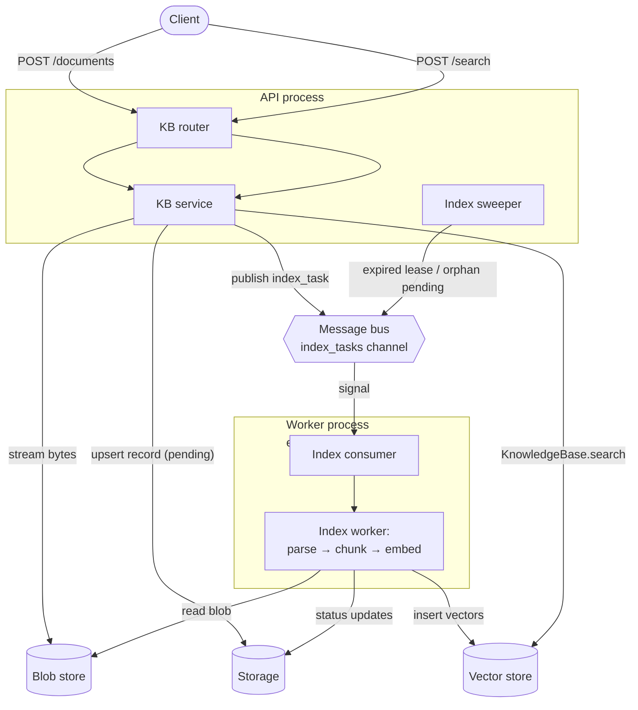

The [RAG](/versions/2.0.3dev/en/building-blocks/rag) chapter covers the extension points and library-mode usage of AgentScope's RAG module. This chapter introduces the **multi-tenant, distribution-ready** RAG service layer included in the Agent Service. Building on top of those building blocks, the service layer provides the following capabilities around "multi-tenancy", "distribution", and "easy onboarding":

| Capability | Description |
|------|------|
| Multi-tenant knowledge bases | Each user gets its own namespace, with knowledge bases fully isolated from each other — **a natural fit for multi-user SaaS scenarios, no extra permission isolation needed**. |
| Full knowledge base / document management | Full CRUD endpoints for knowledge bases and documents; deletion cascades through vectors, records, and original files — **no stale data or orphan files build up over time**. |
| Asynchronous uploads + live progress | Uploads return immediately, indexing runs in the background, and a batch status endpoint is exposed — **the front-end can render second-level progress bars and failure hints without blocking the user**. |
| Pluggable file object store | Local / S3 / custom object-store backends — **large files do not need to stay in memory, multiple workers in a distributed deployment can share the same file source, and migrating to the cloud requires zero application changes**. |
| Distributed indexing and horizontal scaling | Parsing / chunking / embedding can be deployed as independent worker processes — **as document volume or parse cost grows, scale the workers without affecting API throughput**. |
| Built-in fault tolerance and self-healing | Task leases, heartbeat renewal, and periodic re-dispatch are all built in — **worker crashes, network blips, and duplicate enqueues never get stuck, and operational cost is essentially zero**. |
| Automatic embedding-model fit | At knowledge-base creation time, the service automatically filters out models incompatible with the vector store's dimension policy — **the user does not need to worry about dimension matching; the front-end options *are* the usable set, eliminating indexing failures from picking the wrong model**. |
| Out-of-the-box REST API and front-end UI | Every capability is exposed as a complete REST endpoint, with an official front-end implementation — **integrators get a ready-to-use upload / search / progress UI with no extra work**. |

## Quick Start

The steps below bring the RAG service up — backend + the official front-end — and let you create knowledge bases, upload documents, and run searches from the UI.

<Steps>
  <Step title="Configure and start the RAG service">
    Pass a few RAG-related components to `create_app` to enable the full set of `/knowledge_bases` endpoints. The minimal example below shows the two configurations — **local blob store** and **S3 blob store** — assuming Redis and Qdrant are already running locally (or at a reachable address):

    <CodeGroup>

    ```python Local blob store
    import uvicorn

    from agentscope.app import create_app
    from agentscope.app.rag.blob_store import LocalBlobStore
    from agentscope.app.rag.knowledge_base_manager import CollectionPerKbManager
    from agentscope.app.message_bus import RedisMessageBus
    from agentscope.app.storage import RedisStorage
    from agentscope.app.workspace_manager import LocalWorkspaceManager
    from agentscope.rag import (
        ApproxTokenChunker,
        ImageParser,
        PDFParser,
        PPTParser,
        QdrantStore,
        TextParser,
    )

    storage = RedisStorage(host="localhost", port=6379)
    message_bus = RedisMessageBus(host="localhost", port=6379)
    workspace_manager = LocalWorkspaceManager(basedir="/data/workspaces")

    vector_store = QdrantStore(url="http://localhost:6333")
    kb_manager = CollectionPerKbManager(
        storage=storage,
        vector_store=vector_store,
    )

    app = create_app(
        storage=storage,
        message_bus=message_bus,
        workspace_manager=workspace_manager,
        knowledge_base_manager=kb_manager,
        # Route by IANA media type: text / PDF / PPT / images each go through their own parser
        knowledge_parsers=[
            TextParser(),
            PDFParser(),
            PPTParser(),
            ImageParser(),
        ],
        knowledge_chunker=ApproxTokenChunker(chunk_size=512, overlap=50),
        blob_store=LocalBlobStore(root_dir="/data/blobs"),
    )

    uvicorn.run(app, host="0.0.0.0", port=8000)
    ```

    ```python S3 blob store
    import uvicorn

    from agentscope.app import create_app
    from agentscope.app.rag.blob_store import S3BlobStore
    from agentscope.app.rag.knowledge_base_manager import CollectionPerKbManager
    from agentscope.app.message_bus import RedisMessageBus
    from agentscope.app.storage import RedisStorage
    from agentscope.app.workspace_manager import LocalWorkspaceManager
    from agentscope.rag import (
        ApproxTokenChunker,
        ImageParser,
        PDFParser,
        PPTParser,
        QdrantStore,
        TextParser,
    )

    storage = RedisStorage(host="localhost", port=6379)
    message_bus = RedisMessageBus(host="localhost", port=6379)
    workspace_manager = LocalWorkspaceManager(basedir="/data/workspaces")

    vector_store = QdrantStore(url="http://localhost:6333")
    kb_manager = CollectionPerKbManager(
        storage=storage,
        vector_store=vector_store,
    )

    app = create_app(
        storage=storage,
        message_bus=message_bus,
        workspace_manager=workspace_manager,
        knowledge_base_manager=kb_manager,
        knowledge_parsers=[
            TextParser(),
            PDFParser(),
            PPTParser(),
            ImageParser(),
        ],
        knowledge_chunker=ApproxTokenChunker(chunk_size=512, overlap=50),
        blob_store=S3BlobStore(bucket="my-rag-bucket"),
    )

    uvicorn.run(app, host="0.0.0.0", port=8000)
    ```

    </CodeGroup>

    The RAG-related `create_app` parameters are listed below; without `knowledge_base_manager`, none of the knowledge-base endpoints are registered.

    <ParamField path="knowledge_base_manager" type="KnowledgeBaseManagerBase | None" default="None">
      Owner of the knowledge base lifecycle; binds a vector store instance whose connection lifecycle the manager proxies. The built-in `CollectionPerKbManager` takes the "one collection per knowledge base" strategy, letting every knowledge base pick its own embedding dimension freely.
    </ParamField>
    <ParamField path="knowledge_parsers" type="list[ParserBase] | dict[str, ParserBase] | None" default="[TextParser()]">
      Parsers registered to the upload path, dispatched by each parser's `supported_media_types`. In `list` form, later registrations override earlier ones for overlapping types (overrides log a warning); `dict` form `media_type → parser` is verbatim explicit routing (useful for binding one parser to multiple types or to custom aliases).
    </ParamField>
    <ParamField path="knowledge_chunker" type="ChunkerBase | None" default="ApproxTokenChunker()">
      The chunker shared across every knowledge base. In production, tune `chunk_size` and `overlap` to fit the embedding model's context window.
    </ParamField>
    <ParamField path="blob_store" type="BlobStoreBase | None" default="LocalBlobStore('./blobs')">
      Binary store for uploaded files. Local is fine for single-host setups; in a distributed deployment use S3 or a custom shared backend, because workers must share the same file source as the API.
    </ParamField>
    <ParamField path="enable_index_worker" type="bool" default="True">
      When `True`, the API process also runs parsing / chunking / embedding (single-process mode); when `False`, the API only accepts uploads and enqueues tasks, leaving indexing to a dedicated worker (distributed mode) — see "Deployment topologies" below.
    </ParamField>
  </Step>

  <Step title="Start the official front-end">
    The [`examples/web_ui`](https://github.com/agentscope-ai/agentscope/tree/main/examples/web_ui) directory in the AgentScope reposory ships a React front-end matching the backend above; just bring it up:

    ```bash
    cd examples/web_ui
    pnpm install
    pnpm dev
    ```

    Open the URL the dev server prints (usually `http://localhost:5173`); the front-end auto-connects to the service on port 8000.
  </Step>

  <Step title="Operate from the front-end">
    With the front-end open, you can complete the full flow inside the UI — create a knowledge base, upload documents, watch processing progress, and run search tests.

    {/* TODO: knowledge base list / create knowledge base screenshot */}
    {/* TODO: upload document + status progress screenshot */}
    {/* TODO: search test screenshot */}
  </Step>
</Steps>

## Deployment Topologies

The Quick Start above runs the API and the indexing pipeline in **the same process**, which is fine for local development and low-traffic scenarios. In production, however, parsing / chunking / embedding is a CPU- and IO-heavy pipeline; sharing the process with HTTP requests has two issues:

1. **Resource contention**: a single large PDF blocks the event loop on parsing and slows every other API request in the same process.
2. **Coarse scaling unit**: the only horizontal scaling unit is the API replica, but the real resource hog is the indexing pipeline — scaling the API as a whole is wasteful.

To solve this, the service layer supports pulling the indexing pipeline into independent **worker** processes — each worker subscribes to the message bus, pulls files from the blob store, and runs the full "parse → chunk → embed → insert" pipeline. Once decoupled from the API, workers can scale independently and ship heavy parsing dependencies separately. The table below compares the two topologies so you can pick based on traffic and operational complexity:

| Dimension | Single-process | Distributed |
|------|-----------|---------|
| Process topology | API + indexing in the same process | API + N workers |
| Resource isolation | Heavy parsing competes for request threads | API is unaffected by parsing load |
| Scaling | Scale the API replicas as a whole | Scale API and workers independently |
| Deployment complexity | One configuration is enough | Need two images / services |
| Use case | Local, prototype, light traffic | Production, parsing / embedding is the bottleneck |

### Single-process deployment

`create_app`'s `enable_index_worker` defaults to `True`; the API process automatically starts an embedded worker coroutine in its lifespan — no extra configuration needed. This is exactly the form shown in "Quick Start". If you previously disabled it, set it back to `True`:

```python
app = create_app(
    ...,
    enable_index_worker=True,   # default, can be omitted
)
```

### Distributed deployment

The API process disables the embedded worker and only accepts uploads, enqueues tasks, and runs the safety-net sweeper; one or more worker processes start independently, subscribe to the same message-bus channel, and pull tasks.

API side:

```python
app = create_app(
    storage=storage,
    message_bus=message_bus,
    workspace_manager=workspace_manager,
    knowledge_base_manager=kb_manager,
    blob_store=blob_store,
    enable_index_worker=False,   # ← no embedded worker in the API process
)
```

The worker side has two launch flavours:

- **CLI**: `python -m agentscope.app.rag.index_worker`, combined with the environment variable `AGENTSCOPE_WORKER_BOOTSTRAP=module:callable` pointing at a factory that returns the backend dict. Operators can copy the same systemd / k8s unit to scale workers in bulk.
- **Library**: in your own entry script, call `agentscope.app.rag.index_worker.run_worker(...)` (or `from agentscope.app.rag import run_worker`), sharing the same backend instances with whatever you wired into `create_app`.

Here is the minimum library-mode example. **Critical convention**: the API and the workers must be configured against the same storage / message bus / blob store / knowledge base manager — they share the vector store collections, blob URIs, and document leases, and a mismatch on any of them will result in indexing failure or data corruption.

```python
import asyncio
import os

from agentscope.app.rag import run_worker
from agentscope.app.rag.blob_store import S3BlobStore
from agentscope.app.rag.knowledge_base_manager import CollectionPerKbManager
from agentscope.app.message_bus import RedisMessageBus
from agentscope.app.storage import RedisStorage
from agentscope.rag import (
    ApproxTokenChunker,
    ImageParser,
    PDFParser,
    PPTParser,
    QdrantStore,
    TextParser,
)


async def main() -> None:
    storage = RedisStorage(url=os.environ["REDIS_URL"])
    message_bus = RedisMessageBus(url=os.environ["REDIS_URL"])
    blob_store = S3BlobStore(bucket=os.environ["S3_BUCKET"])
    vector_store = QdrantStore(url=os.environ["QDRANT_URL"])
    kb_manager = CollectionPerKbManager(
        storage=storage,
        vector_store=vector_store,
    )

    await run_worker(
        storage=storage,
        message_bus=message_bus,
        blob_store=blob_store,
        knowledge_base_manager=kb_manager,
        # Keep the parser list identical to the API side
        parsers=[
            TextParser(),
            PDFParser(),
            PPTParser(),
            ImageParser(),
        ],
        chunker=ApproxTokenChunker(),
        worker_max_concurrency=4,   # max documents this worker processes concurrently
        consumer_max_batch=32,      # max entries pulled per bus signal
    )


if __name__ == "__main__":
    asyncio.run(main())
```

The CLI form needs a bootstrap factory — same `run_worker(...)` call, just split into "build the kwargs" and "invoke" — returning the kwargs dict to be forwarded to `run_worker`:

```python
# mydeploy/worker_bootstrap.py
import os

from agentscope.app.rag.blob_store import S3BlobStore
from agentscope.app.rag.knowledge_base_manager import CollectionPerKbManager
from agentscope.app.message_bus import RedisMessageBus
from agentscope.app.storage import RedisStorage
from agentscope.rag import (
    ApproxTokenChunker,
    ImageParser,
    PDFParser,
    PPTParser,
    QdrantStore,
    TextParser,
)


def bootstrap() -> dict:
    storage = RedisStorage(url=os.environ["REDIS_URL"])
    message_bus = RedisMessageBus(url=os.environ["REDIS_URL"])
    vector_store = QdrantStore(url=os.environ["QDRANT_URL"])
    return {
        "storage": storage,
        "message_bus": message_bus,
        "blob_store": S3BlobStore(bucket=os.environ["S3_BUCKET"]),
        "knowledge_base_manager": CollectionPerKbManager(
            storage=storage,
            vector_store=vector_store,
        ),
        "parsers": [
            TextParser(),
            PDFParser(),
            PPTParser(),
            ImageParser(),
        ],
        "chunker": ApproxTokenChunker(),
    }
```

Then launch like this:

```bash
AGENTSCOPE_WORKER_BOOTSTRAP=mydeploy.worker_bootstrap:bootstrap \
    python -m agentscope.app.rag.index_worker
```

<Note>
HA / replication of the vector store itself is the chosen backend's responsibility; the service layer only holds a connection handle. Pointing Qdrant at a cluster or S3 at a cross-region bucket is enough to scale the storage side without touching application code.
</Note>

## How It Works

The service layer's core design is **using the message bus (event bus) to fully decouple "upload" and "indexing"** — the former is a synchronous path optimised for millisecond responses, the latter is asynchronous, retryable, and distribution-friendly. The two paths only talk through a single `index_tasks` channel on the bus, which is why the same code runs single-process in "Quick Start" and scales across hosts in "Distributed deployment" with no business logic changes.

The roles around the bus:

| Role | Process | Relationship with the bus | Responsibility |
|------|---------|--------------|------|
| Knowledge base service (API) | API process | **Publishes** index tasks | Handles HTTP requests, streams blobs, persists `pending` records, and pushes tasks to the bus |
| Index consumer | Worker process (or embedded in the API process) | **Subscribes** to index signals | Listens to bus signals, batch-pulls tasks, hands them to the index worker |
| Index worker | Worker process (or embedded in the API process) | Runs the full pipeline once it gets a task | Lease → parse → chunk → embed → write vector store → mark `ready` |
| Index sweeper | API process | **Re-publishes** stuck tasks | Periodically scans for expired leases / long-lived `pending` records and re-enqueues them |

The diagram below shows the full path from upload to retrievability; all cross-process communication goes through the bus, so pulling workers out into separate processes requires no wiring changes:



Key points:

- **Upload path** (API process): the router forwards the request to the knowledge base service, which **streams** the file into the blob store, persists a `pending` record, and pushes one index task onto the bus; the HTTP response returns immediately, **without running parsing / embedding inside the request**.
- **Indexing path** (worker process; can be embedded in the API or deployed standalone): the index consumer subscribes to bus signals, batch-pulls tasks, and hands them to the index worker, which then runs the full "lease → parse → chunk → embed → insert → mark ready" pipeline. Internally the indexing path calls `KnowledgeBaseManagerBase.get_knowledge(...)` to obtain a runtime `KnowledgeBase` handle and then calls `insert_document(...)` for embedding + insertion — the same code path library-mode callers run.
- **Self-healing path** (always in the API process): the index sweeper periodically detects expired leases or long-stuck `pending` records and re-enqueues them on the bus; the CAS-based lease on the worker side guarantees no duplicate processing.

### Document state machine

A document record's `status` field flows strictly through the following states; the front-end uses it to render progress bars and failure hints:

| Status | Trigger | Meaning |
|------|--------|------|
| `pending` | Upload complete | File written to the blob store, record persisted; waiting for a worker to pick it up |
| `parsing` | Worker acquires the lease | Streaming bytes from the blob store and handing them to the parser |
| `chunking` | Parser returns | Chunking the parsed sections |
| `indexing` | Chunker returns | Embedding and writing to the vector store |
| `ready` | Vector-store write succeeded | Document is retrievable; `chunk_count` is populated at this moment |
| `error` | Any stage raises | The error is reduced to one line and written into the `error` field; the blob and record are preserved so the front-end can investigate / the user can re-upload |

### Fault tolerance and self-healing

The service layer ships a few designs around bus + lease that make long-running deployments uneventful:

- **Lease + CAS prevents reentry**: the worker uses storage-layer CAS to acquire the lease; duplicate enqueues or multiple workers racing for the same document only execute once.
- **Automatic lease renewal**: leases live for 90 seconds by default and a built-in heartbeat renews every 45 seconds, so long-document parses never time out.
- **Race detection**: the worker runs the pipeline and the heartbeat in parallel; if the heartbeat detects a stolen lease (sweeper false positive / network blip), the pipeline is cancelled immediately to avoid double-writes against the vector store with the new owner.
- **Safety-net re-dispatch**: documents whose lease expired (worker crash) or whose `pending` exceeded the grace period (API publish failed) are periodically re-enqueued.
- **Errors isolated to the record**: an exception at any stage is recorded in the document's `error` field — visible in the front-end. The blob and the record are not auto-cleaned, so the user can investigate and re-upload.
- **Idempotent delete path**: vector store → record → blob, in that order; a mid-way failure followed by a retry never leaves the state inconsistent.

<Warning>
Parsers run on the event-loop thread by default. If you bring in CPU-intensive parsers (e.g. `PDFParser`, `PPTParser` or anything Office-related), **always** pass `parser_executor=ProcessPoolExecutor(...)` to the worker, otherwise other asyncio tasks in the same process (and in the single-process deployment, the API itself) will be blocked.
</Warning>

## REST API Overview

The service exposes a full set of CRUD + upload + search endpoints under the `/knowledge_bases` prefix. Field-level request / response details live in the OpenAPI document; the table below groups endpoints by responsibility:

| Category | Endpoint | Description |
|------|------|------|
| Capability discovery | `GET /knowledge_bases/embedding_models` | Lists embedding models compatible with the vector store's dimension policy under the current user's credentials |
| Capability discovery | `GET /knowledge_bases/supported_content_types` | Lists IANA media types and file extensions supported by the parsers currently mounted on the API; the front-end uses this for `<input accept>` |
| Capability discovery | `GET /knowledge_bases/middleware/parameters_schema` | Returns the JSON Schema of `RAGMiddleware.Parameters`; the front-end uses this for a dynamic form |
| Knowledge base CRUD | `POST/GET/PATCH/DELETE /knowledge_bases` | Create / read / update / delete knowledge bases; deletion cascades through the collection, document records, and blobs |
| Document management | `GET/POST/DELETE /knowledge_bases/{kb_id}/documents` | List / upload / delete documents; uploads return immediately with `pending` |
| Status polling | `GET /knowledge_bases/{kb_id}/documents/status?ids=a,b,c` | Batch-query the current state of N in-flight documents; used by the front-end for progress rendering |
| Search | `POST /knowledge_bases/{kb_id}/search` | Natural-language query, returns the top-K retrieval results |

<Tip>
Upload and search both go through the **same** knowledge base handle — the service-layer `POST /search` endpoint internally calls `KnowledgeBaseService.search`, which delegates to `KnowledgeBase.search`. That is the same code path library-mode callers and the `RAGMiddleware` go through. In other words, debugging retrieval through the `/search` endpoint reproduces exactly what the agent sees at inference time.
</Tip>

## Further Reading

<CardGroup cols={2}>
  <Card title="RAG" icon="cubes" href="/versions/2.0.3dev/en/building-blocks/rag" cta="View library-mode usage" arrow>
    Learn the atomic interfaces of parser / chunker / vector store / middleware and their library-mode usage.
  </Card>
  <Card title="Architecture" icon="sitemap" href="/versions/2.0.3dev/en/deploy/agent-service" cta="View create_app parameters" arrow>
    `create_app`'s global parameters, lifespan, dependency injection, and ASGI middleware layer.
  </Card>
  <Card title="Middleware" icon="layer-group" href="/versions/2.0.3dev/en/building-blocks/middleware" cta="Learn the middleware mechanism" arrow>
    Which hooks `RAGMiddleware` uses to inject retrieval results.
  </Card>
  <Card title="Embedding Model" icon="cube" href="/versions/2.0.3dev/en/building-blocks/model" cta="View model list" arrow>
    Embedding-model cards and dimension constraints decide which models a knowledge base can pick.
  </Card>
</CardGroup>
