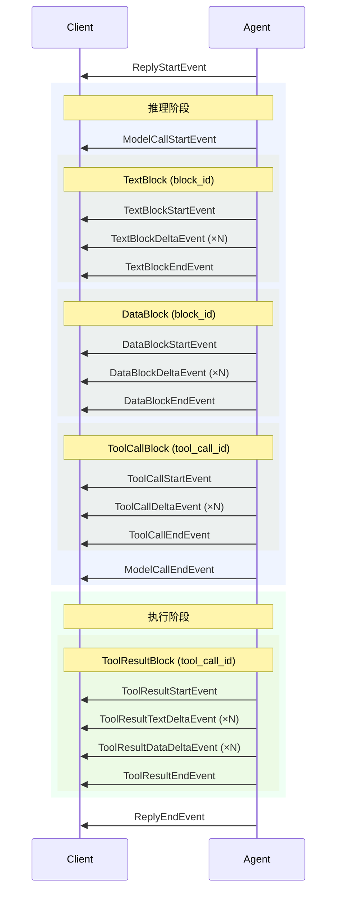

消息（Message）与事件（Event）是 AgentScope 中两种基础数据结构。

- **消息** — 智能体间通信与上下文持久化的基本单元。
- **事件** — 前后端交互与流式传输的基本单元，支持人工介入（Human-in-the-loop）场景。

## 消息

AgentScope 中`Msg`类的一个实例容纳一次完整的对话信息——一次用户输入或一次完整的智能体回复，信息以不同类型的内容块（Block）进行组织。

<Tip>
1. 智能体运行一次`reply`产生一个完整的`Msg`实例，包含多轮的思考，工具调用，运行结果等所有信息。
2. 前端渲染时，一个`Msg`实例即对应渲染成一个完整的消息气泡。
</Tip>

### 结构

`Msg` 类的核心字段如下：

| 字段          | 类型                                | 说明                                |
|---------------|-------------------------------------|-------------------------------------|
| `id`          | `str`                               | 唯一消息标识符                      |
| `name`        | `str`                               | 发送方名称                          |
| `role`        | `"user" \| "assistant" \| "system"` | 发送方角色                          |
| `content`     | `list[ContentBlock]`                | 有序内容块列表                      |
| `metadata`    | `dict`                              | 任意键值元数据                      |
| `created_at`  | `str`                               | 创建时间（ISO 8601）                |
| `finished_at` | `str \| None`                       | 消息完成时间（ISO 8601）            |
| `usage`       | `Usage`                             | 次元用量统计（仅 assistant 消息） |

### 内容块

消息内容由类型化的块组成，每种块代表一类独立信息：

| 块类型            | 说明                                        |
|-------------------|---------------------------------------------|
| `TextBlock`       | 纯文本内容                                  |
| `DataBlock`       | 二进制数据（图片、音频、视频等），可以是 base64 或 URL |
| `ThinkingBlock`   | 模型推理过程（思维链）                      |
| `ToolCallBlock`   | 工具调用，包含名称、输入和状态              |
| `ToolResultBlock` | 工具执行结果                                |
| `HintBlock`       | 提示信息（例如调度任务触发、团队消息、后台工具结果），支持多模态数据，使用`source`标识提示来源。 |

<Note>
角色约束在构造时强制执行：
- `msg.role=="user"`的消息只能包含`TextBlock`和`DataBlock`；
- `msg.role=="system"`的消息只能包含`TextBlock`；
- `msg.role=="assistant"`的消息可包含所有块类型。
</Note>

这些数据块承载不同的数据信息，其详细字段说明如下：

<AccordionGroup>
  <Accordion title="TextBlock" description="文本数据">


    | 字段 | 类型 | 说明 |
    |------|------|------|
    | `type` | `str` | 固定为 `"text"`。 |
    | `text` | `str` | 文本的具体内容。 |
    | `id` | `str` | 该内容块的唯一标识符（默认自动生成 UUID）。 |
  </Accordion>

  <Accordion title="ThinkingBlock" description="模型的思考过程">
	此内容块允许透传模型厂商自定义的元数据（如 Anthropic 模型的 `signature` 等）

    | 字段 | 类型 | 说明 |
    |------|------|------|
    | `type` | `str` | 固定为 `"thinking"`。 |
    | `thinking` | `str` | 模型的思维或推理文本。 |
    | `id` | `str` | 该内容块的唯一标识符（默认自动生成 UUID）。 |
  </Accordion>

  <Accordion title="DataBlock" description="多模态数据（如图片、音频、视频等）">

    | 字段 | 类型 | 说明 |
    |------|------|------|
    | `type` | `str` | 固定为 `"data"`。 |
    | `id` | `str` | 该内容块的唯一标识符（默认自动生成 UUID）。 |
    | `source` | `Base64Source \| URLSource` | 标识数据源。支持 Base64 输入或 URL 输入。 |
    | `name` | `str \| None` | 可选字段，表示该内容资产的名称。 |

    **数据源配置说明：**
    - **`Base64Source`**:
      - `type`: 固定为 `"base64"`。
      - `data`: 经 Base64 编码的二进制数据。
      - `media_type`: 媒体类型（如 `"image/png"`, `"audio/mpeg"`、`"video/mp4"` 等）。
    - **`URLSource`**:
      - `type`: 固定为 `"url"`。
      - `url`: 满足 RFC 3986 标准的有效 URI/URL 字符串。
      - `media_type`: 媒体类型（如 `"image/png"`、`"audio/wav"` 等）。
  </Accordion>

  <Accordion title="HintBlock" description="用于引导 LLM 的提示信息">
	在最终传递给 LLM API 时，`HintBlock`也会被转换为标准的用户消息（User message）。

	为避免和用户输入混淆，推荐在提示中使用 XML 标签标记提示内容（如`<system-reminder>...</system-reminder>`）。

    | 字段 | 类型 | 说明 |
    |------|------|------|
    | `type` | `str` | 固定为 `"hint"`。 |
    | `hint` | `str \| list[TextBlock \| DataBlock]` | 提示信息——支持纯文本或复合多模态块列表。 |
    | `id` | `str` | 该内容块的唯一标识符（默认自动生成 UUID）。 |
    | `source` | `str \| None` | 发送方/提示源标签（可以是 JSON 字符串用于前端解析和渲染）。 |
  </Accordion>

  <Accordion title="ToolCallBlock" description="工具调用的数据和状态">

    | 字段 | 类型 | 说明 |
    |------|------|------|
    | `type` | `str` | 固定为 `"tool_call"`。 |
    | `id` | `str` | 本次工具调用的唯一标识符。 |
    | `name` | `str` | 要调用的工具名称。 |
    | `input` | `str` | JSON 字符串格式的工具调用参数。 |
    | `state` | `ToolCallState` | 工具调用状态：<br/>• `"pending"`: 待处理，还未通过审核与权限检测。<br/>• `"asking"`: 正挂起，等待用户进行确认授权。<br/>• `"allowed"`: 已被用户或权限规则放行，正在等待执行。<br/>• `"submitted"`: 已提交给智能体外部并等待执行结果。<br/>• `"finished"`: 执行已结束（无论成功或失败）。 |
    | `suggested_rules` | `list[PermissionRule]` | 在用户确认时附带的建议授权规则。 |
  </Accordion>

  <Accordion title="ToolResultBlock" description="工具执行结果的数据和状态">
    `ToolResultBlock`的`id`与发起该次调用的`ToolCallBlock.id`必须一致。支持多模态数据。

    | 字段 | 类型 | 说明 |
    |------|------|------|
    | `type` | `str` | 固定为 `"tool_result"`。 |
    | `id` | `str` | 与对应工具调用相同的唯一 ID。 |
    | `name` | `str` | 调用的工具名称。 |
    | `output` | `str \| list[TextBlock \| DataBlock]` | 执行返回产出——支持纯文本和多模态数据。 |
    | `state` | `ToolResultState` | 工具执行状态：<br/>• `"running"`: 工具执行中。<br/>• `"success"`: 执行成功。<br/>• `"error"`: 执行错误。<br/>• `"interrupted"`: 执行被用户打断。<br/>• `"denied"`: 被用户或安全规则拒绝执行。 |
  </Accordion>
</AccordionGroup>

### 创建消息

AgentScope 提供三个快捷方法来构建`Msg`对象，以避免重复的设置`role`参数，并支持从字符串构建`TextBlock`：

| 工厂函数                          | 角色          |
|-------------------------------|-------------|
| `UserMsg(name, content)`      | `user`      |
| `AssistantMsg(name, content)` | `assistant` |
| `SystemMsg(name, content)`    | `system`    |

当`content`参数为字符串时，会自动包装为`TextBlock`。

<CodeGroup>
```python 创建文本消息
from agentscope.message import UserMsg, SystemMsg, AssistantMsg

# 用户消息
user_msg = UserMsg(
	name="user",
	content="这张图片里有什么？"
)

# 系统消息，仅用于系统提示（System prompt）
system_msg = SystemMsg(
	name="system",
	content="你是一个名为 Friday 的 AI 助手。"
)

# 助手消息
assistant_msg = AssistantMsg(
	name="Friday",
	content="你好，有什么我可以帮你的吗？"
)
```

```python 创建多模态消息
from agentscope.message import UserMsg, TextBlock, DataBlock, Base64Source

# 用户消息
user_msg = UserMsg(
    name="user",
    content=[
        TextBlock(text="描述这张图片："),
        DataBlock(
			source=Base64Source(
				data="...",
				media_type="image/png"
			)
		),
    ],
)
```

```python 创建工具调用消息
from agentscope.message import AssistantMsg, ThinkingBlock, TextBlock, ToolCallBlock, ToolCallState, ToolResultBlock, ToolResultState

assistant_msg = AssistantMsg(
	name="Friday",
	content=[
		ThinkingBlock(thinking="我应该调用工具来查询天气。"),
		TextBlock(text="让我查询下北京的天气。"),
		ToolCallBlock(
			id="tool_call_1",
			name="weather_search",
			input='{"city": "Beijing"}',
			state=ToolCallState.FINISHED,
		),
		ToolResultBlock(
			id="tool_call_1",
			name="weather_search",
			output="北京的天气是晴天，温度 25°C。",
			state=ToolResultState.SUCCESS,
		),
	]
)
```
</CodeGroup>

### 访问内容

`Msg` 提供了一组辅助方法用于提取特定块类型：

| 方法 | 返回值 |
|------|--------|
| `get_text_content(separator="\n")` | 返回所有 `TextBlock` 的拼接文本，或 `None` |
| `get_content_blocks(block_type)` | 按类型过滤后的块列表 |
| `has_content_blocks(block_type)` | 若存在指定类型的块则返回 `True` |

```python
# 获取所有文本内容
text = msg.get_text_content()

# 获取所有工具调用
tool_calls = msg.get_content_blocks("tool_call")

# 检查消息是否包含工具结果
if msg.has_content_blocks("tool_result"):
    ...
```

## 事件

事件是消息的流式传输单元，即一个序列的事件可以组成一个完整的消息。

智能体类`Agent`在运行`reply_stream`的过程中，会产生一系列`AgentEvent`对象，表示增量的思考、文本回复、工具调用和工具调用结果。前端可通过订阅事件流来实现消息的实时渲染。

### 事件生命周期

事件的`reply_id`标识它所属的消息，`block_id`或`tool_call_id`标识它所属的内容块。
事件的产生遵循 **start → delta → end** 模式：



同一次`reply_stream`的调用中所有事件共享相同的 `reply_id`。在回复内部，用 `block_id` 关联文本/思考/数据块事件，用 `tool_call_id` 关联工具调用和工具结果事件。

### 事件类型

所有事件继承自 `EventBase`，提供以下公共字段：

| 字段 | 类型 | 说明 |
|------|------|------|
| `id` | `str` | 唯一事件标识符 |
| `created_at` | `str` | ISO 8601 时间戳 |

事件按类别分组如下。除特别说明外，每个事件还携带 `reply_id` 字段，关联到正在构建的消息。

<AccordionGroup>
  <Accordion title="生命周期事件">
    **ReplyStartEvent** — 智能体开始新的回复。

    | 字段 | 类型 | 说明 |
    |------|------|------|
    | `reply_id` | `str` | 回复消息 ID |
    | `session_id` | `str` | 会话 ID |
    | `name` | `str` | 智能体名称 |
    | `role` | `str` | 智能体角色（默认 `"assistant"`） |

    **ReplyEndEvent** — 智能体完成回复。

    | 字段 | 类型 | 说明 |
    |------|------|------|
    | `reply_id` | `str` | 回复消息 ID |
    | `session_id` | `str` | 会话 ID |

    **ExceedMaxItersEvent** — 智能体达到最大推理-执行迭代次数。

    | 字段 | 类型 | 说明 |
    |------|------|------|
    | `reply_id` | `str` | 回复消息 ID |
    | `name` | `str` | 智能体名称 |
  </Accordion>

  <Accordion title="文本流式事件">
    **TextBlockStartEvent** — 新的文本块开始。

    | 字段 | 类型 | 说明 |
    |------|------|------|
    | `reply_id` | `str` | 回复消息 ID |
    | `block_id` | `str` | 文本块唯一标识符 |

    **TextBlockDeltaEvent** — 增量文本内容到达。

    | 字段 | 类型 | 说明 |
    |------|------|------|
    | `reply_id` | `str` | 回复消息 ID |
    | `block_id` | `str` | 文本块唯一标识符 |
    | `delta` | `str` | 增量文本内容 |

    **TextBlockEndEvent** — 文本块完成。

    | 字段 | 类型 | 说明 |
    |------|------|------|
    | `reply_id` | `str` | 回复消息 ID |
    | `block_id` | `str` | 文本块唯一标识符 |
  </Accordion>

  <Accordion title="思考流式事件">
    **ThinkingBlockStartEvent** — 新的思考块开始。

    | 字段 | 类型 | 说明 |
    |------|------|------|
    | `reply_id` | `str` | 回复消息 ID |
    | `block_id` | `str` | 思考块唯一标识符 |

    **ThinkingBlockDeltaEvent** — 增量思考内容到达。

    | 字段 | 类型 | 说明 |
    |------|------|------|
    | `reply_id` | `str` | 回复消息 ID |
    | `block_id` | `str` | 思考块唯一标识符 |
    | `delta` | `str` | 增量思考文本 |

    **ThinkingBlockEndEvent** — 思考块完成。

    | 字段 | 类型 | 说明 |
    |------|------|------|
    | `reply_id` | `str` | 回复消息 ID |
    | `block_id` | `str` | 思考块唯一标识符 |
  </Accordion>

  <Accordion title="数据流式事件">
    **DataBlockStartEvent** — 新的数据块开始（图片、音频等）。

    | 字段 | 类型 | 说明 |
    |------|------|------|
    | `reply_id` | `str` | 回复消息 ID |
    | `block_id` | `str` | 数据块唯一标识符 |
    | `media_type` | `str` | MIME 类型（如 `"image/png"`） |

    **DataBlockDeltaEvent** — 增量二进制数据到达。

    | 字段 | 类型 | 说明 |
    |------|------|------|
    | `reply_id` | `str` | 回复消息 ID |
    | `block_id` | `str` | 数据块唯一标识符 |
    | `data` | `str` | 增量 base64 编码数据 |
    | `media_type` | `str` | MIME 类型 |

    **DataBlockEndEvent** — 数据块完成。

    | 字段 | 类型 | 说明 |
    |------|------|------|
    | `reply_id` | `str` | 回复消息 ID |
    | `block_id` | `str` | 数据块唯一标识符 |
  </Accordion>

  <Accordion title="工具调用流式事件">
    **ToolCallStartEvent** — 智能体开始一次工具调用。

    | 字段 | 类型 | 说明 |
    |------|------|------|
    | `reply_id` | `str` | 回复消息 ID |
    | `tool_call_id` | `str` | 工具调用唯一标识符 |
    | `tool_call_name` | `str` | 被调用的工具名称 |

    **ToolCallDeltaEvent** — 增量工具调用参数到达。

    | 字段 | 类型 | 说明 |
    |------|------|------|
    | `reply_id` | `str` | 回复消息 ID |
    | `tool_call_id` | `str` | 工具调用唯一标识符 |
    | `delta` | `str` | 增量 JSON 参数片段 |

    **ToolCallEndEvent** — 工具调用参数完成。

    | 字段 | 类型 | 说明 |
    |------|------|------|
    | `reply_id` | `str` | 回复消息 ID |
    | `tool_call_id` | `str` | 工具调用唯一标识符 |
  </Accordion>

  <Accordion title="工具结果流式事件">
    **ToolResultStartEvent** — 工具开始执行。

    | 字段 | 类型 | 说明 |
    |------|------|------|
    | `reply_id` | `str` | 回复消息 ID |
    | `tool_call_id` | `str` | 对应工具调用的 ID |
    | `tool_call_name` | `str` | 工具名称 |

    **ToolResultTextDeltaEvent** — 工具的增量文本输出到达。

    | 字段 | 类型 | 说明 |
    |------|------|------|
    | `reply_id` | `str` | 回复消息 ID |
    | `tool_call_id` | `str` | 对应工具调用的 ID |
    | `delta` | `str` | 增量文本内容 |

    **ToolResultDataDeltaEvent** — 工具的二进制数据输出到达。

    | 字段 | 类型 | 说明 |
    |------|------|------|
    | `reply_id` | `str` | 回复消息 ID |
    | `tool_call_id` | `str` | 对应工具调用的 ID |
    | `block_id` | `str` | 数据块唯一标识符 |
    | `media_type` | `str` | 内容的 MIME 类型 |
    | `data` | `str \| None` | base64 编码数据（与 `url` 互斥） |
    | `url` | `str \| None` | 指向内容的 URL（与 `data` 互斥） |

    **ToolResultEndEvent** — 工具执行完成。

    | 字段 | 类型 | 说明 |
    |------|------|------|
    | `reply_id` | `str` | 回复消息 ID |
    | `tool_call_id` | `str` | 对应工具调用的 ID |
    | `state` | `ToolResultState` | 最终状态：`SUCCESS`、`ERROR`、`INTERRUPTED`、`DENIED` 或 `RUNNING` |
  </Accordion>

  <Accordion title="模型调用事件">
    **ModelCallStartEvent** — 模型 API 调用开始。

    | 字段 | 类型 | 说明 |
    |------|------|------|
    | `reply_id` | `str` | 回复消息 ID |
    | `model_name` | `str` | 被调用的模型名称 |

    **ModelCallEndEvent** — 模型 API 调用完成。

    | 字段 | 类型 | 说明 |
    |------|------|------|
    | `reply_id` | `str` | 回复消息 ID |
    | `input_tokens` | `int` | 输入 token 数量 |
    | `output_tokens` | `int` | 输出 token 数量 |
  </Accordion>

  <Accordion title="人工介入事件">
    **RequireUserConfirmEvent** — 智能体暂停等待用户确认。

    | 字段 | 类型 | 说明 |
    |------|------|------|
    | `reply_id` | `str` | 回复消息 ID |
    | `tool_calls` | `list[ToolCallBlock]` | 待用户确认的工具调用列表 |

    **RequireExternalExecutionEvent** — 智能体暂停等待外部执行。

    | 字段 | 类型 | 说明 |
    |------|------|------|
    | `reply_id` | `str` | 回复消息 ID |
    | `tool_calls` | `list[ToolCallBlock]` | 待外部执行的工具调用列表 |

    **UserConfirmResultEvent** — 用户提供确认结果（输入事件）。

    | 字段 | 类型 | 说明 |
    |------|------|------|
    | `reply_id` | `str` | 回复消息 ID |
    | `confirm_results` | `list[ConfirmResult]` | 每个待确认工具调用的确认结果 |

    **ExternalExecutionResultEvent** — 外部系统提供执行结果（输入事件）。

    | 字段 | 类型 | 说明 |
    |------|------|------|
    | `reply_id` | `str` | 回复消息 ID |
    | `execution_results` | `list[ToolResultBlock]` | 外部执行器返回的结果 |
  </Accordion>

  <Accordion title="一次性事件">
    与文本 / 思考 / 数据 / 工具块不同，这些事件不遵循 start → delta → end 模式。完整载荷在单个事件中到达，因为它在事前就已知，无需流式传输。

    **HintBlockEvent** — 一个 `HintBlock` 被注入到智能体上下文中（例如调度任务触发、团队消息、卸载后台工具返回的结果）。

    | 字段 | 类型 | 说明 |
    |------|------|------|
    | `reply_id` | `str` | 回复消息 ID |
    | `block_id` | `str` | 提示块唯一标识符 |
    | `hint` | `str \| list[TextBlock \| DataBlock]` | 提示载荷 —— 纯文本或多模态块列表 |
    | `source` | `str \| None` | 可选的发送方 / 来源标签（通常是一个小的 JSON 对象，描述前端应如何标记此提示） |

    **CustomEvent** — 通用可扩展事件，由服务层 middleware 用来通知订阅者状态变更（任务进度、团队成员、权限更新……），无需污染核心 agent 事件枚举。

    | 字段 | 类型 | 说明 |
    |------|------|------|
    | `reply_id` | `str` | 回复消息 ID |
    | `name` | `str` | 信号名称（例如 `"tasks_context"`、`"team_updated"`） |
    | `value` | `dict` | 该信号任意可 JSON 序列化的载荷 |
  </Accordion>
</AccordionGroup>

## 从事件流重建消息

事件与消息并非相互独立，而是同一数据的两种视图。`reply_stream` 产出的每个事件都可以通过 `append_event()` 追加数据到 `Msg` 上，从而增量地重建完整消息。这保证了最终消息状态可以仅凭事件流完整还原。

```python
from agentscope.message import Msg, AssistantMsg

msg = None

async for event in agent.reply_stream(user_msg):
    if isinstance(event, ReplyStartEvent):
        # 回复开始时创建新消息
        msg = AssistantMsg(name=event.name, content=[], id=event.reply_id)
    else:
        # 其他事件追加到消息，逐步还原状态
        msg.append_event(event)
```

`append_event` 方法处理所有事件类型：

| 事件类型                           | 对消息的影响                                                          |
|--------------------------------|-----------------------------------------------------------------|
| `ReplyEndEvent`                | 设置 `finished_at` 时间戳                                            |
| `TextBlockStartEvent`          | 追加新的空 `TextBlock`                                               |
| `TextBlockDeltaEvent`          | 将 `delta` 拼接到对应块的文本                                             |
| `DataBlockStartEvent`          | 追加新的空 `DataBlock`                                               |
| `DataBlockDeltaEvent`          | 将 `data` 拼接到对应块的 base64 内容                                      |
| `ThinkingBlockStartEvent`      | 追加新的空 `ThinkingBlock`                                           |
| `ThinkingBlockDeltaEvent`      | 将 `delta` 拼接到对应块的思考文本                                           |
| `ToolCallStartEvent`           | 追加新的空参数 `ToolCallBlock`                                         |
| `ToolCallDeltaEvent`           | 将 `delta` 拼接到工具调用的参数                                            |
| `ToolResultStartEvent`         | 追加新的空输出 `ToolResultBlock`                                       |
| `ToolResultTextDeltaEvent`     | 将文本追加到工具结果的输出                                                   |
| `ToolResultDataDeltaEvent`     | 将二进制数据块追加到工具结果的输出                                               |
| `ToolResultEndEvent`           | 设置工具结果的最终 `state`                                               |
| `HintBlockEvent`               | 将 `HintBlock` 追加到 content（携带事件的 `hint` 与 `source`），从而持久化并可重放该提示 |
| `RequireUserConfirmEvent`      | 将对应工具调用的状态更新为 `ASKING`                                          |
| `ExternalExecutionResultEvent` | 将 `ToolResultBlock` 追加到消息内容                                     |

<Tip>
这种设计让部署更加灵活：后端可以通过 SSE 将事件流推送到前端，前端重建消息并进行渲染。即使连接中断，从任意检查点重放事件序列也能精确恢复消息状态。
</Tip>

### TypeScript 支持

AgentScope 提供 TypeScript 版本的消息和事件元语，前端可以使用相同的 `appendEvent` API 从事件流重建消息。

安装 TS 版本的 AgentScope：

```bash
pnpm install @agentscope-ai/agentscope
```

前端接收消息并重建消息的示例：

```typescript 从事件流重建消息
import { Msg, AssistantMsg, EventType } from "@agentscope-ai/agentscope/message";

let msg: Msg | null = null;
for await (const event of stream) {
    if (event.type === EventType.REPLY_START) {
        msg = new AssistantMsg({
			name: event.name,
			content: [],
			id: event.reply_id
		});
    } else {
        msg?.appendEvent(event);
    }
}
```

### 示例：流式界面

以终端打印为例，展示如何在前端接收事件流并实时渲染：

```python
from agentscope.message import AssistantMsg, UserMsg
from agentscope.event import (
    ReplyStartEvent,
    TextBlockDeltaEvent,
    ToolCallStartEvent,
    ToolResultEndEvent,
    ReplyEndEvent,
)

msg = None
async for event in agent.reply_stream(UserMsg("user", "帮我修复这个 bug")):
    if isinstance(event, ReplyStartEvent):
        msg = AssistantMsg(name=event.name, content=[], id=event.reply_id)

    elif isinstance(event, TextBlockDeltaEvent):
        print(event.delta, end="", flush=True)

    elif isinstance(event, ToolCallStartEvent):
        print(f"\n[正在调用 {event.tool_call_name}...]")

    elif isinstance(event, ToolResultEndEvent):
        print(f"[工具执行完成：{event.state}]")

    elif isinstance(event, ReplyEndEvent):
        print("\n[完成]")

    # 始终将事件追加到消息中
    if msg is not None:
        msg.append_event(event)

# msg 现在包含完整的回复内容
```

## 延伸阅读

<CardGroup cols={2}>
  <Card title="智能体" icon="robot" href="/versions/2.0.3dev/zh/building-blocks/agent">
    智能体如何在 ReAct 循环中产出事件和消息
  </Card>
  <Card title="上下文" icon="database" href="/versions/2.0.3dev/zh/building-blocks/context">
    消息如何存储、压缩和卸载
  </Card>
</CardGroup>

