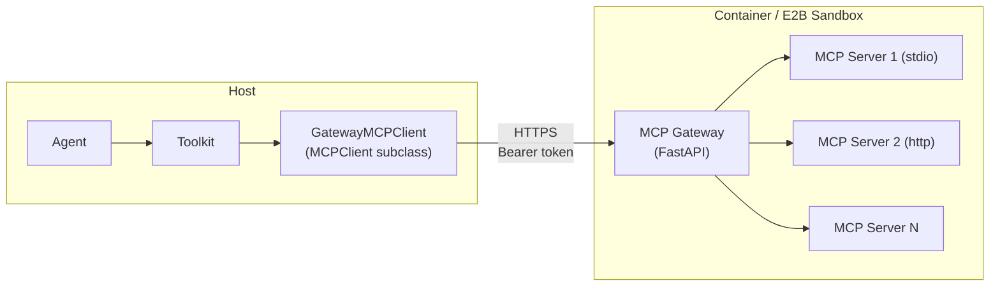

## Overview

A workspace is the agent's execution environment. It supplies the agent with three categories of resources — **tools** (built-in tools and MCPs), **skills**, and **context offloading** for compressed messages and oversized tool results — and owns the lifecycle of the resources living inside it (MCP server processes, dynamically added skills, offloaded files).

AgentScope ships three workspace implementations — local filesystem, Docker container, and E2B cloud sandbox — plus a **workspace manager** that allocates and tracks workspaces in [Agent Service](/versions/2.0.4/en/deploy/agent-service) so that multi-tenant deployments can map workspaces to users, agents, or sessions without rewriting the agent code.

For Docker and E2B, MCP servers run *inside* the isolated environment; the host reaches them through an in-workspace gateway covered in [MCP Gateway](#mcp-gateway).

## Use a Workspace

### Create a Workspace

AgentScope ships three workspace implementations, one per execution backend:

| Class | Backend |
|-------|---------|
| `LocalWorkspace` | Host filesystem (built-in tools run host-side) |
| `DockerWorkspace` | Docker container via `aiodocker` |
| `E2BWorkspace` | E2B cloud sandbox via `AsyncSandbox` |

Each backend has its own persistence model and directory layout — pick the tab matching your target environment:

<Tabs>
  <Tab title="LocalWorkspace">
    `LocalWorkspace` persists state directly under `workdir` on the host filesystem — restarts simply re-open the same directory. The directory has the following layout:

    ```
    {workdir}/
    ├── .mcp           # registered MCP client configs (JSON array)
    ├── data/          # offloaded multimodal payloads (deduped by SHA-256)
    ├── skills/        # skill subdirectories, each with SKILL.md
    │   └── .skills    # name/hash index for de-duplication
    └── sessions/      # per-session context.jsonl and tool-result files
    ```

    ```python
    from agentscope.workspace import LocalWorkspace

    workspace = LocalWorkspace(
        workdir="/data/my-workspace",
        default_mcps=[],
        skill_paths=["./skills/web-search"],
    )
    await workspace.initialize()
    ```
  </Tab>

  <Tab title="DockerWorkspace">
    `DockerWorkspace` bind-mounts the host `workdir` to `/workspace` inside the container, so the layout below lives on the host and survives container restarts. Omit `workdir` for a purely ephemeral container whose writable layer disappears with it.

    ```
    {workdir}/         # host directory, bind-mounted to /workspace in container
    ├── .mcp           # registered MCP client configs (JSON array)
    ├── data/          # offloaded multimodal payloads
    ├── skills/        # skill subdirectories, each with SKILL.md
    └── sessions/      # per-session context.jsonl and tool-result files
    ```

    ```python
    from agentscope.workspace import DockerWorkspace

    workspace = DockerWorkspace(
        base_image="python:3.11-slim",
        workdir="/data/docker-workspaces/agent-1",  # bind-mounted to /workspace
        node_version="20",
        extra_pip=["numpy", "pandas"],
        default_mcps=[],
        skill_paths=["./skills/web-search"],
    )
    await workspace.initialize()
    ```
  </Tab>

  <Tab title="E2BWorkspace">
    `E2BWorkspace` uses the sandbox filesystem itself as the persistence layer — there is no host `workdir`. Each sandbox is tagged with `workspace_id` in its E2B metadata; on restart the manager looks it up via `AsyncSandbox.list(...)` and reconnects with `connect(sandbox_id=...)`. Pausing keeps disk state, resuming restores it intact.

    ```
    $workdir/          # inside the sandbox
    ├── .mcp           # registered MCP client configs (JSON array)
    ├── data/          # offloaded multimodal payloads
    ├── skills/        # skill subdirectories, each with SKILL.md
    └── sessions/      # per-session context.jsonl and tool-result files
    ```

    ```python
    from agentscope.workspace import E2BWorkspace

    workspace = E2BWorkspace(
        template="base",
        api_key="your-e2b-api-key",   # or set E2B_API_KEY
        timeout_seconds=300,
        default_mcps=[],
        skill_paths=["./skills/web-search"],
    )
    await workspace.initialize()
    ```
  </Tab>
</Tabs>

`default_mcps` and `skill_paths` are seed-time inputs — they populate a brand-new workspace on first `initialize()`. On restart the workspace restores its MCP list from the persisted `.mcp` file, so re-passing the seeds is a no-op.

All three implementations share the same `WorkspaceBase` interface, so the same agent code runs against any backend. The methods fall into four roles:

<ParamField path="initialize() / close() / reset()" type="lifecycle (developer)">
  Provision the workspace, release its resources, and clear per-session state for pool reuse. Also drives the `async with` protocol.
</ParamField>

<ParamField path="list_tools() / list_mcps() / list_skills() / get_instructions()" type="discovery (agent)">
  Enumerate the built-in tools, active `MCPClient` instances, available skills, and a workspace-specific system prompt fragment.
</ParamField>

<ParamField path="offload_context(session_id, msgs) / offload_tool_result(session_id, tool_result)" type="offloading (agent)">
  Persist compressed context or oversized tool results into `sessions/<session_id>/` and return a reference path the agent stores in place of the original payload.
</ParamField>

<ParamField path="add_mcp(mcp_client) / remove_mcp(name) / add_skill(skill_path) / remove_skill(name)" type="dynamic management (user)">
  Register or remove MCP servers and skills at runtime; changes are persisted to `.mcp` and `skills/` so they survive restarts.
</ParamField>

### Integrate with Agent

A workspace plugs into `Agent` along two axes — as a source of tools / MCPs / skills, and as the offloader for context compression:

```python
from agentscope.agent import Agent
from agentscope.tool import Toolkit
from agentscope.workspace import LocalWorkspace

workspace = LocalWorkspace(workdir="./my-workspace")
await workspace.initialize()

agent = Agent(
    name="coder",
    system_prompt="You are a coding assistant.",
    model=model,
    toolkit=Toolkit(
        tools=await workspace.list_tools(),
        mcps=await workspace.list_mcps(),
        skills_or_loaders=await workspace.list_skills(),
    ),
    offloader=workspace,
)
```

| Axis | Wiring | What the agent gets |
|------|--------|---------------------|
| Resources | `Toolkit(tools=..., mcps=..., skills_or_loaders=...)` | Built-in tools, MCP-provided tools, and skills available in the workspace |
| Offloading | `Agent(offloader=workspace)` | When context compression triggers or a tool result exceeds the size limit, the agent calls `workspace.offload_context()` / `offload_tool_result()` and stores the returned reference path in place of the original payload |

`Agent` only depends on the `Offloader` protocol (`offload_context` / `offload_tool_result`), so any object satisfying that protocol can take the role — the workspace is the typical implementation.

<Tip>
Because the workspace exposes its resources as flat lists, you can partition them into `ToolGroup`s when the agent has too many tools to keep all active at once. Pass the groups to `Toolkit(tool_groups=[...])` and the agent activates them on demand through the built-in `ResetTools` meta-tool — only the reserved `basic` group stays always-on.

```python
from agentscope.tool import Toolkit, ToolGroup

mcps = await workspace.list_mcps()
skills = await workspace.list_skills()

toolkit = Toolkit(
    tools=await workspace.list_tools(),         # always active (basic group)
    tool_groups=[
        ToolGroup(name="search", description="Web search and retrieval.",
                  mcps=[m for m in mcps if m.name.startswith("search")]),
        ToolGroup(name="coding", description="Code editing skills.",
                  skills_or_loaders=skills),
    ],
)
```
</Tip>

## Workspace Manager

A workspace manager is the allocator and lifecycle owner for workspaces in a multi-tenant service. It is used by [Agent Service](/versions/2.0.4/en/deploy/agent-service) to map incoming requests to the right workspace instance and to release them on shutdown.

A manager is responsible for:

- **Allocation** — `create_workspace(user_id, agent_id, session_id)` builds a fresh workspace and tracks it; `get_workspace(..., workspace_id)` returns a live one or rebuilds on cache miss.
- **Caching and TTL** — workspaces are cached in memory keyed by `workspace_id`; idle entries are evicted after `ttl` seconds and their underlying resources (containers, sandboxes, MCP processes) torn down.
- **Isolation policy** — the manager decides whether two requests share a workspace; the built-in managers all isolate by `agent_id`, but `WorkspaceManagerBase` is a tiny abstract class that can be subclassed for per-user or per-session policies.
- **Cleanup** — `close(workspace_id)` evicts a single entry and `close_all()` drains the cache on app shutdown.

AgentScope ships three managers, each paired with one workspace backend and all isolating per agent:

| Class | Pairs with | Isolation key | Cache key |
|-------|-----------|---------------|-----------|
| `LocalWorkspaceManager` | `LocalWorkspace` | `agent_id` (workdir = `<basedir>/<agent_id>`) | `workspace_id` |
| `DockerWorkspaceManager` | `DockerWorkspace` | `(user_id, agent_id)` (workdir = `<basedir>/<user_id>/<agent_id>`) | `workspace_id` |
| `E2BWorkspaceManager` | `E2BWorkspace` | `agent_id` (workspace metadata, no host workdir) | `workspace_id` |

Construct a manager and use it like a workspace allocator:

```python
from agentscope.app._manager import LocalWorkspaceManager

manager = LocalWorkspaceManager(
    basedir="/data/workspaces",
    skill_paths=["./skills/coding"],
    ttl=3600.0,
)

ws = await manager.create_workspace(
    user_id="user-1",
    agent_id="agent-42",
    session_id="session-abc",
)

# Later, on a follow-up request for the same workspace:
ws = await manager.get_workspace(
    user_id="user-1",
    agent_id="agent-42",
    session_id="session-abc",
    workspace_id=ws.workspace_id,
)
```

To plug a different isolation policy (per-user, per-session, or hybrid), subclass `WorkspaceManagerBase` and override `get_workspace` / `create_workspace` with your own keying — see [Agent Service · Workspace implementation and isolation](/versions/2.0.4/en/deploy/agent-service#workspace-implementation-and-isolation) for how the service wires a manager into the request lifecycle.

<Tip>
In the agent service, the workspace manager is bound to the FastAPI app state during the lifespan and shared across all requests; routers acquire workspaces through `get_workspace_manager` dependency injection. See [Agent Service](/versions/2.0.4/en/deploy/agent-service) for the full integration.
</Tip>

## MCP Gateway

`DockerWorkspace` and `E2BWorkspace` cannot register host-side MCP clients directly — the MCP servers live inside the container or sandbox, and stdio sessions cannot cross that boundary. AgentScope solves this with an **MCP gateway**: a lightweight FastAPI process that runs *inside* the workspace, owns the upstream MCP sessions, and exposes them over a single authenticated HTTP endpoint that the host talks to.



The gateway exposes a small REST surface — `GET /health`, `GET/POST/DELETE /mcps`, `GET /mcps/{name}/tools`, `POST /mcps/{name}/tools/{tool}` — protected by a per-workspace bearer token minted at each `initialize()`. On the host, two adapters preserve the standard interfaces:

- **`GatewayMCPClient`** — an `MCPClient` subclass whose `connect` / `close` / `list_tools` calls become HTTP requests against the gateway, so the rest of the toolkit cannot tell it apart from a local MCP client.
- **`GatewayMCPTool`** — a `ToolBase` subclass whose `__call__` posts to `/mcps/{name}/tools/{tool}` and reconstructs the returned `ToolChunk`.

This abstraction keeps the agent-side code identical across all three workspace backends — a workspace returns `MCPClient` instances from `list_mcps()` regardless of whether the upstream session lives on the host (`LocalWorkspace`) or inside an isolated environment (`DockerWorkspace` / `E2BWorkspace`).

## Further Reading

<CardGroup cols={2}>
  <Card title="Agent" icon="robot" href="/versions/2.0.4/en/building-blocks/agent">
    Agent abstraction, the ReAct loop, and offloader integration
  </Card>
  <Card title="Tool" icon="wrench" href="/versions/2.0.4/en/building-blocks/tool">
    Built-in tools, MCP integration, and toolkit composition
  </Card>
  <Card title="Agent Service" icon="server" href="/versions/2.0.4/en/deploy/agent-service">
    Multi-tenant service that drives the workspace manager
  </Card>
  <Card title="Context" icon="database" href="/versions/2.0.4/en/building-blocks/context">
    Context compression and the offloading triggers
  </Card>
</CardGroup>
