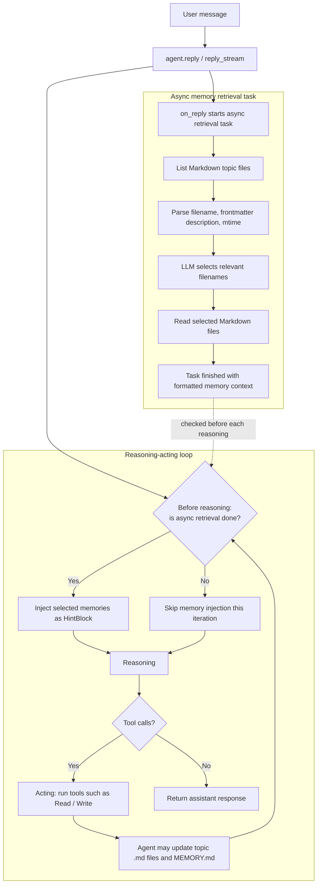

**Long-term memory** is an agent's ability to retain information across sessions, including user preferences, past decisions, and knowledge or rules summarized from conversations.

AgentScope implements different long-term memory capabilities as [agent middleware](/versions/2.0.5dev/en/building-blocks/middleware). Each long-term memory implementation is a `MiddlewareBase` subclass that non-invasively handles memory injection, retrieval, and write-back.

AgentScope currently supports the following long-term memory implementations, with more under development:

| Name | Code API | Description |
|------|----------|-------------|
| Agentic Memory | `AgenticMemoryMiddleware` | Markdown-file-based long-term memory that agents create, maintain, and use autonomously. |
| Mem0 | `Mem0Middleware` | A drop-in long-term memory backend powered by [mem0](https://github.com/mem0ai/mem0). |
| More coming ... | | |

## Agentic Memory

Agentic Memory is AgentScope's native long-term memory implementation. It provides long-term memory through Markdown file reads, writes, and retrieval.
At runtime, the agent autonomously creates Markdown memory files, maintains an index of all memory files in a fixed `MEMORY.md` file, and automatically injects that index into the system prompt. This follows a "progressive disclosure" pattern.

<Tip>
Agentic Memory supports different runtime environments through the `backend` parameter, such as local, Docker, E2B, and cloud sandboxes. It uses `LocalBackend` by default.
</Tip>

At runtime, the agent uses the built-in `Read`, `Write`, and `Edit` tools to create, access, and modify long-term memory. A typical file structure looks like this:

```text
<workdir>/Memory/
├── MEMORY.md
├── <agent_created_topic>.md
├── <agent_created_feedback>.md
└── ...
```

Each Markdown file follows the frontmatter convention and includes `name`, `description`, and `type` fields for later retrieval and injection:

```markdown
---
name: {{memory name}}
description: {{one-line description — used to decide relevance in future conversations, so be specific}}
type: {{user, feedback, project, reference}}
---

{{memory content — for feedback/project types, structure as: rule/fact, then **Why:** and **How to apply:** lines}}
```

`MEMORY.md` stays short. It serves only as an index and is automatically injected into the system prompt. For example:

```text
- [User profile](user_profile.md) — User location and answer-style preference.
- [Feedback on answer style](feedback_answer_style.md) — User prefers concise Chinese answers.
```

Agentic Memory has two retrieval paths. First, the agent can autonomously retrieve relevant files based on the prompt and the `MEMORY.md` index. Second, when `reply` / `reply_stream` is called, the middleware starts an async task that asks an LLM to select relevant Markdown files, then checks before later reasoning steps whether that task has finished and injects the retrieved results as a `HintBlock`.

Note that retrieval is asynchronous: injection happens at checkpoints **before reasoning starts** inside the reasoning-acting loop, and the exact timing depends on retrieval latency. If the current reply does not enter a later reasoning round, such as when the model produces no tool calls, the retrieved long-term memory may not be injected into that reply. The workflow is:



Use Agentic Memory in different environments as follows:

<CodeGroup>

```python title="Local environment"
from agentscope.agent import Agent
from agentscope.middleware import AgenticMemoryMiddleware
from agentscope.permission import AdditionalWorkingDirectory, PermissionMode
from agentscope.tool import Read, Toolkit, Write, Edit


workdir = "/tmp/agentscope_ltm_demo"
memory = AgenticMemoryMiddleware(workdir=workdir)

agent = Agent(
    name="assistant",
    system_prompt="You are a helpful assistant.",
    model=my_chat_model,
    toolkit=Toolkit(tools=[Read(), Write(), Edit()]),
    middlewares=[memory],
)

# Optional: allow the Write tool in this example to write into workdir.
# In production, configure permissions according to your security policy.
agent.state.permission_context.mode = PermissionMode.ACCEPT_EDITS
agent.state.permission_context.working_directories[workdir] = (
    AdditionalWorkingDirectory(path=workdir, source="long-term-memory-demo")
)

await agent.reply("Remember that I live in Hangzhou and prefer concise Chinese answers.")

# Recreate an agent. Reusing the same workdir reuses the same Markdown memories.
new_agent = Agent(
    name="assistant",
    system_prompt="You are a helpful assistant.",
    model=my_chat_model,
    toolkit=Toolkit(tools=[Read(), Write(), Edit()]),
    middlewares=[AgenticMemoryMiddleware(workdir=workdir)],
)

await new_agent.reply("Do you remember my location and answer style preference?")
```

```python title="Docker environment"
from agentscope.agent import Agent
from agentscope.middleware import AgenticMemoryMiddleware
from agentscope.tool import Read, Toolkit, Write
from agentscope.workspace import DockerWorkspace


workspace = DockerWorkspace()
await workspace.initialize()

# Get the Docker sandbox backend.
backend = workspace.get_backend()
memory = AgenticMemoryMiddleware(
    workdir=workspace.workdir,
    # Switch to the sandbox environment.
    backend=backend,
)

agent = Agent(
    name="assistant",
    system_prompt="You are a helpful assistant.",
    model=my_chat_model,
    toolkit=Toolkit(
        # Docker workspace tools include Read / Write / Edit by default.
        tools=await workspace.list_tools(),
        # You can also pass Read / Write / Edit yourself.
        # tools=[Read(backend=backend), Write(backend=backend), Edit(backend=backend)],
    ),
    middlewares=[memory],
)

try:
    await agent.reply("Remember that I am testing long-term memory in a Docker sandbox.")
finally:
    await workspace.close()
```

```python title="E2B environment"
from agentscope.agent import Agent
from agentscope.middleware import AgenticMemoryMiddleware
from agentscope.tool import Read, Toolkit, Write
from agentscope.workspace import E2BWorkspace


workspace = E2BWorkspace()
await workspace.initialize()

# Get the E2B sandbox backend.
backend = workspace.get_backend()
memory = AgenticMemoryMiddleware(
    workdir=workspace.workdir,
    # Switch to the sandbox environment.
    backend=backend,
)

agent = Agent(
    name="assistant",
    system_prompt="You are a helpful assistant.",
    model=my_chat_model,
    toolkit=Toolkit(
        # E2B workspace tools include Read / Write / Edit by default.
        tools=await workspace.list_tools(),
        # You can also pass Read / Write / Edit yourself.
        # tools=[Read(backend=backend), Write(backend=backend), Edit(backend=backend)],
    ),
    middlewares=[memory],
)

try:
    await agent.reply("Remember that I am testing long-term memory in an E2B sandbox.")
finally:
    await workspace.close()
```

</CodeGroup>

## Mem0

`Mem0Middleware` is a drop-in long-term memory backend powered by [mem0](https://github.com/mem0ai/mem0). It works with both `mem0.AsyncMemory` (open-source) and `mem0.AsyncMemoryClient` (hosted Platform). With `mem0.AsyncMemory` (open-source), it can route mem0's own memory extraction and embedding through your existing AgentScope models — so mem0 needs no separate provider key.

### Installation

`Mem0Middleware`'s dependencies are available as an optional extra in AgentScope:

```bash
pip install "agentscope[mem0]"
```

### Quick start

The fastest path is to pass a dedicated AgentScope chat model and an embedding model to the middleware; it builds an open-source mem0 store internally and wires both extraction and embedding through them.

```python
import asyncio
import os

from agentscope.agent import Agent
from agentscope.credential import DashScopeCredential
from agentscope.embedding import DashScopeEmbeddingModel
from agentscope.message import UserMsg
from agentscope.middleware import Mem0Middleware
from agentscope.model import DashScopeChatModel
from agentscope.tool import Toolkit


async def main():
    api_key = os.environ["DASHSCOPE_API_KEY"]

    # Construct these as two separate chat-model objects, even though they
    # use the same provider, model name, endpoint, and API key.
    agent_chat_model = DashScopeChatModel(
        credential=DashScopeCredential(api_key=api_key),
        model="qwen3.7-max",
        stream=False,
    )
    mem0_chat_model = DashScopeChatModel(
        credential=DashScopeCredential(api_key=api_key),
        model="qwen3.7-max",
        stream=False,
    )
    embedding_model = DashScopeEmbeddingModel(
        credential=DashScopeCredential(api_key=api_key),
        model="text-embedding-v4",
        dimensions=1536,
    )

    mw = Mem0Middleware(
        user_id="alice",
        chat_model=mem0_chat_model,
        embedding_model=embedding_model,
        mode="both",
    )

    agent = Agent(
        name="assistant",
        system_prompt="You are a helpful assistant.",
        model=agent_chat_model,
        toolkit=Toolkit(tools=await mw.list_tools()),
        middlewares=[mw],
    )

    # Memories written in this session resurface in later sessions
    # for the same ``user_id``.
    await agent.reply(
        UserMsg("alice", "Remember that I prefer dark-mode charts."),
    )


asyncio.run(main())
```

<Note>
`Mem0Middleware` contributes its `search_memory` / `add_memory` tools through `list_tools()`, which the agent does **not** call automatically. To make the tools available to the agent, collect them yourself and pass them into the toolkit — `Toolkit(tools=await mw.list_tools())`. In `static_control` mode `list_tools()` returns an empty list.
</Note>

### Control modes

The `mode` parameter decides how the agent interacts with mem0. It defaults to `"both"`, matching AgentScope 1.x's `ReActAgent.long_term_memory_mode`.

| Mode | Behavior |
|------|----------|
| `static_control` | The middleware searches mem0 before each reply, injects the retrieved memories into the context as an `AssistantMsg(name="memory")`, and writes the new exchange back after the reply. The agent is unaware of mem0. |
| `agent_control` | The middleware exposes `search_memory` / `add_memory` tools and appends a short usage nudge to the system prompt. The agent decides when to read from or write to memory; there is no automatic retrieval or write-back. |
| `both` | Both patterns are active at once — automatic retrieval **and** on-demand tools. |

### Construction paths

`Mem0Middleware` supports three ways to wire up the mem0 backend:

<Warning>
**When you use an AgentScope chat model to construct the mem0 backend, `Agent` and `Mem0Middleware` must use separate model instances.** This requirement applies to both model-backed paths below: passing AgentScope models directly, and providing `chat_model` with a custom mem0 config. It does not apply to the pre-built client path, where `Mem0Middleware` uses the supplied mem0 client directly.

The instances must be separate because AgentScope chat models use an asynchronous interface, while mem0 invokes a synchronous LLM interface during memory extraction. To bridge these interfaces, `Mem0Middleware` wraps the AgentScope model in an adapter: `Agent` invokes its model on the application's event loop, whereas the adapter runs the memory-extraction model coroutine on a dedicated bridge event loop.

If the two paths share one model instance, they also share its async HTTP client and connection pool across two event loops. The pool's underlying resources may become bound to the loop where they are first used; accessing them from the other loop can then cause intermittent `Connection error` failures or `RuntimeError: ... is bound to a different event loop`. Because the failure can occur only during memory extraction, the Agent may still return a normal response even though the memory write fails or produces no new facts.

The two instances may still use the same provider, model name, endpoint, and API key—the requirement is only that they are separate model/client objects. In multi-agent applications, do not share one mem0 chat-model instance across independently constructed model-backed `Mem0Middleware` instances, because each adapter may own a different bridge event loop.
</Warning>

<Tabs>
  <Tab title="AgentScope models">
  Pass AgentScope models and let the middleware build an open-source `AsyncMemory` internally (mem0's default Qdrant store). The embedding model's `dimensions` must match the vector store (the default Qdrant expects `1536`).

```python
Mem0Middleware(
    user_id="alice",
    chat_model=mem0_chat_model,
    embedding_model=my_embedding_model,
)
```
  </Tab>
  <Tab title="Models + custom config">
  Start from your own `mem0.configs.base.MemoryConfig` to customize the vector store, history DB, or reranker, while still routing the LLM and embedder through AgentScope. Only the `.llm` / `.embedder` slots are overridden; every other field is preserved.

```python
Mem0Middleware(
    user_id="alice",
    chat_model=mem0_chat_model,
    embedding_model=my_embedding_model,
    mem0_config=my_mem0_config,
)
```
  </Tab>
  <Tab title="Pre-built client">
  Pass a pre-built mem0 client when you want full control (e.g. the hosted Platform, or sharing one store across agents). When `client` is given it takes absolute precedence, and `chat_model` / `embedding_model` / `mem0_config` are ignored.

```python
from mem0 import AsyncMemoryClient

Mem0Middleware(
    user_id="alice",
    client=AsyncMemoryClient(api_key="m0-..."),
)
```
  </Tab>
</Tabs>

<Warning>
`Mem0Middleware` requires an **async** mem0 client (`mem0.AsyncMemory` or `mem0.AsyncMemoryClient`). The synchronous `Memory` / `MemoryClient` are not supported.
</Warning>

### Key parameters

| Parameter | Type | Default | Description |
|-----------|------|---------|-------------|
| `user_id` | `str` | *(required)* | mem0 namespace for the user's memories. |
| `mode` | `"static_control" \| "agent_control" \| "both"` | `"both"` | How the agent interacts with mem0 (see above). |
| `agent_id` | `str \| None` | `None` | Optional finer-grained namespace. |
| `top_k` | `int` | `5` | Max memories retrieved per static-control search; also the default for the `search_memory` tool. |
| `threshold` | `float \| None` | `None` | Minimum similarity score; `None` lets mem0 decide. |
| `scope_search_by_agent` | `bool` | `True` | When `True`, searches filter by both `user_id` and `agent_id`; when `False`, a user's memories are shared across agents. |
| `await_write` | `bool` | `True` | When `True`, the post-turn write is awaited inline; when `False`, it's fire-and-forget (faster, but exceptions only surface in logs). |

### Agent-callable tools

In `agent_control` and `both` modes, the middleware contributes two tools the model can invoke on demand:

- **`search_memory(keywords, limit=5)`** — retrieves memories using a list of short, targeted keywords. Each keyword is issued as an independent query; results are merged and deduplicated.
- **`add_memory(thinking, content)`** — records durable facts. Only `content` (a list of standalone sentences) is persisted to mem0; `thinking` stays in the transcript for auditability.

Both tools auto-allow themselves and read `user_id` / `agent_id` directly from the middleware instance, so they require no extra wiring beyond adding them to the toolkit.
