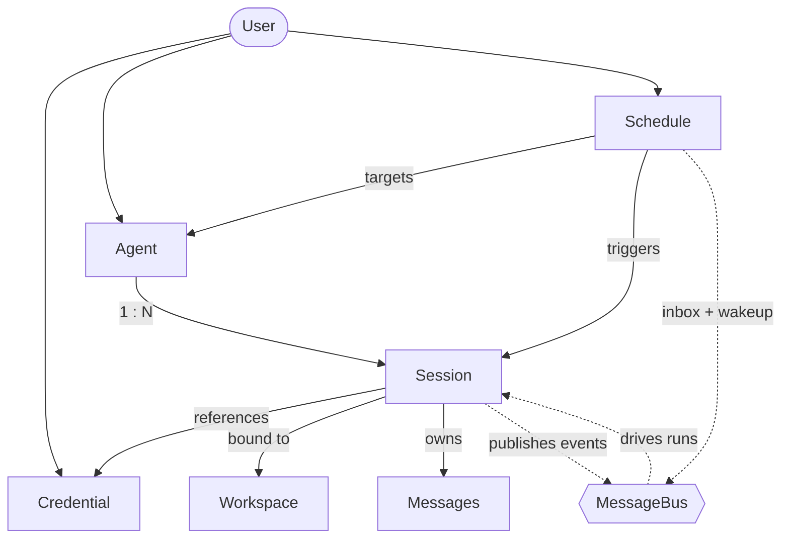
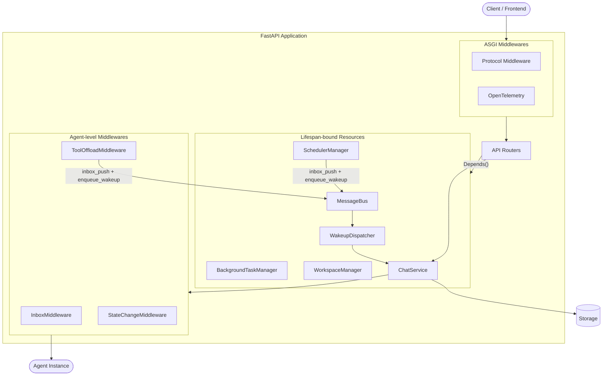

Agent Service is the FastAPI-based hosting layer that turns AgentScope agents into a **multi-tenant, multi-session HTTP service**. It owns everything *around* the agent — request routing, per-user resource lifecycle, session state, persistence, scheduling, and tool offloading — so that the agent code you wrote against [`Agent`](/versions/2.0.5dev/en/building-blocks/agent) can serve production traffic without being rewritten.

What sets it apart:

- **Production backbone for live agents** — agent runs, background tasks, schedules, and the tool/MCP/skill/workspace lifecycle are managed end-to-end, with session streams that fan out to multiple subscribers and replay buffered history on reconnect.
- **Schema-driven frontend** — credentials publish JSON schemas and models expose declarative cards (input/output types, context size, parameter schemas), so the UI can render forms and capability badges without coupling to provider-specific code.
- **Multi-tenant by construction** — credentials, agents, sessions, schedules, and messages are all owned by the request's `user_id`, and ownership is enforced at the routing layer — one deployment serves many users with no per-tenant code paths.
- **Modular and extensible** — authentication, chat protocols, workspace isolation strategy, storage backend, and the set of model providers and credential types are all open at the boundary, swappable without touching framework code.

### Capabilities

| Capability | Description |
|------------|-------------|
| Agent teams | A leader agent spawns worker agents and coordinates them through built-in team tools; see the [Agent Team](/versions/2.0.5dev/en/deploy/agent-team) chapter. |
| Workspace management | Configurable workspace isolation — `per_agent` (default), `per_session`, or `per_user` — for the agent's filesystem, MCP clients, and skills. |
| Knowledge bases (RAG) | Optional built-in knowledge base service with document ingestion, chunking, embedding, and natural-language search — enabled by passing a `knowledge_base_manager` to `create_app`. |
| Background task offloading | Long-running tool calls move to background; their results are delivered back through the session's event stream when they finish. |
| Cron scheduling | Time-based agent execution with stateful or stateless sessions; schedules persist across restarts. |
| Session replay | Late-joining clients to the per-session SSE stream receive buffered history before live events, so multiple tabs or a reconnecting frontend stay in sync. |
| Interruption | Running or HITL-parked chat runs can be cancelled from outside via `POST /sessions/{id}/interrupt`; the agent unwinds cleanly and remains ready for the next input. |
| Protocol adaptation | Middleware-based conversion to external protocols (AG-UI, A2A, etc.) on top of AgentScope's native event stream. |
| Distributed deployment <Badge color="yellow" size="sm">WIP</Badge> | All shared state lives in Redis (storage + message bus), so multiple worker processes — or multiple nodes — can serve one logical service. |

<Note>
The service does **not** include a built-in user authentication system. It provides a placeholder `X-User-ID` header dependency that you replace with your own auth middleware (JWT, OAuth, session tokens, etc.).
</Note>

## Quickstart

The fastest way to see Agent Service in action is to run the bundled example backend together with the example frontend — both ship inside the AgentScope repo.

### Try the bundled example

The [`examples/agent_service`](https://github.com/agentscope-ai/agentscope/tree/main/examples/agent_service) directory boots a ready-to-use service, and [`examples/web_ui`](https://github.com/agentscope-ai/agentscope/tree/main/examples/web_ui) is a matching React frontend that talks to it. Together they give you a working playground for every capability above in a few minutes.

<Frame caption="Background task offloading — a long-running tool moves to a background watcher; the result later wakes the agent up and the conversation resumes.">
  
</Frame>

<Frame caption="Permission control in bypass mode — the agent runs end-to-end without pausing for tool-call confirmations.">
  
</Frame>

<Frame caption="Task planning — the agent breaks complex work into a tracked plan and updates it as it goes.">
  
</Frame>

<Frame caption="Agent team — a leader agent spawns workers and coordinates them through the built-in team tools.">
  
</Frame>

<Steps>
  <Step title="Clone the repository">
    ```bash
    git clone https://github.com/agentscope-ai/agentscope.git
    cd agentscope
    ```
  </Step>
  <Step title="Start the example backend">
    Make sure a local Redis is reachable (the example expects `localhost:6379`), then launch the service:

    ```bash
    cd examples/agent_service
    python main.py
    ```

    The service comes up on `http://localhost:8000`.
  </Step>
  <Step title="Start the example frontend">
    In another terminal, install and run the web UI:

    ```bash
    cd examples/web_ui
    pnpm install
    pnpm dev
    ```

    Open the URL the dev server prints (typically `http://localhost:5173`) and the frontend will connect to the backend you started in step 2.
  </Step>
</Steps>

Once both are running, the same UI lets you exercise every capability the service ships with:

- **Permission control** — tools that touch the system pause for confirmation; explore-mode locks the agent to read-only operations.
- **Background task offloading** — long-running tool calls move to the background and their results stream in when they finish, without blocking the conversation.
- **Task planning** — the agent breaks complex work into a tracked plan and updates it as it goes.
- **Agent teams** — a leader agent spawns workers and coordinates them through the team tools.
- **Scheduled runs** — cron-driven agents that fire on their own and report back to the same session stream.

### From your own code

When you want to embed the service in your own deployment instead of running the example, build the FastAPI app yourself with `create_app`. The minimum to get a service running is a storage backend, a message bus, and a workspace manager. The examples below boot a service on port 8000 backed by Redis — pick the workspace backend that matches where you want the agent's tools to execute.

<CodeGroup>

```python Local filesystem
import uvicorn
from agentscope.app import create_app
from agentscope.app.storage import RedisStorage
from agentscope.app.message_bus import RedisMessageBus
from agentscope.app.workspace_manager import LocalWorkspaceManager

# Persistence layer for agents, sessions, credentials, messages, and schedules.
# Its connection pool is opened on app startup and closed on shutdown.
storage = RedisStorage(host="localhost", port=6379)

# Redis-backed message bus: session locks, replay logs, inbox queues, and
# wakeup signals that decouple chat triggering from event delivery and
# let multiple worker processes share one logical service.
message_bus = RedisMessageBus(host="localhost", port=6379)

# Workspace lifecycle — working directory, MCP clients, skills.
# The built-in manager isolates per agent: sessions of the same agent
# share one workspace. Idle workspaces are evicted after `ttl` seconds.
workspace_manager = LocalWorkspaceManager(
    basedir="/data/workspaces",
    ttl=3600.0,
)

app = create_app(
    storage=storage,
    message_bus=message_bus,
    workspace_manager=workspace_manager,
)

uvicorn.run(app, host="0.0.0.0", port=8000)
```

```python Docker sandbox
import uvicorn
from agentscope.app import create_app
from agentscope.app.storage import RedisStorage
from agentscope.app.message_bus import RedisMessageBus
from agentscope.app.workspace_manager import DockerWorkspaceManager

storage = RedisStorage(host="localhost", port=6379)
message_bus = RedisMessageBus(host="localhost", port=6379)

# Each workspace runs inside its own local Docker container for isolation.
# Per-user/per-agent host workdirs live under `basedir` and are bind-mounted
# into each container.
workspace_manager = DockerWorkspaceManager(basedir="/data/docker-workspaces")

app = create_app(
    storage=storage,
    message_bus=message_bus,
    workspace_manager=workspace_manager,
)
uvicorn.run(app, host="0.0.0.0", port=8000)
```

```python E2B
import uvicorn
from agentscope.app import create_app
from agentscope.app.storage import RedisStorage
from agentscope.app.message_bus import RedisMessageBus
from agentscope.app.workspace_manager import E2BWorkspaceManager

storage = RedisStorage(host="localhost", port=6379)
message_bus = RedisMessageBus(host="localhost", port=6379)

# Each workspace runs inside a remote E2B cloud sandbox.
# Provide `api_key` here or set the `E2B_API_KEY` environment variable.
workspace_manager = E2BWorkspaceManager()

app = create_app(
    storage=storage,
    message_bus=message_bus,
    workspace_manager=workspace_manager,
)
uvicorn.run(app, host="0.0.0.0", port=8000)
```

</CodeGroup>

### create_app parameters

<ParamField path="storage" type="StorageBase" required>
  The storage backend for persisting agents, sessions, credentials, messages, schedules, teams, and knowledge base records. Its lifecycle (`__aenter__` / `__aexit__`) is managed by the app lifespan.
</ParamField>
<ParamField path="message_bus" type="MessageBus" required>
  Redis-backed primitives — session locks, replay logs, inbox queues, and wakeup signals — that decouple chat triggering from event delivery. Required because every code path that delivers events to the frontend (`POST /chat`, scheduled fires, team messages, background-tool completions) goes through it, and because it is what makes multi-process deployments possible.
</ParamField>
<ParamField path="workspace_manager" type="WorkspaceManagerBase" required>
  Manages workspaces (file storage, MCP clients, skills) with TTL-based caching. The built-in `LocalWorkspaceManager` supports three built-in isolation grains (`per_agent`, `per_session`, `per_user`); see [Workspace implementation and isolation](#workspace-implementation-and-isolation) for details.
</ParamField>
<ParamField path="knowledge_base_manager" type="KnowledgeBaseManagerBase | None" default="None">
  Manager that owns the knowledge base lifecycle and serves `KnowledgeBase` runtime handles to both HTTP endpoints and agent code. The manager carries its own vector store instance — its `__aenter__` / `__aexit__` enter and release it. Passing `None` disables every `/knowledge_bases` endpoint.
</ParamField>
<ParamField path="knowledge_parsers" type="list[ParserBase] | dict[str, ParserBase] | None" default="None">
  Parsers registered for knowledge base document uploads. Pass a **list** to have the service route by each parser's `supported_media_types` (later entries override earlier ones for overlapping types, with a warning); pass a **dict** `media_type → parser` for explicit routing. Defaults to `[TextParser()]` when `knowledge_base_manager` is set.
</ParamField>
<ParamField path="knowledge_chunker" type="ChunkerBase | None" default="None">
  The chunker shared across every knowledge base. Defaults to `ApproxTokenChunker()` when `knowledge_base_manager` is set.
</ParamField>
<ParamField path="blob_store" type="BlobStoreBase | None" default="None">
  Backend that stores uploaded document bytes between the upload endpoint and the indexing worker. Required when `knowledge_base_manager` is set; defaults to `LocalBlobStore(root_dir="./blobs")`. Its lifecycle is managed by the app lifespan.
</ParamField>
<ParamField path="enable_index_worker" type="bool" default="True">
  When `True` (embedded deployment) the API process starts an `IndexWorker` and `IndexSweeper` in its lifespan and dispatches indexing tasks via an in-process queue. When `False` (dedicated deployment) the API process performs no indexing — a separate worker process is expected to consume tasks from the message bus. No effect when `knowledge_base_manager` is `None`.
</ParamField>
<ParamField path="extra_credentials" type="list[Type[CredentialBase]] | None" default="None">
  Additional credential types to register. Each class is registered with `CredentialFactory` before the app starts.
</ParamField>
<ParamField path="extra_middlewares" type="list[Middleware] | None" default="None">
  Additional ASGI middlewares (e.g., protocol adapters, CORS, auth).
</ParamField>
<ParamField path="extra_agent_middlewares" type="AgentMiddlewareFactory | None" default="None">
  Async factory `(user_id, agent_id, session_id) -> Awaitable[list[MiddlewareBase]]` invoked once per agent assembly (per chat turn or scheduled trigger). Returned middlewares are appended to the framework-supplied ones (e.g., `ToolOffloadMiddleware`) before the agent runs, so the factory can produce per-user / per-session middlewares such as audit logging, tenant isolation, or custom auth.
</ParamField>
<ParamField path="extra_agent_tools" type="AgentToolFactory | None" default="None">
  Async factory `(user_id, agent_id, session_id) -> Awaitable[list[ToolBase]]` invoked once per agent assembly. Returned tools are merged into the toolkit's `"basic"` group alongside the workspace-derived tools, so tool availability can vary per caller (per-tenant integrations, user-specific credentials).
</ParamField>
<ParamField path="custom_subagent_templates" type="list[SubAgentTemplate] | None" default="None">
  Reusable blueprints for sub-agent creation within teams. Each template defines a sub-agent *type* (e.g. `"researcher"`, `"coder"`) with pre-configured system prompt, permission context, and task context. When registered, the `AgentCreate` tool exposes a `subagent_type` parameter so the leader agent can route to the appropriate template. See [Custom sub-agent types](/versions/2.0.5dev/en/deploy/agent-team#custom-sub-agent-types) for details.
</ParamField>
<ParamField path="custom_agent_cls" type="Type[Agent] | None" default="None">
  A custom `Agent` subclass to instantiate on every chat turn instead of the built-in `Agent`. Use this to swap in an agent implementation with different reasoning behaviour while keeping the rest of the service unchanged.
</ParamField>
<ParamField path="title" type="str" default="AgentScope">
  OpenAPI title shown in the docs UI.
</ParamField>
<ParamField path="version" type="str" default="package version">
  API version shown in the docs UI. Defaults to the installed AgentScope package version.
</ParamField>

<Warning>
The default `X-User-ID` header provides no authentication. Replace it with a real auth integration before deploying — see [User authentication](#user-authentication).
</Warning>

### Typical operation flow

Once the server is running, drive it through the resources defined in the resource model. The flow below is the path a chat session usually takes — each step is one or two REST calls.

<Steps>
  <Step title="Create an agent">
    Register the agent's identity — display name, system prompt, and runtime configuration. The same agent can drive many sessions under different models.

    ```http
    POST /agent
    ```
  </Step>
  <Step title="Create and configure a credential">
    Discover each provider's form fields with `GET /credential/schemas`, then save the API key. One credential can be reused across many sessions and agents.

    ```http
    GET  /credential/schemas
    POST /credential
    ```
  </Step>
  <Step title="Create a session and select a model">
    Create a session bound to the agent and attach a model configuration — provider, model name, parameters, and the credential to call it with. The session owns the runtime state from here on.

    ```http
    POST /sessions
    ```
  </Step>
  <Step title="Configure MCPs and skills (optional)">
    Attach MCP clients and skills to the session's workspace if the agent needs tools beyond its built-ins. Out of the box, every agent already has access to the workspace's built-in tools (filesystem, shell, search, …), task-planning tools, schedule and background-task controls, and — when the session is a team leader or member — the team coordination tools described in [Agent Team](/versions/2.0.5dev/en/deploy/agent-team). Anything you pass via `extra_agent_tools` in `create_app` is merged in alongside.

    ```http
    POST /workspace/mcp
    POST /workspace/skill
    ```
  </Step>
  <Step title="Start chatting">
    Fire a chat run by posting a user `Msg` to `/chat`. The endpoint returns immediately with `{"status": "started", "session_id": "..."}` — events are delivered out-of-band on the per-session SSE stream `GET /sessions/{id}/stream`, which any number of clients can subscribe to and which replays buffered history to late joiners before serving live events.

    ```http
    POST /chat
    GET  /sessions/{session_id}/stream
    ```
  </Step>
</Steps>

Trigger a run:

```bash
curl -X POST http://localhost:8000/chat \
  -H "X-User-ID: alice" \
  -H "Content-Type: application/json" \
  -d '{
    "agent_id": "agent-xxx",
    "session_id": "session-xxx",
    "input": {
      "name": "alice",
      "role": "user",
      "content": [{"type": "text", "text": "Hello"}]
    }
  }'
```

Subscribe to the session's event stream in parallel (or before triggering — the stream stays open across runs and broadcasts everything the session produces, including scheduled fires and background-tool completions):

```bash
curl -N -H "X-User-ID: alice" \
  "http://localhost:8000/sessions/session-xxx/stream?agent_id=agent-xxx"
```

For a **scheduled run**, complete steps 1 and 2, then create a schedule that targets the agent — the scheduler creates the session (stateful or stateless) and triggers the run on the cron expression you provide. No `/chat` call is needed; the agent runs autonomously when the cron fires.

```http
POST /schedule
```

To **interrupt** a running or HITL-parked chat run at any time, post to the session's interrupt endpoint. The agent unwinds cleanly and stays ready for the next `/chat` call.

```bash
curl -X POST -H "X-User-ID: alice" \
  "http://localhost:8000/sessions/session-xxx/interrupt?agent_id=agent-xxx"
```

## Resource Model

Every operation in Agent Service is scoped to a `user_id` resolved from the request. Below that boundary, the service manages seven resource types — six persisted (left half of the diagram) plus the message bus that ties their runtime behavior together (right half):



| Resource | Description |
|----------|-------------|
| **User** | Opaque tenant identifier resolved from the request. The service models no user system of its own; you plug yours in via `get_current_user_id`. |
| **Credential** | Connection configuration for a model provider — an API key plus provider-specific settings. Reusable across many agents and sessions. |
| **Agent** | Display name, system prompt, and runtime configuration (context, ReAct loop). The reusable template — identity belongs to the agent, runtime state belongs to the session. |
| **Workspace** | The agent's runtime environment — working directory, MCP clients, skills, offloaded context. How workspaces map to users / agents / sessions is decided by the workspace manager. |
| **Session** | One ongoing exchange between a user and an agent. Carries the agent state (working memory, in-flight reply, permission context), persisted message transcript, and the LLM configuration the session runs under. |
| **Schedule** | Fires an agent on a cron expression. Each fire runs inside a session — fresh per execution (stateless) or reused so context accumulates (stateful). Schedules persist across restarts. |
| **MessageBus** | Redis-backed runtime layer — session locks, replay logs, inbox queues, wakeup signals. The single delivery channel for scheduled fires, team messages, and background-tool completions to reach idle sessions; also what makes multi-process operation possible. |

<Tip>
	The shape to remember: **agents are reusable templates, sessions are the unit of runtime state**, and the message bus is what brings idle sessions back to life when something external (a schedule, a teammate, a background tool) has something to say.
</Tip>

## API Overview

The service exposes the resources from the resource model as REST endpoints, plus the streaming chat endpoint. The table below groups them by category; full request and response shapes are documented in the service's OpenAPI specification.

| Category | Endpoints | Description |
|----------|-----------|-------------|
| Chat | `POST /chat` | Fire a chat run for a session; returns `ChatTriggerResponse` JSON. Accepts a new `Msg`, a `list[Msg]`, a `UserConfirmResultEvent` / `ExternalExecutionResultEvent` (HITL resume), or `None` (continue). Events are delivered out-of-band on the per-session stream. |
| Session stream | `GET /sessions/{id}/stream` | Per-session SSE stream of `AgentEvent` objects, with buffered replay for late joiners and multi-subscriber fan-out. |
| Session control | `POST /sessions/{id}/interrupt`, `GET /sessions/{id}/status` | Interrupt a running or HITL-parked chat run; probe the unified session status (running / parked / idle / gone). |
| Sessions | `GET/POST/PATCH/DELETE /sessions` | Create and manage chat sessions, including model binding and permission level. |
| Messages | `GET /sessions/{id}/messages` | Paginated message transcript for a session (`offset`, `limit`). |
| Agents | `GET/POST/PATCH/DELETE /agent` | Manage agent records — display name, system prompt, runtime config. |
| Agent schema | `GET /agent/schema/v2` | Full `AgentData` JSON Schema for rendering the agent form on the frontend. (`GET /agent/schema` remains for legacy clients but is deprecated.) |
| Credentials | `GET/POST/PATCH/DELETE /credential` | CRUD for per-provider API keys and connection configs. |
| Credential schemas | `GET /credential/schemas` | Discover all registered credential types and their JSON parameter schemas for form rendering. |
| Models | `GET /model?provider=<name>` | List candidate chat models for a provider, with their declarative `ModelCard` (capabilities and parameter schemas). |
| TTS models | `GET /tts-model?provider=<name>` | List candidate text-to-speech models for a provider that exposes them. |
| Schedules | `GET/POST/PATCH/DELETE /schedule`, `GET /schedule/{id}/sessions` | Manage cron-based agent execution, stateful or stateless. |
| Workspace MCPs | `GET/POST /workspace/mcp`, `DELETE /workspace/mcp/{mcp_name}` | Manage MCP clients attached to the session's workspace. Each response entry includes live tool list and health status. |
| Workspace skills | `GET/POST /workspace/skill`, `DELETE /workspace/skill/{skill_name}` | Manage skills available in the session's workspace. |
| Knowledge bases | `GET/POST/PATCH/DELETE /knowledge_bases` | CRUD for knowledge bases. Enabled only when `knowledge_base_manager` is passed to `create_app`. |
| KB documents | `GET/POST /knowledge_bases/{id}/documents`, `GET /knowledge_bases/{id}/documents/status`, `DELETE /knowledge_bases/{id}/documents/{doc_id}` | Upload, list, delete documents in a knowledge base and batch-query indexing status. |
| KB search | `POST /knowledge_bases/{id}/search` | Natural-language search over a knowledge base. |
| KB discovery | `GET /knowledge_bases/embedding_models`, `GET /knowledge_bases/supported_content_types`, `GET /knowledge_bases/middleware/parameters_schema` | Discover compatible embedding models, ingestable file types, and the KB middleware's tunable parameter schema for form rendering. |

## Customization

The service is open at every infrastructure boundary. The sections below describe what is built in and how to plug in your own.

### Agent chat protocol

The per-session stream endpoint (`GET /sessions/{id}/stream`) emits AgentScope's native [`AgentEvent`](/versions/2.0.5dev/en/building-blocks/message-and-event) stream over SSE. To serve the same agent under a different frontend protocol, install a protocol middleware that intercepts the SSE stream and rewrites each frame.

AgentScope ships with `AGUIProtocolMiddleware` for the [AG-UI](https://docs.ag-ui.com/) protocol. Install it via `extra_middlewares`:

```python
from fastapi.middleware import Middleware
from agentscope.app import create_app
from agentscope.app.middleware import AGUIProtocolMiddleware

app = create_app(
    storage=storage,
    extra_middlewares=[
        Middleware(AGUIProtocolMiddleware),
    ],
)
```

To add a new protocol, subclass `ProtocolMiddlewareBase` and implement `_convert_to_protocol`:

```python
from agentscope.app.middleware import ProtocolMiddlewareBase
from agentscope.event import AgentEvent

class MyProtocolMiddleware(ProtocolMiddlewareBase):
    def _convert_to_protocol(self, event: AgentEvent) -> dict:
        # Convert AgentEvent to your protocol's frame format.
        return {"type": event.type, "data": event.model_dump()}
```

The middleware automatically intercepts `StreamingResponse` objects from the session stream endpoint, deserializes each SSE frame back into an `AgentEvent`, calls `_convert_to_protocol()` to produce the target format, and re-serializes the converted frame.

### User authentication

The built-in `get_current_user_id` dependency extracts the caller identity from the `X-User-ID` request header — a placeholder, not authentication. Override it with your own dependency to integrate any identity system.

JWT bearer token:

```python
from fastapi import Header, HTTPException, status

async def get_current_user_id(
    authorization: str = Header(...),
) -> str:
    try:
        payload = decode_jwt(authorization.removeprefix("Bearer "))
        return payload["sub"]
    except InvalidTokenError:
        raise HTTPException(
            status_code=status.HTTP_401_UNAUTHORIZED,
            detail="Invalid authentication token.",
        )
```

OAuth2 password flow:

```python
from fastapi import Depends, HTTPException, status
from fastapi.security import OAuth2PasswordBearer

oauth2_scheme = OAuth2PasswordBearer(tokenUrl="token")

async def get_current_user_id(token: str = Depends(oauth2_scheme)) -> str:
    user = await verify_oauth_token(token)
    if user is None:
        raise HTTPException(status_code=status.HTTP_401_UNAUTHORIZED)
    return user.id
```

Wire your override by replacing the dependency on the FastAPI app:

```python
from agentscope.app.deps import get_current_user_id as default_dependency

app.dependency_overrides[default_dependency] = get_current_user_id
```

<Warning>
The default `X-User-ID` header provides no authentication. Always replace it with a secure mechanism before deploying to production.
</Warning>

### Workspace implementation and isolation

Two independent axes are configurable:

- **Workspace backend** — what runtime environment the agent runs in. Built-in implementations include `LocalWorkspace`, `DockerWorkspace`, and `E2BWorkspace`. New backends implement the workspace interface and can wrap container images, sandboxes, or remote VMs.
- **Isolation strategy** — how workspaces map to users, agents, and sessions. The built-in `LocalWorkspaceManager` keys workspaces by `agent_id`: all sessions of the same agent share one workspace. To switch to per-user or per-session isolation, subclass `WorkspaceManagerBase` and override `get_workspace` with your own keying strategy.

```python
from agentscope.app.workspace_manager import WorkspaceManagerBase
from agentscope.workspace import WorkspaceBase


class CustomWorkspaceManager(WorkspaceManagerBase):
    async def get_workspace(
        self,
        user_id: str,
        agent_id: str,
        session_id: str,
        workspace_id: str,
    ) -> WorkspaceBase:
        # Resolve an initialized workspace using your own keying strategy.
        ...

	async def close(self, workspace_id: str) -> None:
        # Close and evict a single workspace.
        ...

    async def close_all(self) -> None:
        # Close every cached workspace; called on app shutdown.
        ...
```

### API credentials

A new credential type is a pair of classes: a `CredentialBase` subclass that captures the connection config (and publishes its JSON schema for form rendering), and a `ChatModelBase` subclass that implements the actual streaming chat protocol against the provider's API. The credential class is the entry point — it tells the service which chat model class to instantiate.

```python
from agentscope.credential import CredentialBase
from agentscope.model import ChatModelBase

class MyProviderChatModel(ChatModelBase):
    # Implement the streaming chat interface against the provider's API.
    ...

class MyProviderCredential(CredentialBase):
    api_key: str
    endpoint: str = "https://api.my-provider.com"

    @classmethod
    def get_chat_model_class(cls):
        return MyProviderChatModel
```

Register the credential class with the app — it becomes immediately usable by clients:

```python
app = create_app(
    storage=storage,
    extra_credentials=[MyProviderCredential],
)
```

The service automatically exposes the credential's JSON schema under `GET /credential/schemas`, and `GET /model?provider=<name>` routes to the chat model class returned by `get_chat_model_class()`.

### Provider models

The model list returned by `GET /model?provider=<name>` is built from `ModelCard` instances — declarative metadata records that tell the frontend how to display each model and what request parameters are valid. Each chat model exposes its catalog through `list_models()`, which by default loads `ModelCard` entries from YAML files in the provider's model directory; `ModelCard.from_yaml()` parses each YAML and merges its overrides into the base parameter schema supplied by the chat model's parameters class.

A model card carries the following fields:

| Field | Description |
|-------|-------------|
| `name` | Provider-side model identifier. |
| `label` | Display name shown in the UI. |
| `status` | One of `active`, `deprecated`, `sunset`. |
| `deprecated_at` | Deprecation timestamp, if any. |
| `input_types` | MIME types the model accepts (e.g., `text/plain`, `image/png`, `video/mp4`). |
| `output_types` | MIME types the model emits (e.g., `text/plain`, `application/x-thinking`). |
| `context_size` | Maximum context window in tokens. |
| `output_size` | Maximum output tokens. |
| `parameter_schema` | JSON schema for the request parameters, auto-merged with per-model overrides. |
| `parameters_overrides` | Per-model deltas applied on top of the base parameter schema. |

Example YAML for a multimodal model that accepts text, images, and video and emits text plus thinking traces:

```yaml qwen3.6-plus.yaml
name: qwen3.6-plus
label: Qwen3.6-Plus
status: active

input_types:
  - text/plain
  - application/x-thinking
  - image/bmp
  - image/jpeg
  - image/png
  - image/tiff
  - image/webp
  - image/heic
  - video/mp4

output_types:
  - text/plain
  - application/x-thinking

context_size: 1000000
output_size: 65536

parameter_overrides:
  max_tokens: {"maximum": 65536}
```

To add a new model under an existing provider, drop a YAML file alongside the others in the provider's model directory — the loader picks it up automatically and the new entry shows up in `GET /model?provider=<name>`.

### Storage backend

The `StorageBase` abstract class defines the persistence contract for agents, sessions, credentials, messages, schedules, teams, and knowledge base records. AgentScope ships with `RedisStorage` as the built-in implementation:

```python
from agentscope.app.storage import RedisStorage

storage = RedisStorage(
    host="localhost",
    port=6379,
    db=0,
    password="your-password",
)
```

To use another database, implement the same interface:

```python
from agentscope.app.storage import StorageBase


class PostgresStorage(StorageBase):
    async def __aenter__(self):
        # Open connection pool.
        ...

    async def __aexit__(self, exc_type, exc_val, exc_tb):
        # Close connection pool.
        ...

    # Implement CRUD methods for each record type:
    # agents, sessions, credentials, messages, schedules, teams,
    # knowledge bases, knowledge documents.
    ...

app = create_app(
    storage=PostgresStorage(dsn="postgresql://..."),
    message_bus=message_bus,
    workspace_manager=workspace_manager,
)
```

The records the storage layer manages:

| Record | Description |
|--------|-------------|
| `AgentRecord` | Agent configuration (name, system prompt, context config, react config, invite config). |
| `SessionRecord` | Session state including `AgentState`, model config, and workspace binding. |
| `CredentialRecord` | Encrypted model provider API keys. |
| `ScheduleRecord` | Cron schedule definitions with execution history. |
| `TeamRecord` | Team identity, leader binding, and worker member list. |
| `KnowledgeBaseRecord` | Knowledge base identity, embedding-model binding, and middleware parameters. Only used when the KB feature is enabled. |
| `KnowledgeDocumentRecord` | Per-document metadata and indexing status for KB uploads. Only used when the KB feature is enabled. |
| `Msg` | Persisted messages per session with pagination support. |

## Service Internals

For developers who need to extend or embed the actual implementation of Agent Service in AgentScope, this section describes how the FastAPI app is wired together — what runs at startup, which managers hold runtime state, where middlewares sit in the request path, and how routers get hold of those resources.



### Lifespan

The lifespan context manager runs once per process. Built with `AsyncExitStack`, it enters resources in order — storage → message bus → workspace manager → optional blob store & knowledge base manager → background task manager → scheduler manager → chat run registry → chat / session / knowledge base services → optional index worker & sweeper → wakeup dispatcher — and tears them down in reverse on shutdown. If any startup step raises, every previously-entered resource is still cleaned up. The scheduler restores persisted cron jobs on entry so they survive restarts.

### Managers

The following resources are bound to the FastAPI app state during the lifespan and shared across all requests:

| Resource | Responsibility |
|---------|----------------|
| `MessageBus` | Redis-backed primitives (session locks + replay log, inbox queues, wakeup signals). The single delivery channel for scheduled fires, team messages, and background-tool completions to reach idle sessions; also what enables multi-process operation. |
| `WakeupDispatcher` | One per process. Subscribes to the wakeup signal and, for each enqueued wakeup, drives `ChatService.run` for the target session. |
| `BackgroundTaskManager` | Pure asyncio task registry. `ToolOffloadMiddleware` spawns watcher tasks here; results are pushed back through the message bus (inbox + wakeup), not held in this manager. |
| `ChatRunRegistry` | Per-process registry that enforces the single-run-per-session rule for `POST /chat`. A double-submit surfaces as HTTP 409. |
| `SchedulerManager` | APScheduler-backed cron execution. On fire, the trigger pushes a `HintBlock` to the target session's inbox and enqueues a wakeup — no direct call into `ChatService`. |
| `WorkspaceManager` | Workspace lifecycle and TTL-based caching; the isolation grain (`per_agent`, `per_session`, `per_user`) is set on the manager. |
| `ChatService` | Single entry point for running or interrupting a session. Loads records, assembles the toolkit, builds middlewares, takes the bus session lock, and drives the agent's reply stream. |
| `SessionService` | Composes storage and the message bus for session-level operations: create / update / delete, probing the unified `SessionStatus`, and dispatching interrupts. |
| `KnowledgeBaseService` | Optional. When a `knowledge_base_manager` is passed to `create_app`, owns the CRUD, upload, and search endpoints under `/knowledge_bases`. |
| `IndexWorker` / `IndexSweeper` | Optional. Started in-process when `enable_index_worker=True`; consume upload tasks and reclaim orphaned blobs. Skipped when running in a dedicated worker deployment. |

### Middlewares

Two distinct middleware layers operate at different scopes.

**ASGI middlewares** wrap every HTTP request. The two categories used in practice are **protocol middlewares** (e.g., `AGUIProtocolMiddleware`), which intercept SSE responses from the session stream endpoint and rewrite each frame into the target protocol, and **observability middlewares** (e.g., OpenTelemetry tracing). Both install via `extra_middlewares`.

**Agent-level middlewares** wrap each call to the agent inside `ChatService`. They are exposed under `agentscope.app.middleware` and the framework always installs three:

- `InboxMiddleware` — the sole owner of hint injection. Before each reasoning step it drains the session's inbox and yields the queued `HintBlock`s as `HintBlockEvent`s, so scheduled fires, team messages, and offloaded-tool results all flow into the agent's context through the same path.
- `ToolOffloadMiddleware` — when a tool call exceeds its timeout, the call is moved to a background watcher task and a synthetic placeholder is yielded to the agent. When the watcher finishes, the result is pushed back to the session's inbox plus a wakeup, so the next run picks it up.
- `StateChangeMiddleware` — emits `CustomEvent`s when the agent state changes (e.g., `tasks_context`, `permission_context`) so the frontend can react without reading raw state snapshots.

To add your own (audit logging, tenant isolation, custom auth, …), pass an `extra_agent_middlewares` factory to `create_app`. The factory runs once per agent assembly and its middlewares are appended to the framework-supplied ones.

### Dependencies

Routers receive application state through FastAPI's `Depends()`. The standard injectables (in `agentscope.app.deps`) are:

| Dependency | Returns |
|------------|---------|
| `get_current_user_id` | The caller's user id — overridable to integrate any auth system. |
| `get_storage` | The `StorageBase` instance bound to the app. |
| `get_message_bus` | The `MessageBus` instance bound to the app. |
| `get_workspace_manager` | The lifespan-bound `WorkspaceManager`. |
| `get_background_task_manager` | The lifespan-bound `BackgroundTaskManager`. |
| `get_scheduler_manager` | The lifespan-bound `SchedulerManager`. |
| `get_chat_run_registry` | The per-process `ChatRunRegistry` that enforces single-run-per-session. |
| `get_chat_service` | The lifespan-bound `ChatService`. |
| `get_session_service` | The `SessionService` that composes storage and bus for session lifecycle, status probing, and interruption. |
| `get_extra_agent_middlewares` | The optional `AgentMiddlewareFactory` passed to `create_app`. |
| `get_extra_agent_tools` | The optional `AgentToolFactory` passed to `create_app`. |
| `get_knowledge_base_manager` | The `KnowledgeBaseManagerBase` (raises 503 if the KB feature was not enabled). |
| `get_knowledge_base_service` | The `KnowledgeBaseService` (raises 503 if the KB feature was not enabled). |
| `get_blob_store` | The `BlobStoreBase` backing KB uploads (raises 503 if the KB feature was not enabled). |
| `get_knowledge_parsers` | The parser registry configured for KB uploads (raises 503 if the KB feature was not enabled). |

## Further Reading

<CardGroup cols={2}>
  <Card title="Agent" icon="robot" href="/versions/2.0.5dev/en/building-blocks/agent">
    Core agent abstraction and the ReAct loop
  </Card>
  <Card title="Message & Event" icon="envelope" href="/versions/2.0.5dev/en/building-blocks/message-and-event">
    Event streaming and message reconstruction
  </Card>
  <Card title="Tool" icon="wrench" href="/versions/2.0.5dev/en/building-blocks/tool">
    Built-in and custom tools including external execution
  </Card>
  <Card title="Context" icon="database" href="/versions/2.0.5dev/en/building-blocks/context">
    Context compression and workspace offloading
  </Card>
</CardGroup>
