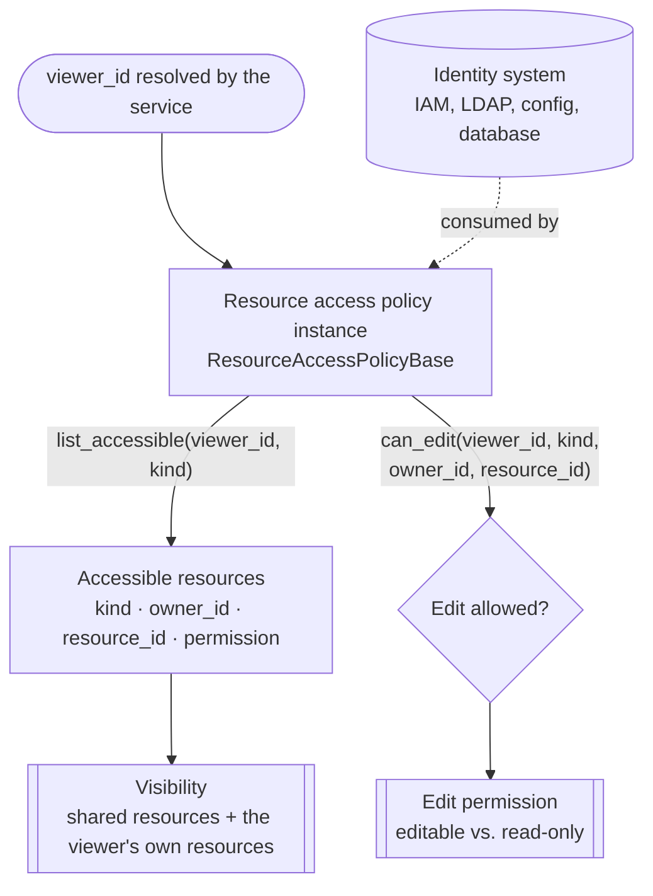

Resource sharing makes one user's **credentials**, **agents**, and **knowledge bases** visible (usable) or editable to other users.

By default, the Agent Service in AgentScope is strictly isolated per tenant — no user can see another user's records (see [Resource Model](/versions/2.0.5dev/en/deploy/agent-service#resource-model)). Resource sharing is the sanctioned way to share resources while keeping data secure.

Typical scenarios include:

- **Shared team API keys**: one administrator configures the API key once, and everyone on the team can use it without ever seeing the secret itself.
- **Publishing an agent**: offer a well-tuned agent as a service to other users, or to a whole team / department.
- **A shared knowledge base**: a single indexed knowledge base (a product handbook, a policy set) is queried by an entire team instead of each user rebuilding it.
- **Co-maintaining a knowledge base**: a small group jointly maintains an agent or knowledge base, and every member can edit it.

## How it works

AgentScope implements secure resource sharing through the **resource access policy**: it maps a viewer's `user_id` to the resources they can reach — think of it as a routing table for resources. The Agent Service itself **carries no user, group, or membership model**; this sharing relationship can come from any identity system (config, IAM, LDAP, database).

On a resource-related request, the service first resolves the `viewer_id` (the *viewer's `user_id`*) and governs access through the policy's two interfaces:

- `list_accessible` decides **what the viewer can see and use**, and
- `can_edit` decides **whether the viewer may make changes**.

The diagram below traces these two paths.



In this flow, the service injects the viewer id and its storage instance into `list_accessible` and `can_edit`; the deployer implements the "which resources this viewer can reach" logic inside these two methods based on that input.

| Method | Required | Description |
|--------|----------|-------------|
| `list_accessible(viewer_id, kind, storage)` | Yes | Return the `ResourceRef`s of `kind` that `viewer_id` may access, **excluding** the viewer's own resources. This single method drives list, get, and runtime resolution for every shared resource. |
| `can_edit(viewer_id, kind, owner_id, resource_id, storage)` | No | Whether `viewer_id` may modify a resource. The default derives the answer from `list_accessible` (grant when a matching entry carries `EDIT`); override it to implement custom authorization logic. |

The relevant types are:

| Type | Role |
|------|------|
| `ResourceAccessPolicyBase` | The abstract policy the deployer subclasses and passes to `create_app`. |
| `ResourceKind` | The shared resource type: `CREDENTIAL`, `AGENT`, or `KNOWLEDGE_BASE`. |
| `ResourcePermission` | The access level granted: `READ` (see and use) or `EDIT` (use and modify). |
| `ResourceRef` | An index to a shared resource — `(kind, owner_id, resource_id, permission)`. |

Developers / deployers implement their business-specific resource-sharing logic by subclassing and implementing `ResourceAccessPolicyBase`.

<Note>
The default policy in the Agent Service is `DenyAllResourceAccessPolicy` — no resources are shared across users.
</Note>

## Implementation

In the Agent Service, the deployer supplies the resource-sharing policy at the `create_app` entry point, telling the service *who can see what*. Sharing a credential, an agent, or a knowledge base differs only in the `kind` of the `ResourceRef` you return.

<Steps>

<Step title="Implement a policy">
Subclass `ResourceAccessPolicyBase` and implement the sharing logic you need. `list_accessible` is the abstract interface you must implement; `can_edit` is optional. Both are async and receive a `storage` argument when called, giving access to the backing store — so your implementation can freely consult an external source (your company's user directory, an org chart, project-membership tables, an IAM service) and turn those relationships into resource grants.

The class below shows the interface you fill in:

```python policy.py
from agentscope.app.access import (
    ResourceAccessPolicyBase,
    ResourceKind,
    ResourceRef,
)
from agentscope.app.storage import StorageBase


class MyResourceAccessPolicy(ResourceAccessPolicyBase):
    """Map a user id to the resources visible to them."""

    async def list_accessible(
        self,
        viewer_id: str,
        kind: ResourceKind,
        storage: StorageBase,
    ) -> list[ResourceRef]:
        # Look up, in your own system, the resources of the given `kind`
        # that `viewer_id` may access; no need to include the user's own
        # resources.
        ...

    async def can_edit(
        self,
        viewer_id: str,
        kind: ResourceKind,
        owner_id: str,
        resource_id: str,
        storage: StorageBase,
    ) -> bool:
        # Optional. Decide whether the user behind `viewer_id` may edit
        # this resource. By default it matches against the resources
        # returned by `list_accessible` and answers based on the
        # permission level.
        ...
```
</Step>

<Step title="Describe what is shared">
Each shared resource is represented by one `ResourceRef` instance. `kind` is the resource type and `permission` decides read-only versus editable. The tabs below show shared-resource instances of each type:

<CodeGroup>

```python Credential
from agentscope.app.access import (
    ResourceKind,
    ResourcePermission,
    ResourceRef,
)

# Share Alice's API credential with Bob as read-only.
# Bob can use this credential to create agents and run sessions,
# but never sees the credential's real value.
ref = ResourceRef(
    kind=ResourceKind.CREDENTIAL,
    owner_id="alice",
    resource_id="cred-openai-prod",
    permission=ResourcePermission.READ,
)
```

```python Agent
from agentscope.app.access import (
    ResourceKind,
    ResourcePermission,
    ResourceRef,
)

# Share the agent Alice created with Bob; Bob may also edit it.
ref = ResourceRef(
    kind=ResourceKind.AGENT,
    owner_id="alice",
    resource_id="agent-support-bot",
    permission=ResourcePermission.EDIT,
)
```

```python Knowledge Base
from agentscope.app.access import (
    ResourceKind,
    ResourcePermission,
    ResourceRef,
)

# Share Alice's knowledge base with Bob; defaults to read-only (query only).
ref = ResourceRef(
    kind=ResourceKind.KNOWLEDGE_BASE,
    owner_id="alice",
    resource_id="kb-handbook",
)
```

</CodeGroup>
</Step>

<Step title="Install the policy">
Pass the policy instance to `create_app` via the `resource_access_policy` parameter. From then on, the list and get endpoints for credentials, agents, and knowledge bases merge each viewer's own resources with those shared to them.

```python app.py
from agentscope.app import create_app
from policy import MyResourceAccessPolicy

app = create_app(
    # ...existing code...
    resource_access_policy=MyResourceAccessPolicy(),
)
```
</Step>

</Steps>

<Warning>
Shared credentials are **masked** in every list and get response — a viewer sees only the credential's `type` and `name`, never the secret payload. The raw secret is resolved only inside trusted runtime paths (chat / embedding / TTS model construction) when the viewer actually runs the agent. Do not add endpoints that echo a resolved credential back to the client.
</Warning>

<Tip>
Views returned to a viewer carry an `editable` flag computed from the ref's permission, so a frontend can render read-only versus editable resources without a second authorization round-trip. A viewer with only `READ` who attempts a `PATCH`/`DELETE` receives `403`; a resource they cannot see at all returns `404`.
</Tip>

<Note>
Sharing an agent shares its **configuration** — display name, system prompt, and context / ReAct settings — but **not its workspace content**. MCP client setups, skills, and accumulated memory (`MEMORY.md`) live in the per-user [workspace](/versions/2.0.5dev/en/deploy/workspace-manager), which is provisioned fresh per viewer, so a shared agent starts from a clean workspace for each user rather than inheriting the owner's tools and memory.

Sharing this workspace-resident state is a known gap we are actively working on; follow the tracking issue on GitHub for progress.
</Note>
