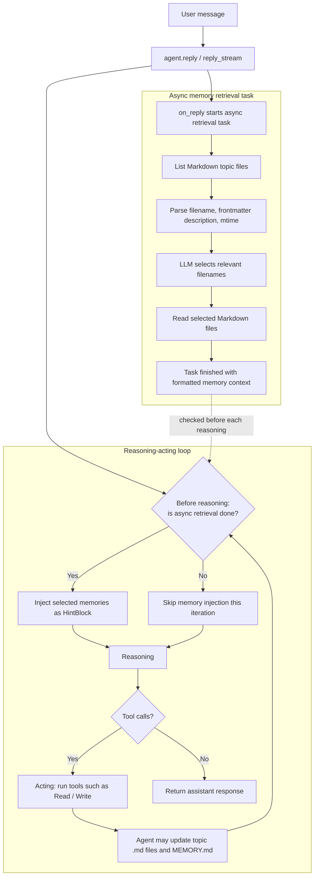

**长期记忆** 是智能体跨会话保留信息的能力，包括用户偏好、历史决策，以及在会话中总结、凝练的知识或规则。

AgentScope 通过 [智能体中间件](/versions/2.0.5dev/zh/building-blocks/middleware) 的形式实现不同长期记忆能力。每个长期记忆实现都是一个 `MiddlewareBase` 的子类，以非侵入式的方式完成记忆的注入、检索和写回。

AgentScope 目前支持以下长期记忆，更多实现正在开发中：

| 名称 | 代码接口 | 描述 |
|------|----------|------|
| Agentic Memory | `AgenticMemoryMiddleware` | 基于 Markdown 文件的长期记忆，由智能体自主创建、维护和使用。 |
| Mem0 | `Mem0Middleware` | 由 [mem0](https://github.com/mem0ai/mem0) 驱动的、开箱即用的长期记忆后端。 |
| 开发中 ... | |

## Agentic Memory

Agentic Memory 是 AgentScope 原生的长期记忆实现，通过 Markdown 文件的读写和检索实现长期记忆功能。
运行中智能体自主创建各种 Markdown 格式的记忆文件，并通过一个固定的 `MEMORY.md` 文件维护所有记忆文件的索引，并自动注入到系统提示中，是一种“渐进暴露”的实现方式。

<Tip>
Agentic Memory 通过 `backend` 参数支持切换不同的运行环境（例如本地、Docker、E2B、云端等），可以在不同的沙箱环境中运行，默认使用 `LocalBackend`。
</Tip>

运行时，智能体通过内置的 `Read`、`Write` 和 `Edit` 工具创建、访问和修改长期记忆，典型的文件结构如下：

```text
<workdir>/Memory/
├── MEMORY.md
├── <agent_created_topic>.md
├── <agent_created_feedback>.md
└── ...
```

其中每个 Markdown 文件都遵循 frontmatter 规范，包含 `name`、`description` 和 `type` 字段，便于后续检索和注入：

```markdown
---
name: {{memory name}}
description: {{one-line description — used to decide relevance in future conversations, so be specific}}
type: {{user, feedback, project, reference}}
---

{{memory content — for feedback/project types, structure as: rule/fact, then **Why:** and **How to apply:** lines}}
```

`MEMORY.md` 则保持简短，只作为索引并自动注入到系统提示中，示例如下：

```markdown
- [User profile](user_profile.md) — User location and answer-style preference.
- [Feedback on answer style](feedback_answer_style.md) — User prefers concise Chinese answers.
```

Agentic Memory 有两种检索链路：一种是智能体根据提示词和 `MEMORY.md` 索引自主检索相关文件；另一种是在调用智能体 `reply`/`reply_stream` 时，启动一个异步任务使用 LLM 来选择相关的 Markdown 文件，并在后续推理前检查该异步任务是否结束，再以 `HintBlock` 的形式插入检索结果。

需要注意检索过程是异步的：注入发生在推理-行动循环中推理**开始前**的检查点，具体时机取决于检索过程耗时；如果本次回复没有进入后续推理轮次（例如模型没有产生工具调用），则该次回复可能不会注入检索到的长期记忆内容。具体工作流程如下：



通过如下代码在不同的环境中使用 Agentic Memory：

<CodeGroup>

```python title="本地环境"
from agentscope.agent import Agent
from agentscope.middleware import AgenticMemoryMiddleware
from agentscope.permission import AdditionalWorkingDirectory, PermissionMode
from agentscope.tool import Read, Toolkit, Write, Edit


workdir = "/tmp/agentscope_ltm_demo"
memory = AgenticMemoryMiddleware(workdir=workdir)

agent = Agent(
    name="assistant",
    system_prompt="You are a helpful assistant.",
    model=my_chat_model,
    toolkit=Toolkit(tools=[Read(), Write(), Edit()]),
    middlewares=[memory],
)

# [可选] 允许示例中的 Write 工具写入 workdir。生产环境请根据安全策略配置权限。
agent.state.permission_context.mode = PermissionMode.ACCEPT_EDITS
agent.state.permission_context.working_directories[workdir] = (
    AdditionalWorkingDirectory(path=workdir, source="long-term-memory-demo")
)

await agent.reply("请记住：我住在杭州，并且偏好简洁的中文回答。")

# 重新创建一个智能体，只要复用同一个 workdir，就能使用同一份 Markdown 记忆。
new_agent = Agent(
    name="assistant",
    system_prompt="You are a helpful assistant.",
    model=my_chat_model,
    toolkit=Toolkit(tools=[Read(), Write()]),
    middlewares=[AgenticMemoryMiddleware(workdir=workdir)],
)

await new_agent.reply("你还记得我的所在地和回答风格偏好吗？")
```

```python title="Docker 环境"
from agentscope.agent import Agent
from agentscope.middleware import AgenticMemoryMiddleware
from agentscope.tool import Read, Toolkit, Write
from agentscope.workspace import DockerWorkspace


workspace = DockerWorkspace()
await workspace.initialize()

# 获取 Docker 沙箱的 backend
backend = workspace.get_backend()
memory = AgenticMemoryMiddleware(
    workdir=workspace.workdir,
    # 切换到沙箱环境中
    backend=backend,
)

agent = Agent(
    name="assistant",
    system_prompt="You are a helpful assistant.",
    model=my_chat_model,
    toolkit=Toolkit(
        # Docker workspace 默认工具中自带 Read / Write / Edit 工具
        tools=await workspace.list_tools(),
        # 也可以自己传入 Read / Write / Edit 工具
        # tools=[Read(backend=backend), Write(backend=backend), Edit(backend=backend)],
    ),
    middlewares=[memory],
)

try:
    await agent.reply("请记住：我正在 Docker 沙箱中测试长期记忆。")
finally:
    await workspace.close()
```

```python title="E2B 环境"
from agentscope.agent import Agent
from agentscope.middleware import AgenticMemoryMiddleware
from agentscope.tool import Read, Toolkit, Write
from agentscope.workspace import E2BWorkspace


workspace = E2BWorkspace()
await workspace.initialize()

# 获取 E2B 沙箱的 backend
backend = workspace.get_backend()
memory = AgenticMemoryMiddleware(
    workdir= workspace.workdir,
    # 切换到沙箱环境中
    backend=backend,
)

agent = Agent(
    name="assistant",
    system_prompt="You are a helpful assistant.",
    model=my_chat_model,
    toolkit=Toolkit(
        # E2B workspace 默认工具中自带 Read / Write / Edit 工具
        tools=await workspace.list_tools(),
        # 也可以自己传入 Read / Write / Edit 工具
        # tools=[Read(backend=backend), Write(backend=backend), Edit(backend=backend)],
    ),
    middlewares=[memory],
)

try:
    await agent.reply("请记住：我正在 E2B 沙箱中测试长期记忆。")
finally:
    await workspace.close()
```

</CodeGroup>


## Mem0

`Mem0Middleware` 是由 [mem0](https://github.com/mem0ai/mem0) 驱动的、开箱即用的长期记忆后端，同时支持 `mem0.AsyncMemory`（开源版）与 `mem0.AsyncMemoryClient`（托管 Platform 版）。在使用 `mem0.AsyncMemory`（开源版）时，可以让 mem0 自身的记忆抽取与 embedding 都走你现有的 AgentScope 模型 —— 因此 mem0 无需单独的 provider key。

### 安装

`Mem0Middleware` 的依赖位于 AgentScope 的可选依赖中：

```bash
pip install "agentscope[mem0]"
```

### 快速开始

最快捷的方式是为中间件传入一个专用的 AgentScope chat 模型和一个 embedding 模型；中间件会在内部构建一个开源版 mem0 存储，并把记忆抽取与 embedding 都接到这两个模型上。

```python
import asyncio
import os

from agentscope.agent import Agent
from agentscope.credential import DashScopeCredential
from agentscope.embedding import DashScopeEmbeddingModel
from agentscope.message import UserMsg
from agentscope.middleware import Mem0Middleware
from agentscope.model import DashScopeChatModel
from agentscope.tool import Toolkit


async def main():
    api_key = os.environ["DASHSCOPE_API_KEY"]

    # 即使 provider、模型名称、endpoint 和 API key 相同，
    # 也必须分别创建两个 chat 模型对象。
    agent_chat_model = DashScopeChatModel(
        credential=DashScopeCredential(api_key=api_key),
        model="qwen3.7-max",
        stream=False,
    )
    mem0_chat_model = DashScopeChatModel(
        credential=DashScopeCredential(api_key=api_key),
        model="qwen3.7-max",
        stream=False,
    )
    embedding_model = DashScopeEmbeddingModel(
        credential=DashScopeCredential(api_key=api_key),
        model="text-embedding-v4",
        dimensions=1536,
    )

    mw = Mem0Middleware(
        user_id="alice",
        chat_model=mem0_chat_model,
        embedding_model=embedding_model,
        mode="both",
    )

    agent = Agent(
        name="assistant",
        system_prompt="You are a helpful assistant.",
        model=agent_chat_model,
        toolkit=Toolkit(tools=await mw.list_tools()),
        middlewares=[mw],
    )

    # 本次会话写入的记忆，会在后续相同 ``user_id`` 的会话中重新出现。
    await agent.reply(
        UserMsg("alice", "请记住：我偏好深色模式的图表。"),
    )


asyncio.run(main())
```

<Note>
`Mem0Middleware` 通过 `list_tools()` 提供 `search_memory` / `add_memory` 工具，而智能体 **不会** 自动调用它。要让这些工具对智能体可用，需要开发者手动传入 toolkit —— `Toolkit(tools=await mw.list_tools())`。在 `static_control` 模式下 `list_tools()` 返回空列表。
</Note>

### 控制模式

`mode` 参数决定智能体与 mem0 的交互方式，默认为 `"both"`，与 AgentScope 1.x 的 `ReActAgent.long_term_memory_mode` 一致。

| 模式 | 行为 |
|------|------|
| `static_control` | 中间件在每次 reply 前检索 mem0，把检索到的记忆以 `AssistantMsg(name="memory")` 注入上下文，并在 reply 后把新的对话写回。智能体对 mem0 无感知。 |
| `agent_control` | 中间件暴露 `search_memory` / `add_memory` 工具，并在系统提示中追加一段简短的使用提示。由智能体自行决定何时读写记忆；没有自动检索或写回。 |
| `both` | 两种模式同时生效 —— 既自动检索，又提供按需调用的工具。 |

### 构造方式

`Mem0Middleware` 支持三种接入 mem0 后端的方式：

<Warning>
**使用 AgentScope chat 模型构造 mem0 后端时，`Agent` 与 `Mem0Middleware` 必须使用不同的模型实例。** 该要求适用于下面两种由模型驱动的接入方式：直接传入 AgentScope 模型，以及将 `chat_model` 与自定义 mem0 config 一起传入。预构建 client 路径不受影响，因为 `Mem0Middleware` 会直接使用传入的 mem0 client。

之所以需要分离实例，是因为 AgentScope chat 模型采用异步接口，而 mem0 在记忆抽取时调用的是同步 LLM 接口。为衔接这两种接口，`Mem0Middleware` 会通过 adapter 包装 AgentScope 模型：`Agent` 在应用自身的 event loop 上调用模型，adapter 则在专用的 bridge event loop 上运行用于记忆抽取的模型协程。

如果两个路径共享同一个模型实例，它们也会跨两个 event loop 共享该实例持有的异步 HTTP client 和连接池。连接池的底层资源可能绑定到首次使用它们的 loop；随后从另一个 loop 访问时，就可能间歇性触发 `Connection error` 或 `RuntimeError: ... is bound to a different event loop`。由于故障可能只发生在记忆抽取阶段，Agent 仍可能正常回复，但记忆写入会失败或没有产生新事实。

两个模型实例仍然可以使用相同的 provider、模型名称、endpoint 和 API key；只需确保它们是独立的模型/client 对象。在多 Agent 应用中，也不要让多个独立构建、由模型驱动的 `Mem0Middleware` 共享同一个 mem0 chat 模型实例，因为每个 adapter 都可能拥有不同的 bridge event loop。
</Warning>

<Tabs>
  <Tab title="AgentScope 模型">
  传入 AgentScope 模型，让中间件在内部构建开源版 `AsyncMemory`（mem0 默认的 Qdrant 存储）。embedding 模型的 `dimensions` 必须与向量存储匹配（默认 Qdrant 期望 `1536`）。

```python
Mem0Middleware(
    user_id="alice",
    chat_model=mem0_chat_model,
    embedding_model=my_embedding_model,
)
```
  </Tab>
  <Tab title="模型 + 自定义 config">
  以你自己的 `mem0.configs.base.MemoryConfig` 为基础，自定义向量存储、history DB 或 reranker，同时仍让 LLM 与 embedder 走 AgentScope。只有 `.llm` / `.embedder` 槽位会被覆盖，其余字段全部保留。

```python
Mem0Middleware(
    user_id="alice",
    chat_model=mem0_chat_model,
    embedding_model=my_embedding_model,
    mem0_config=my_mem0_config,
)
```
  </Tab>
  <Tab title="预构建 client">
  当你需要完全掌控时（例如使用托管 Platform，或在多个智能体间共享同一存储），可传入预构建的 mem0 client。一旦提供 `client`，它具有绝对优先级，`chat_model` / `embedding_model` / `mem0_config` 都会被忽略。

```python
from mem0 import AsyncMemoryClient

Mem0Middleware(
    user_id="alice",
    client=AsyncMemoryClient(api_key="m0-..."),
)
```
  </Tab>
</Tabs>

<Warning>
`Mem0Middleware` 要求使用**异步** mem0 client（`mem0.AsyncMemory` 或 `mem0.AsyncMemoryClient`）。同步的 `Memory` / `MemoryClient` 不受支持。
</Warning>

### 关键参数

| 参数 | 类型 | 默认值 | 说明 |
|------|------|--------|------|
| `user_id` | `str` | *（必填）* | 用户记忆的 mem0 命名空间。 |
| `mode` | `"static_control" \| "agent_control" \| "both"` | `"both"` | 智能体与 mem0 的交互方式（见上文）。 |
| `agent_id` | `str \| None` | `None` | 可选的更细粒度命名空间。 |
| `top_k` | `int` | `5` | 每次 static-control 检索返回的最大记忆数；同时作为 `search_memory` 工具的默认值。 |
| `threshold` | `float \| None` | `None` | 最小相似度分数；`None` 表示交由 mem0 决定。 |
| `scope_search_by_agent` | `bool` | `True` | 为 `True` 时检索同时按 `user_id` 与 `agent_id` 过滤；为 `False` 时同一用户的记忆在多个智能体间共享。 |
| `await_write` | `bool` | `True` | 为 `True` 时回合结束后的写入会内联等待；为 `False` 时为异步触发（更快，但异常只在日志中体现）。 |

### 供智能体调用的工具

在 `agent_control` 与 `both` 模式下，中间件提供两个模型可按需调用的工具：

- **`search_memory(keywords, limit=5)`** —— 用一组简短、精准的关键词检索记忆。每个关键词作为独立查询发起，结果合并并去重。
- **`add_memory(thinking, content)`** —— 记录持久信息。只有 `content`（一组独立完整的句子）会被写入 mem0；`thinking` 留在对话记录中以便审计。

两个工具都会自动放行（auto-allow），并直接从中间件实例读取 `user_id` / `agent_id`，因此除了把它们加入 toolkit 之外无需额外接线。
