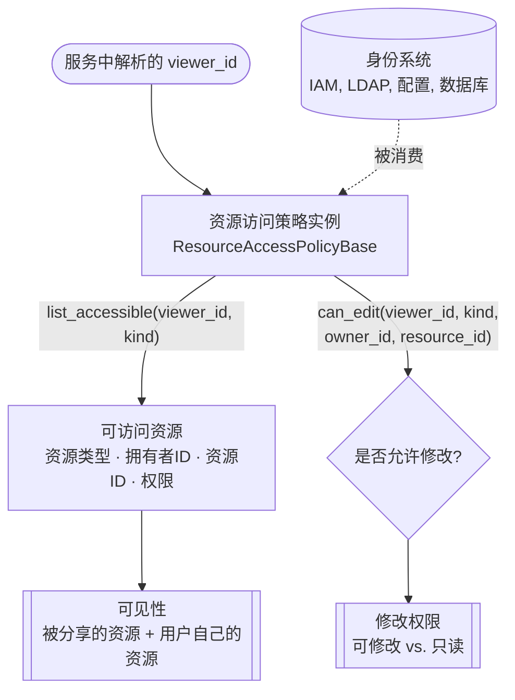

资源共享是指让一个用户的 **凭证**、**智能体** 和 **知识库** 对其他用户变得可见（可使用）或可编辑。

默认情况下，AgentScope 中智能体服务默认是按照租户严格隔离的，任何用户都看不到别人的记录（见[资源模型](/versions/2.0.5dev/zh/deploy/agent-service#资源模型)）。
资源共享是在确保数据安全的前提下合法实现资源共享的途径。

适用的典型场景包括：

- **团队共享 API 密钥**: 由一名管理员统一配置好 API key，团队内成员都能使用，却始终看不到密钥本身。
- **发布智能体**: 将一个精心调校好的智能体作为服务分享给其他用户，或整个团队/部门。
- **公共知识库**: 一份已建好索引的知识库（产品手册、政策集）由一个团队共同查询，而不必每个用户各自重复建立。
- **知识库共建**: 一个小组共同维护某个智能体或知识库，每位成员都能编辑它。

## 工作原理

AgentScope 通过 **资源访问策略（resource access policy）** 实现资源的安全共享：它把一个访问者的 `user_id` 映射到其可触达的资源，可以理解为一份资源的路由表单。
而智能体服务中则 **不带有任何用户、群组或成员关系模型**，这份共享关系可以来自任何身份系统（配置、IAM、LDAP、数据库）。

在资源相关的请求中，服务会首先解析出 `view_id`（即*访问者的 `user_id`*），并通过资源访问策略的如下两个接口控制访问权限：

- `list_accessible` 决定**访问者能看到并使用什么**，
- `can_edit` 决定**访问者是否可以进行修改**。

下图描绘这两条路径。



在这个流程中，服务会在 `list_accessible` 和 `can_edit` 中注入访问者 ID 和服务的存储实例，服务的部署者需要根据输入在这两个方法中实现“访问者能触达哪些资源”的逻辑。

| 方法 | 是否必需 | 说明 |
|------|----------|------|
| `list_accessible(viewer_id, kind, storage)` | 是 | 返回 `viewer_id` 可访问的、类型为 `kind` 的 `ResourceRef`，**不包含**访问者自己的资源。这一个方法就驱动了所有共享资源的 list、get 以及运行时解析。 |
| `can_edit(viewer_id, kind, owner_id, resource_id, storage)` | 否 | `viewer_id` 是否可以修改某个资源。默认实现由 `list_accessible` 推导答案（当存在一个携带 `EDIT` 的匹配项时放行）；可重写该接口进行特定鉴权逻辑。 |

相关字段如下：

| 类型 | 作用 |
|------|------|
| `ResourceAccessPolicyBase` | 部署者要继承并传给 `create_app` 的抽象策略类。 |
| `ResourceKind` | 被共享的资源类型：`CREDENTIAL`、`AGENT` 或 `KNOWLEDGE_BASE`。 |
| `ResourcePermission` | 授予的访问级别：`READ`（可见并可用）或 `EDIT`（可用并可改） |
| `ResourceRef` | 共享资源的索引 `(kind, owner_id, resource_id, permission)`。 |


开发者/部署者通过继承并实现 `ResourceAccessPolicyBase` 类实现业务相关的资源共享逻辑。


<Note>
智能体服务中默认策略实现是 `DenyAllResourceAccessPolicy`，即跨用户不共享任何资源。
</Note>

## 实现方式

在智能体服务中，开发者/部署者需要在 `create_app` 的入口处提供对应的资源共享策略，告诉服务*谁能看到什么*。共享凭证、智能体还是知识库，差别仅在于返回的 `ResourceRef` 的 `kind` 值。

<Steps>

<Step title="实现一个策略">
继承 `ResourceAccessPolicyBase`，实现所需的共享逻辑。`list_accessible` 是必须实现的抽象接口，`can_edit` 是可选的。两者都是异步方法，在被调用时会提供 `storage` 参数，从而可以访问后端存储，在接口实现时开发者可以自由接入外部源 —— 公司的用户目录、组织架构、项目成员表、IAM 服务 —— 并把这些关系转换为资源授权。

下面的类展示了要填写的接口：

```python policy.py
from agentscope.app.access import (
    ResourceAccessPolicyBase,
    ResourceKind,
    ResourceRef,
)
from agentscope.app.storage import StorageBase


class MyResourceAccessPolicy(ResourceAccessPolicyBase):
    """将用户ID映射为其可见的资源。"""

    async def list_accessible(
        self,
        viewer_id: str,
        kind: ResourceKind,
        storage: StorageBase,
    ) -> list[ResourceRef]:
        # 在你的系统中查询 `view_id` 能够访问的对应 `kind` 指向的资源类型；
        # 注意：不需要包含该用户自己拥有的资源；
        ...

    async def can_edit(
        self,
        viewer_id: str,
        kind: ResourceKind,
        owner_id: str,
        resource_id: str,
        storage: StorageBase,
    ) -> bool:
        # 可选实现。决定 `view_id` 指向的用户是否可以编辑该资源，
        # 默认根据 `list_accessible` 返回的资源做匹配，并根据权
        # 限类型返回是否可以编辑        
        ...
```
</Step>

<Step title="描述共享了什么">
每个被共享的资源都使用一个 `ResourceRef` 实例表示。`kind` 代表资源类型，`permission` 决定只读还是可编辑，下面了不同类型的共享资源实例：

<CodeGroup>

```python API 凭证
from agentscope.app.access import (
    ResourceKind,
    ResourcePermission,
    ResourceRef,
)

# 将 Alice 的 API 凭证以“只读”权限分享给用户 Bob。
# Bob 可以使用该 API 凭证创建智能体并运行会话，但是不会看到 API 凭证的真实值。
ref = ResourceRef(
    kind=ResourceKind.CREDENTIAL,
    owner_id="alice",
    resource_id="cred-openai-prod",
    permission=ResourcePermission.READ,
)
```

```python 智能体
from agentscope.app.access import (
    ResourceKind,
    ResourcePermission,
    ResourceRef,
)

# 将 Alice 创建的智能体分享给 Bob，并且 Bob 也可以编辑该智能体
ref = ResourceRef(
    kind=ResourceKind.AGENT,
    owner_id="alice",
    resource_id="agent-support-bot",
    permission=ResourcePermission.EDIT,
)
```

```python 知识库
from agentscope.app.access import (
    ResourceKind,
    ResourcePermission,
    ResourceRef,
)

# 将 Alice 的知识库分享给 Bob，默认为只读权限，即仅可以进行查询
ref = ResourceRef(
    kind=ResourceKind.KNOWLEDGE_BASE,
    owner_id="alice",
    resource_id="kb-handbook",
)
```

</CodeGroup>
</Step>

<Step title="安装策略">
通过 `resource_access_policy` 参数把策略实例传给 `create_app`。此后，凭证、智能体和知识库的 list 与 get 端点会把每个访问者自己的资源与共享给他的资源合并返回。

```python app.py
from agentscope.app import create_app
from policy import MyResourceAccessPolicy

app = create_app(
    # ...existing code...
    resource_access_policy=MyResourceAccessPolicy(),
)
```
</Step>

</Steps>

<Warning>
共享的 API 凭证在所有 list 与 get 响应中都会被**脱敏** —— 访问者只能看到凭证的 `type` 和 `name`，永远看不到密钥载荷。原始密钥仅在访问者真正运行智能体时、于受信任的运行时路径（chat / embedding / TTS 模型构造）中被解析。切勿新增会把已解析凭证回传给客户端的端点。
</Warning>

<Tip>
返回给访问者的视图带有一个由引用权限计算出的 `editable` 标志，因此前端无需再发一次鉴权请求即可区分渲染只读与可编辑资源。仅有 `READ` 的访问者若尝试 `PATCH`/`DELETE` 会得到 `403`；对完全不可见的资源则返回 `404`。
</Tip>

<Note>
共享一个智能体，共享的是它的**配置** —— 显示名、系统提示词，以及 context / ReAct 设置 —— 而**不包括它的 workspace 内容**。MCP 客户端配置、skills 以及累积的记忆（`MEMORY.md`）都存放在按用户隔离的 [workspace](/versions/2.0.5dev/zh/deploy/workspace-manager) 中，它会为每个访问者重新初始化，因此共享的智能体对每个用户都是从一个干净的 workspace 起步，而非继承属主的工具与记忆。

共享这部分驻留在 workspace 中的状态是一个已知的缺口，我们正在积极解决；进展请关注 GitHub 上的跟踪 issue。
</Note>
